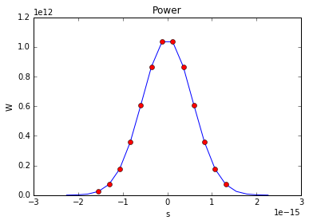
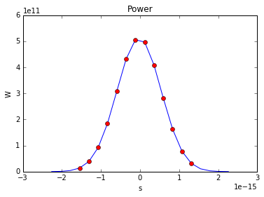
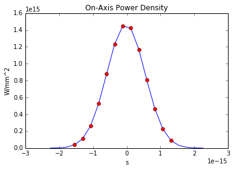
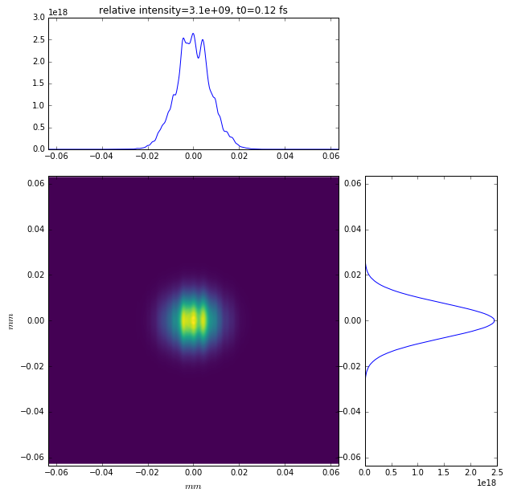

S1 SPB CRL simplified beamline with imperfect mirrors
=====================================================

.. code:: python

    %matplotlib inline

.. code:: python

    from __future__ import absolute_import
    from __future__ import division
    from __future__ import print_function
    from __future__ import unicode_literals

.. code:: python

    import os
    import sys
    
    
    # wpg_path = '/afs/desy.de/group/exfel/software/wpg/latest/' # DESY installation
    wpg_path = os.path.join('..','..','..')
    sys.path.insert(0, wpg_path)
    
    import numpy as np
    import pylab as plt
    
    
    from wpg import Wavefront, Beamline
    from wpg.optical_elements import Aperture, Drift, CRL, Empty, Use_PP
    from wpg.generators import build_gauss_wavefront
    
    from wpg.srwlib import srwl
    
    from wpg.wpg_uti_exfl import calculate_theta_fwhm_cdr_s1
    from wpg.wpg_uti_wf import calculate_fwhm, averaged_intensity, look_at_q_space, plot_t_wf
    from wpg.wpg_uti_oe import show_transmission

.. code:: python

    from IPython.display import Image
    Image(filename='CRL_1.png')

.. image:: output_4_0.png

.. code:: python

    %%file bl_S1_SPB_CRL_mirrors.py
    
    def get_beamline():
        import os
        import wpg
        from wpg import Beamline
        from wpg.optical_elements import Aperture, Drift, CRL, Empty, Use_PP, WF_dist, calculateOPD
    
        wpg_path = os.path.abspath(os.path.dirname(wpg.__file__))
    
        # S1 beamline layout
        # Geometry ###
        src_to_hom1 = 257.8  # Distance source to HOM 1 [m]
        src_to_hom2 = 267.8  # Distance source to HOM 2 [m]
        src_to_crl = 887.8  # Distance source to CRL [m]
        #     src_to_exp = 920.42 # Distance source to experiment [m]
    
        # Drift to focus aperture
        # crl_to_exp_drift = Drift( src_to_exp - src_to_crl )
        z = 34.0
        # define distances, angles, etc
        # ...
        # Incidence angle at HOM
    
          # should be checked for other beams !!!
    
        theta_om = 3.6e-3  # [rad]
    
        om_mirror_length = 0.8  # [m]
        om_clear_ap = om_mirror_length * theta_om
    
        # define the beamline:
        bl0 = Beamline()
        zoom = 1
    
        # Define HOM1.
        aperture_x_to_y_ratio = 1
        hom1 = Aperture(
            shape='r', ap_or_ob='a', Dx=om_clear_ap, Dy=om_clear_ap / aperture_x_to_y_ratio)
        bl0.append(
            hom1, Use_PP(semi_analytical_treatment=0, zoom=zoom, sampling=zoom))
    
        # Define mirror profile
        hom1_wavefront_distortion = WF_dist(nx=1500, ny=100,
                                            Dx=om_clear_ap, Dy=om_clear_ap / aperture_x_to_y_ratio)
        # Apply distortion.
        mirrors_path = os.path.join(wpg_path, '..', 'samples', 'data_common')
        hom1_wavefront_distortion = calculateOPD(wf_dist=hom1_wavefront_distortion,
                                                 mdatafile=os.path.join(
                                                     mirrors_path, 'mirror1.dat'),
                                                 ncol=2,
                                                 delim=' ',
                                                 Orient='x',
                                                 theta=theta_om,
                                                 scale=1.,
                                                 stretching=1.)
        bl0.append(hom1_wavefront_distortion,
                   Use_PP(semi_analytical_treatment=0, zoom=zoom, sampling=zoom))
    
        # Free space propagation from hom1 to hom2
        hom1_to_hom2_drift = Drift(src_to_hom2 - src_to_hom1)
        bl0.append(hom1_to_hom2_drift, Use_PP(semi_analytical_treatment=0))
    
        # Define HOM2.
        zoom = 1.0
        hom2 = Aperture('r', 'a', om_clear_ap, om_clear_ap / aperture_x_to_y_ratio)
        bl0.append(hom2, Use_PP(semi_analytical_treatment=0,
                                zoom=zoom, sampling=zoom / 0.75))
    
        # define mirror 2
        # nx, ny from tutorial #3 (new).
        hom2_wavefront_distortion = WF_dist(nx=1500, ny=100,
                                            Dx=om_clear_ap, Dy=om_clear_ap / aperture_x_to_y_ratio)
        # Apply distortion.
        hom2_wavefront_distortion = calculateOPD(wf_dist=hom2_wavefront_distortion,
                                                 mdatafile=os.path.join(
                                                     mirrors_path, 'mirror2.dat'),
                                                 ncol=2,
                                                 delim=' ',
                                                 Orient='x',
                                                 theta=theta_om,
                                                 scale=1.,
                                                 stretching=1.)
    
        bl0.append(hom2_wavefront_distortion, Use_PP(
            semi_analytical_treatment=0, zoom=zoom, sampling=zoom))
    
        # drift to CRL aperture
        hom2_to_crl_drift = Drift(src_to_crl - src_to_hom2)
    
        bl0.append(hom2_to_crl_drift, Use_PP(semi_analytical_treatment=1))
    
        # Define CRL
        crl_focussing_plane = 3  # Both horizontal and vertical.
        # Refractive index decrement (n = 1- delta - i*beta)
        crl_delta = 4.7177e-06
        crl_attenuation_length = 6.3e-3    # Attenuation length [m], Henke data.
        crl_shape = 1         # Parabolic lenses
        crl_aperture = 5.0e-3  # [m]
        crl_curvature_radius = 5.8e-3  # [m]
        crl_number_of_lenses = 19
        crl_wall_thickness = 8.0e-5  # Thickness
        crl_center_horizontal_coordinate = 0.0
        crl_center_vertical_coordinate = 0.0
        crl_initial_photon_energy = 8.48e3  # [eV] ### OK ???
        crl_final_photon_energy = 8.52e3  # [eV]   ### OK ???
    
        crl = CRL(_foc_plane=crl_focussing_plane,
                  _delta=crl_delta,
                  _atten_len=crl_attenuation_length,
                  _shape=crl_shape,
                  _apert_h=crl_aperture,
                  _apert_v=crl_aperture,
                  _r_min=crl_curvature_radius,
                  _n=crl_number_of_lenses,
                  _wall_thick=crl_wall_thickness,
                  _xc=crl_center_horizontal_coordinate,
                  _yc=crl_center_vertical_coordinate,
                  _void_cen_rad=None,
                  _e_start=crl_initial_photon_energy,
                  _e_fin=crl_final_photon_energy,
                  )
        zoom = 0.6
    
        bl0.append(
            crl, Use_PP(semi_analytical_treatment=1, zoom=zoom, sampling=zoom/0.1))
    
        crl_to_exp_drift = Drift(z)
        bl0.append(crl_to_exp_drift, Use_PP(
            semi_analytical_treatment=1, zoom=1, sampling=1))
        #     bl0.append(Empty(),Use_PP(zoom=0.25, sampling=0.25))
    
        return bl0

.. parsed-literal::

    Overwriting bl_S1_SPB_CRL_mirrors.py

initial Gaussian wavefront
~~~~~~~~~~~~~~~~~~~~~~~~~~

With the calculated beam parameters the initial wavefront is build with
400x400 data points and at distance of the first flat offset mirror at
257.8 m. For further propagation the built wavefront should be stored.

After plotting the wavefront the FWHM could be printed out and compared
with Gaussian beam divergence value. #### Gaussian beam radius and size
at distance :math:`z` from the waist:
:math:`\omega(z) = \omega_0*\sqrt{1+\left(\frac{z}{z_R}\right)^2}`,
where :math:`\frac{1}{z_R} = \frac{\lambda}{\pi\omega_0^2}`

Expected FWHM at first screen or focusing mirror: :math:`\theta_{FWHM}*z`
^^^^^^^^^^^^^^^^^^^^^^^^^^^^^^^^^^^^^^^^^^^^^^^^^^^^^^^^^^^^^^^^^^^^^^^^^

.. code:: python

    src_to_hom1 = 257.8 # Distance source to HOM 1 [m]
    
    # Central photon energy.
    ekev = 8.5 # Energy [keV]
    
    # Pulse parameters.
    qnC = 0.5               # e-bunch charge, [nC]
    pulse_duration = 9.e-15 # [s] <-is not used really, only ~coh time pulse duration has physical meaning 
    pulseEnergy = 1.5e-3    # total pulse energy, J
    coh_time = 0.8e-15     # [s]<-should be SASE coherence time, then spectrum will be the same as for SASE 
                           # check coherence time for 8 keV 0.5 nC SASE1
    
    # Angular distribution
    theta_fwhm = calculate_theta_fwhm_cdr_s1(ekev,qnC) # From tutorial
    #theta_fwhm = 2.124e-6 # Beam divergence        # From Patrick's raytrace.
    
    # Gaussian beam parameters
    wlambda = 12.4*1e-10/ekev # wavelength 
    w0 = wlambda/(np.pi*theta_fwhm) # beam waist; 
    zR = (np.pi*w0**2)/wlambda # Rayleigh range
    fwhm_at_zR = theta_fwhm*zR # FWHM at Rayleigh range
    sigmaAmp = w0/(2*np.sqrt(np.log(2))) # sigma of amplitude
    
    print('expected FWHM at distance {:.1f} m is {:.2f} mm'.format(src_to_hom1,theta_fwhm*src_to_hom1*1e3))
    
    # expected beam radius at M1 position to get the range of the wavefront 
    sig_num = 5.5
    range_xy = w0 * np.sqrt(1+(src_to_hom1/zR)**2) *sig_num;#print('range_xy at HOM1: {:.1f} mm'.format(range_xy*1e3))
    fname = 'at_{:.0f}_m'.format(src_to_hom1)

.. parsed-literal::

    expected FWHM at distance 257.8 m is 0.53 mm

.. code:: python

    bSaved=False
    num_points = 400 #number of points
    dx = 10.e-6; range_xy = dx*(num_points-1);#print('range_xy :', range_xy)
    nslices = 20; 
    
    srwl_wf = build_gauss_wavefront(num_points, num_points, nslices, ekev, -range_xy/2, range_xy/2,
                                    -range_xy/2, range_xy/2 ,coh_time/np.sqrt(2), 
                                    sigmaAmp, sigmaAmp, src_to_hom1,
                                    pulseEn=pulseEnergy, pulseRange=8.)
    wf = Wavefront(srwl_wf)
    z0 = src_to_hom1
    #defining name HDF5 file for storing wavefront
    strOutInDataFolder = 'data_common'
    #store wavefront to HDF5 file 
    if bSaved:     
        wf.store_hdf5(fname+'.h5'); print('saving WF to %s' %fname+'.h5')
    
    xx=calculate_fwhm(wf);
    print('FWHM at distance {:.1f} m: {:.2f} x {:.2f} mm2'.format(z0,xx[u'fwhm_x']*1e3,xx[u'fwhm_y']*1e3));

.. parsed-literal::

    FWHM at distance 257.8 m: 0.52 x 0.52 mm2

.. code:: python

    #input gaussian beam
    print( 'dy {:.1f} um'.format((wf.params.Mesh.yMax-wf.params.Mesh.yMin)*1e6/(wf.params.Mesh.ny-1.)))
    print( 'dx {:.1f} um'.format((wf.params.Mesh.xMax-wf.params.Mesh.xMin)*1e6/(wf.params.Mesh.nx-1.)))
    plot_t_wf(wf)
    look_at_q_space(wf)

.. parsed-literal::

    dy 10.0 um
    dx 10.0 um

.. image:: output_9_2.png

.. parsed-literal::

    number of meaningful slices: 13
    R-space
    (400,) (400,)

.. image:: output_9_4.png

.. parsed-literal::

    Q-space
    {'fwhm_y': 1.999254044117647e-06, 'fwhm_x': 1.999254044117647e-06}
    Q-space
    (400,) (400,)

.. image:: output_9_6.png

.. code:: python

    #loading beamline from file
    import imp
    custom_beamline = imp.load_source('custom_beamline', 'bl_S1_SPB_CRL_mirrors.py')
    get_beamline = custom_beamline.get_beamline
    bl = get_beamline()
    print(bl)

.. parsed-literal::

    Optical Element Setup: CRL Focal Length: 32.35296414510639 m
    Optical Element: Aperture / Obstacle
    Prop. parameters = [0, 0, 1.0, 0, 0, 1.0, 1.0, 1.0, 1.0, 0, 0, 0]
    	Dx = 0.00288
    	Dy = 0.00288
    	ap_or_ob = a
    	shape = r
    	x = 0
    	y = 0
    	
    Optical Element: Transmission (generic)
    Prop. parameters = [0, 0, 1.0, 0, 0, 1.0, 1.0, 1.0, 1.0, 0, 0, 0]
    	Fx = 1e+23
    	Fy = 1e+23
    	arTr = array of size 300000
    	extTr = 0
    	mesh = Radiation Mesh (Sampling)
    		arSurf = None
    		eFin = 0
    		eStart = 0
    		hvx = 1
    		hvy = 0
    		hvz = 0
    		ne = 1
    		nvx = 0
    		nvy = 0
    		nvz = 1
    		nx = 1500
    		ny = 100
    		xFin = 0.00144
    		xStart = -0.00144
    		yFin = 0.00144
    		yStart = -0.00144
    		zStart = 0
    	
    	
    Optical Element: Drift Space
    Prop. parameters = [0, 0, 1.0, 0, 0, 1.0, 1.0, 1.0, 1.0, 0, 0, 0]
    	L = 10.0
    	treat = 0
    	
    Optical Element: Aperture / Obstacle
    Prop. parameters = [0, 0, 1.0, 0, 0, 1.0, 1.3333333333333333, 1.0, 1.3333333333333333, 0, 0, 0]
    	Dx = 0.00288
    	Dy = 0.00288
    	ap_or_ob = a
    	shape = r
    	x = 0
    	y = 0
    	
    Optical Element: Transmission (generic)
    Prop. parameters = [0, 0, 1.0, 0, 0, 1.0, 1.0, 1.0, 1.0, 0, 0, 0]
    	Fx = 1e+23
    	Fy = 1e+23
    	arTr = array of size 300000
    	extTr = 0
    	mesh = Radiation Mesh (Sampling)
    		arSurf = None
    		eFin = 0
    		eStart = 0
    		hvx = 1
    		hvy = 0
    		hvz = 0
    		ne = 1
    		nvx = 0
    		nvy = 0
    		nvz = 1
    		nx = 1500
    		ny = 100
    		xFin = 0.00144
    		xStart = -0.00144
    		yFin = 0.00144
    		yStart = -0.00144
    		zStart = 0
    	
    	
    Optical Element: Drift Space
    Prop. parameters = [0, 0, 1.0, 1, 0, 1.0, 1.0, 1.0, 1.0, 0, 0, 0]
    	L = 620.0
    	treat = 0
    	
    Optical Element: Transmission (generic)
    Prop. parameters = [0, 0, 1.0, 1, 0, 0.6, 5.999999999999999, 0.6, 5.999999999999999, 0, 0, 0]
    	Fx = 32.35296414510639
    	Fy = 32.35296414510639
    	arTr = array of size 2004002
    	extTr = 1
    	mesh = Radiation Mesh (Sampling)
    		arSurf = None
    		eFin = 8520.0
    		eStart = 8480.0
    		hvx = 1
    		hvy = 0
    		hvz = 0
    		ne = 1
    		nvx = 0
    		nvy = 0
    		nvz = 1
    		nx = 1001
    		ny = 1001
    		xFin = 0.0027500000000000003
    		xStart = -0.0027500000000000003
    		yFin = 0.0027500000000000003
    		yStart = -0.0027500000000000003
    		zStart = 0
    	
    	
    Optical Element: Drift Space
    Prop. parameters = [0, 0, 1.0, 1, 0, 1.0, 1.0, 1.0, 1.0, 0, 0, 0]
    	L = 34.0
    	treat = 0
    	
    

.. code:: python

    #propagated gaussian beam
    srwl.SetRepresElecField(wf._srwl_wf, 'f') # <---- switch to frequency domain
    bl.propagate(wf)
    srwl.SetRepresElecField(wf._srwl_wf, 't')
    print('FWHM after CRLs:');print(calculate_fwhm(wf))
    print('FWHM at distance {:.1f} m:'.format(wf.params.Mesh.zCoord));print(calculate_fwhm(wf))
    plot_t_wf(wf)
    look_at_q_space(wf)

.. parsed-literal::

    FWHM after CRLs:
    {'fwhm_y': 1.779350912766013e-05, 'fwhm_x': 1.5219562037271364e-05}
    FWHM at distance 921.8 m:
    {'fwhm_y': 1.779350912766013e-05, 'fwhm_x': 1.5219562037271364e-05}

.. parsed-literal::

    number of meaningful slices: 13
    R-space
    (1944,) (1944,)

.. parsed-literal::

    Q-space
    {'fwhm_y': 4.298910472684863e-05, 'fwhm_x': 4.242918502417042e-05}
    Q-space
    (1944,) (1944,)

.. image:: output_11_6.png

