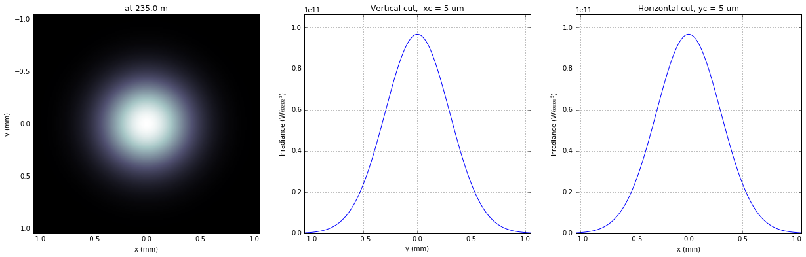
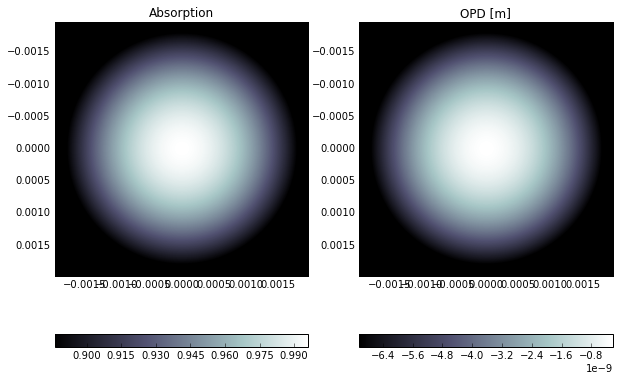
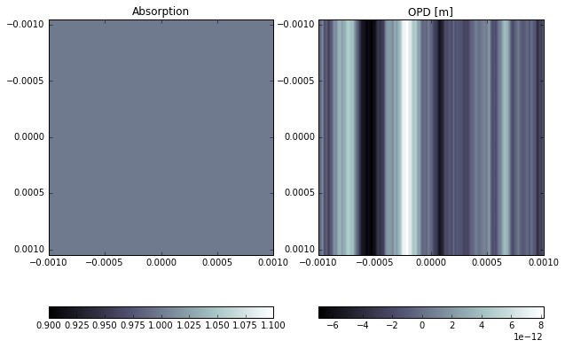
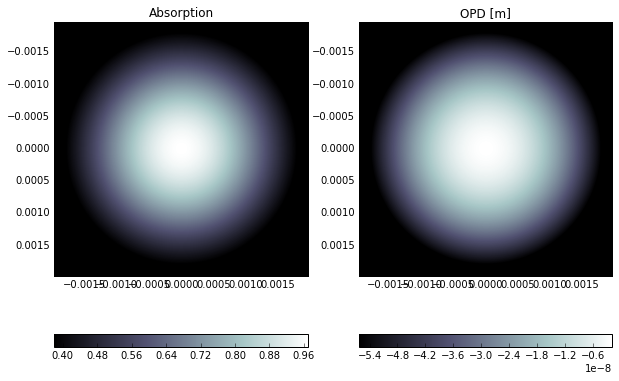
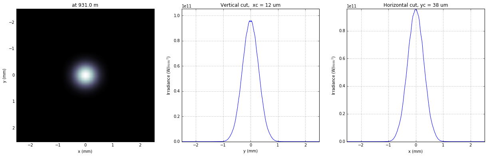
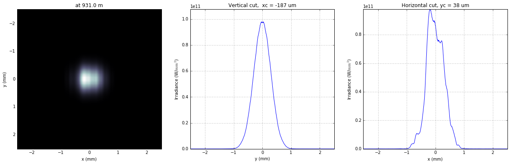
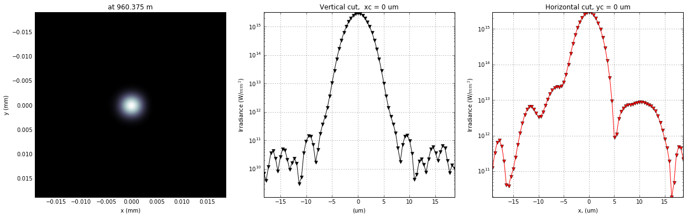

Wavefront propagation simulation tutorial - Case 1
==================================================

L.Samoylova liubov.samoylova@xfel.eu, A.Buzmakov buzmakov@gmail.com

Tutorial course on Wavefront Propagation Simulations, 28/11/2013,
European XFEL, Hamburg. Updated for using new syntax 28/11/2015

Wave optics software is based on SRW core library
https://github.com/ochubar/SRW, available through WPG interactive
framework https://github.com/samoylv/WPG

Propagation through CRLs optics
-------------------------------

Import modules
~~~~~~~~~~~~~~

.. code:: python

    %matplotlib inline

.. code:: python

    from __future__ import absolute_import
    from __future__ import division
    from __future__ import print_function
    from __future__ import unicode_literals
    
    #Importing necessary modules:
    import os
    import sys
    import copy
    
    sys.path.insert(0,os.path.join('..','..'))
    #sys.path.insert('../..')
    
    import time
    import numpy as np
    import pylab as plt
    
    if sys.version_info[0] ==3:
        import pickle
    else:
        import cPickle as pickle
    import errno
    
    #import SRW core functions
    from wpg.srwlib import srwl, srwl_opt_setup_CRL, SRWLOptD, SRWLOptA, SRWLOptC, SRWLOptT
    
    #import SRW auxiliary functions
    from wpg.useful_code.srwutils import AuxTransmAddSurfHeightProfileScaled
    
    #import some helpers functions
    from wpg.useful_code.wfrutils import calculate_fwhm_x, plot_wfront, calculate_fwhm_y, print_beamline, get_mesh, plot_1d, plot_2d
    
    from wpg.wpg_uti_wf import propagate_wavefront
    from wpg.wpg_uti_oe import show_transmission
    
    #from wpg.useful_code.wfrutils import propagate_wavefront
    
    #Import base wavefront class
    from wpg import Wavefront
    
    #Import base beamline class and OE wrappers
    from wpg.beamline import Beamline
    from wpg.optical_elements import Empty, Use_PP
    from wpg.optical_elements import         Drift,Aperture,    Lens,Mirror_elliptical,WF_dist,calculateOPD
    
    #Gaussian beam generator
    from wpg.generators import build_gauss_wavefront_xy
    
    plt.ion()

Use or not new syntax
~~~~~~~~~~~~~~~~~~~~~

.. code:: python

    NEW_SYNTAX = True

Define auxiliary functions
~~~~~~~~~~~~~~~~~~~~~~~~~~

.. code:: python

    def calculate_source_fwhm(ekev, theta_fwhm):
        """
        Calculate source size from photon energy and FWHM angular divergence
        
        :param evev: Energy in keV
        :param theta_fwhm: theta_fwhm [units?] 
        """
        wl = 12.39e-10/ekev
        k = 2 * np.sqrt(2*np.log(2))
        theta_sigma = theta_fwhm /k
        sigma0 = wl /(2*np.pi*theta_sigma)
        return sigma0*k
    
    def calculate_theta_fwhm_cdr(ekev,qnC):
        """
        Calculate angular divergence using formula from XFEL CDR2011
        
        :param ekev: Energy in keV
        :param qnC: e-bunch charge, [nC]
        :return: theta_fwhm [units?]
        """
        theta_fwhm = (17.2 - 6.4 * np.sqrt(qnC))*1e-6/ekev**0.85
        return theta_fwhm
    
    def defineOPD(opTrErMirr, mdatafile, ncol, delim, Orient, theta, scale):
        """
        Define optical path difference (OPD) from mirror profile, i.e. ill the struct opTrErMirr
        
        :params mdatafile: an ascii file with mirror profile data
        :params ncol: number of columns in the file
        :params delim: delimiter between numbers in an row, can be space (' '), tab '\t', etc
        :params orient: mirror orientation, 'x' (horizontal) or 'y' (vertical)
        :params theta: incidence angle
        :params scale: scaling factor for the mirror profile    
        """
        heightProfData = np.loadtxt(mdatafile).T
        AuxTransmAddSurfHeightProfileScaled(opTrErMirr, heightProfData, Orient, theta, scale)
        plt.figure()
        plot_1d(heightProfData,'profile from ' + mdatafile,'x (m)', 'h (m)')

.. code:: python

    def calc_sampling(zoom,mf):
        """
        This function calculates sampling.
        :param zoom: range zoom
        :param mf: modification factor for step, i.e. dx1=mf*dx0
        
        :return: sampling.
        """
        sampling = zoom/mf; 
        print('zoom:{:.1f}; mod_factor:{:.1f}; sampling:{:.1f}'.format(zoom, mf, sampling))
        return sampling

.. code:: python

    def _save_object(obj, file_name):
        """
        Save any python object to file.
        
        :param: obj : - python objest to be saved
        :param: file_name : - output file, wil be overwrite if exists
        """
        with open(file_name,'wb') as f:
            pickle.dump(obj, f)
    
    def _load_object(file_name):
        """
        Save any python object to file.
        
        :param: file_name : - output file, wil be overwrite if exists
        :return: obj : - loaded pthon object
        """
        res = None
        with open(file_name,'rb') as f:
            res = pickle.load(f)
            
        return res
    
    def mkdir_p(path):
        """
        Create directory with subfolders (like Linux mkdir -p)
        
        :param path: Path to be created
        """
        try:
            os.makedirs(path)
        except OSError as exc: # Python >2.5
            if exc.errno == errno.EEXIST and os.path.isdir(path):
                pass
            else: raise
                
    def create_CRL(directory=None, voids_params=None, *args, **keywrds):
        """
        This function build CLR or load it from file if it was created beforehand.
        Out/input filename builded as sequence of function parameters.
        
        Adiitinal parameters (*args) passed to srwlib.srwl_opt_setup_CRL function
        
        :param directory: output directory to save file.
        :param voids_params: void params to build CRL and construct unique file name
        :return: SRWL CRL object
        """
        if not isinstance(voids_params,tuple):
            raise TypeError('Voids_params must be tuple')
            
        file_name = '_'.join([str(a) for a in args[:-1]])
        subdir_name = '_'.join([str(v) for v in voids_params])
        if directory is None:
            full_path = os.path.join(subdir_name,file_name+'.pkl')
        else:
            full_path = os.path.join(directory, subdir_name, file_name+'.pkl')
        
        if  os.path.isfile(full_path):
            print('Found file {}. CLR will be loaded from file'.format(full_path))
            res = _load_object(full_path)
            return res
        else:
            print('CLR file NOT found. CLR will be recalculated and saved in file {}'.format(full_path))
            res = srwlib.srwl_opt_setup_CRL(*args)
            mkdir_p(os.path.dirname(full_path))
            _save_object(res, full_path)
            return res 
    
    def create_CRL1(directory,file_name,*args, **keywrds):
        """
        This function build CLR or load it from file.
        Out/input filename builded as sequence of function parameters.
        Adiitinal parameters (*args) passed to srwlib.srwl_opt_setup_CRL function
        
        :param directory: output directory
        :param fiel_name: CRL file name
        :return: SRWL CRL object
        """
            
        full_path = os.path.join(directory, file_name+'.pkl')
        
        if  os.path.isfile(full_path):
            print('Found file {}. CLR will be loaded from file'.format(full_path))
            res = _load_object(full_path)
            return res
        else:
            print('CLR file NOT found. CLR will be recalculated and saved in file {}'.format(full_path))
            res = srwl_opt_setup_CRL(*args)
            mkdir_p(os.path.dirname(full_path))
            _save_object(res, full_path)
            return res 

Defining initial wavefront and writing electric field data to h5-file
~~~~~~~~~~~~~~~~~~~~~~~~~~~~~~~~~~~~~~~~~~~~~~~~~~~~~~~~~~~~~~~~~~~~~

.. code:: python

    print('*****defining initial wavefront and writing electric field data to h5-file...')
    
    strInputDataFolder ='data_common' # sub-folder name for common input  data 
    strDataFolderName = 'Tutorial_case_1' # output data sub-folder name 
    if not os.path.exists(strDataFolderName):
        mkdir_p(strDataFolderName)
    
    d2crl1_sase1 = 235.0 # Distance to CRL1 on SASE1 [m]
    d2crl1_sase2 = 235.0 # Distance to CRL1 on SASE2 [m]
    d2m1_sase1 = 246.5  # Distance to mirror1 on SASE1 [m]
    d2m1_sase2 = 290.0  # Distance to mirror1 on SASE2 [m]
    
    ekev = 6.742 # Energy [keV] 
    thetaOM = 2.5e-3       # @check!
    
    # e-bunch charge, [nC]; total pulse energy, J
    #qnC = 0.02;pulse_duration = 1.7e-15;pulseEnergy = 0.08e-3   
    #coh_time = 0.24e-15
    
    qnC = 0.1; # e-bunch charge, [nC]
    pulse_duration = 9.e-15; 
    pulseEnergy = 0.5e-3; # total pulse energy, J
    coh_time = 0.24e-15
    
    
    d2m1 = d2m1_sase2
    d2crl1 = d2crl1_sase2
    
    z1 = d2crl1
    theta_fwhm = calculate_theta_fwhm_cdr(ekev,qnC)
    k = 2*np.sqrt(2*np.log(2))
    sigX = 12.4e-10*k/(ekev*4*np.pi*theta_fwhm) 
    print('sigX, waist_fwhm [um], far field theta_fwhms [urad]: {}, {},{}'.format(
                                sigX*1e6, sigX*k*1e6, theta_fwhm*1e6)
          )
    #define limits
    range_xy = theta_fwhm/k*z1*7. # sigma*7 beam size
    npoints=180
    
    wfr0 = build_gauss_wavefront_xy(npoints, npoints, ekev, -range_xy/2, range_xy/2,
                                    -range_xy/2, range_xy/2 ,sigX, sigX, z1,
                                    pulseEn=pulseEnergy, pulseTau=coh_time/np.sqrt(2),
                                    repRate=1/(np.sqrt(2)*pulse_duration))    
        
    mwf = Wavefront(wfr0)
    ip = np.floor(ekev)
    frac = np.floor((ekev - ip)*1e3)
    ename = str(int(ip))+'_'+str(int(frac))+'kev'
    fname0 = 'g' + ename
    ifname = os.path.join(strDataFolderName,fname0+'.h5')
    print('save hdf5: '+fname0+'.h5')
    mwf.store_hdf5(ifname)
    print('done')
    pow_x=plot_wfront(mwf, 'at '+str(z1)+' m',False, False, 1e-5,1e-5,'x', True, saveDir='./'+strDataFolderName)
    plt.set_cmap('bone') #set color map, 'bone', 'hot', 'jet', etc
    fwhm_x = calculate_fwhm_x(mwf);fwhm_y = calculate_fwhm_y(mwf)
    print('FWHMx [mm], theta_fwhm=fwhm_x/z1 [urad], distance to waist: {}, {}'.format(
            fwhm_x*1e3,fwhm_x/z1*1e6)
          )

.. parsed-literal::

    *****defining initial wavefront and writing electric field data to h5-file...
    sigX, waist_fwhm [um], far field theta_fwhms [urad]: 11.499788231945866, 27.079931842197144,2.9970290603902483
    save hdf5: g6_742kev.h5
    done
    FWHMx [mm]: 0.69007789015
    FWHMy [mm]: 0.69007789015
    Coordinates of center, [mm]: 0.00584811771314 0.00584811771314
    stepX, stepY [um]: 11.696235426275774 11.696235426275774 
    
    Total power (integrated over full range): 54.4369 [GW]
    Peak power calculated using FWHM:         52.4365 [GW]
    Max irradiance: 96.7817 [GW/mm^2]
    R-space
    FWHMx [mm], theta_fwhm=fwhm_x/z1 [urad], distance to waist: 0.6900778901502707, 2.9365016602139176

.. code:: python

    print(pow_x[:,1].max())
    print ('I_o {} [GW/mm^2]'.format((pow_x[:,1].max()*1e-9))) 
    print ('peak power {} [GW]'.format((pow_x[:,1].max()*1e-9*1e6*2*np.pi*(fwhm_x/2.35)**2)))

.. parsed-literal::

    96781656064.0
    I_o 96.781656064 [GW/mm^2]
    peak power 52.436466558883836 [GW]

Defining optical beamline(s)
~~~~~~~~~~~~~~~~~~~~~~~~~~~~

.. code:: python

    print('*****Defining optical beamline(s) ...')
    #***********CRLs
    nCRL1 = 1 #number of lenses, collimating
    nCRL2 = 8
    delta = 7.511e-06
    attenLen = 3.88E-3
    diamCRL = 3.58e-03 #CRL diameter
    #rMinCRL = 3.3e-03  #CRL radius at the tip of parabola [m]
    rMinCRL = 2*delta*z1/nCRL1
    wallThickCRL = 30e-06 #CRL wall thickness [m]
    
    #Generating a perfect 2D parabolic CRL:
    #opCRL1 = srwlib.srwl_opt_setup_CRL(3, delta, attenLen, 1, 
    #                                  diamCRL, diamCRL, rMinCRL, nCRL, wallThickCRL, 0, 0)
    opCRL1 = create_CRL1(strDataFolderName,
                         'opd_CRL1_'+str(nCRL1)+'_R'+str(int(rMinCRL*1e6))+'_'+ename,
                         3,delta,attenLen,1,diamCRL,diamCRL,rMinCRL,nCRL1,wallThickCRL,0,0,None)
    #opCRL1 = srwl_opt_setup_CRL(3, delta, attenLen, 1, 
    #                                  diamCRL, diamCRL, rMinCRL, nCRL1, wallThickCRL, 0, 0)
    #Saving transmission data to file
    #AuxSaveOpTransmData(opCRL1, 3, os.path.join(os.getcwd(), strDataFolderName, "opt_path_dif_CRL1.dat"))
    opCRL2 = create_CRL1(strDataFolderName,
                         'opd_CRL2_'+str(nCRL2)+'_R'+str(int(rMinCRL*1e6))+'_'+ename,
                         3,delta,attenLen,1,diamCRL,diamCRL,rMinCRL,nCRL2,wallThickCRL,0,0,None)
    
    scale = 1     #5 mirror profile scaling factor 
    horApM1 = 0.8*thetaOM
    
    #d2crl2_sase1 = 904.0
    d2crl2_sase2 = 931.0
    
    d2exp_sase1 = 904.0
    d2exp_sase2 = 942.0
    
    d2crl2 = d2crl2_sase2
    d2exp = d2exp_sase2
    z2 = d2m1 - d2crl1
    z3 = d2crl2 - d2m1
    #z3 = d2exp - d2m1
    z4 = rMinCRL/(2*delta*nCRL2)
    
    if not NEW_SYNTAX: 
        opApCRL1 = SRWLOptA('c','a',range_xy,range_xy)  # circular collimating CRL(s) aperture  
        opApM1 = SRWLOptA('r', 'a', horApM1, range_xy)  # clear aperture of the Offset Mirror(s)
        DriftCRL1_M1 = SRWLOptD(z2) #Drift from CRL1 to the first offset mirror (M1) 
        DriftM1_Exp  = SRWLOptD(z3) #Drift from M1 to exp hall 
        Drift_Sample  = SRWLOptD(z4) #Drift from focusing CRL2 to focal plane 
    
    #Wavefront Propagation Parameters:
    #[0]:  Auto-Resize (1) or not (0) Before propagation
    #[1]:  Auto-Resize (1) or not (0) After propagation
    #[2]:  Relative Precision for propagation with Auto-Resizing (1. is nominal)
    #[3]:  Allow (1) or not (0) for semi-analytical treatment of quadratic phase terms at propagation
    #[4]:  Do any Resizing on Fourier side, using FFT, (1) or not (0)
    #[5]:  Horizontal Range modification factor at Resizing (1. means no modification)
    #[6]:  Horizontal Resolution modification factor at Resizing
    #[7]:  Vertical Range modification factor at Resizing
    #[8]:  Vertical Resolution modification factor at Resizing
    #[9]:  Type of wavefront Shift before Resizing (not yet implemented)
    #[10]: New Horizontal wavefront Center position after Shift (not yet implemented)
    #[11]: New Vertical wavefront Center position after Shift (not yet implemented)
    #                     [ 0] [1] [2]  [3] [4] [5]  [6]  [7]  [8]  [9] [10] [11] 
        ppCRL1 =          [ 0,  0, 1.0,  0,  0, 1.0, 1.0, 1.0, 1.0,  0,  0,   0]
        ppDriftCRL1_M1 =  [ 0,  0, 1.0,  1,  0, 1.0, 1.0, 1.0, 1.0,  0,  0,   0]
        ppM1 =            [ 0,  0, 1.0,  0,  0, 1.0, 1.0, 1.0, 1.0,  0,  0,   0]
        ppDriftM1_Exp  =  [ 0,  0, 1.0,  1,  0, 2.4, 1.8, 2.4, 1.8,  0,  0,   0]
        ppTrErM1 =        [ 0,  0, 1.0,  0,  0, 1.0, 1.0, 1.0, 1.0,  0,  0,   0]
        ppCRL2 =          [ 0,  0, 1.0,  0,  0, 1.0, 1.0, 1.0, 1.0,  0,  0,   0]
        ppDrift_Sample  = [ 0,  0, 1.0,  1,  0, 1.8, 1.5, 1.8, 1.5,  0,  0,   0]
        ppFin  =          [ 0,  0, 1.0,  0,  0, 0.01, 5.0, 0.01, 5.0,  0,  0,   0]
    
        optBL0 = SRWLOptC([opCRL1,  DriftCRL1_M1,opApM1,  DriftM1_Exp], 
                      [ppCRL1,ppDriftCRL1_M1,  ppM1,ppDriftM1_Exp]) 
    
        print('*****HOM1 data for BL1 beamline ')
        opTrErM1 = SRWLOptT(1500, 100, horApM1, range_xy)
        #defineOPD(opTrErM1, os.path.join(strInputDataFolder,'mirror1.dat'), 2, '\t', 'x',  thetaOM, scale)
        defineOPD(opTrErM1, os.path.join(strInputDataFolder,'mirror2.dat'), 2, ' ', 'x',  thetaOM, scale)
        opdTmp=np.array(opTrErM1.arTr)[1::2].reshape(opTrErM1.mesh.ny,opTrErM1.mesh.nx)
        plt.figure()
        plot_2d(opdTmp, opTrErM1.mesh.xStart*1e3,opTrErM1.mesh.xFin*1e3,
                opTrErM1.mesh.yStart*1e3,opTrErM1.mesh.yFin*1e3,'OPD [m]', 'x (mm)', 'y (mm)')  
    
        optBL1 = SRWLOptC([opCRL1,  DriftCRL1_M1,opApM1,opTrErM1,  DriftM1_Exp], 
                          [ppCRL1,ppDriftCRL1_M1,  ppM1,ppTrErM1,ppDriftM1_Exp]) 
    
        optBL2 = SRWLOptC([opCRL1,  DriftCRL1_M1,opApM1,opTrErM1,  DriftM1_Exp, opCRL2,Drift_Sample], 
                          [ppCRL1,ppDriftCRL1_M1,  ppM1,ppTrErM1,ppDriftM1_Exp, ppCRL2, ppDrift_Sample,ppFin]) 
    else:
        optBL0 = Beamline()
        #optBL0.append(Aperture(shape='c',ap_or_ob='a',Dx=range_xy), Use_PP())# circular CRL aperture
        optBL0.append(opCRL1,    Use_PP())
        optBL0.append(Drift(z2), Use_PP(semi_analytical_treatment=1))
        optBL0.append(Aperture(shape='r',ap_or_ob='a',Dx=horApM1,Dy=range_xy), 
                                 Use_PP())
        optBL0.append(Drift(z3), Use_PP(semi_analytical_treatment=1, zoom=2.4, sampling=1.8))
        
        show_transmission(opCRL1)
        opOPD_M1 = calculateOPD(WF_dist(nx=1500,ny=100,Dx=horApM1,Dy=range_xy),
                                os.path.join(strInputDataFolder,'mirror2.dat'),
                                2, ' ', 'x',  thetaOM, scale)
        show_transmission(opOPD_M1)
        optBL1 = Beamline()
        #optBL1.append(Aperture(shape='c',ap_or_ob='a',Dx=range_xy), Use_PP())# circular CRL aperture
        optBL1.append(opCRL1,    Use_PP())
        optBL1.append(Drift(z2), Use_PP(semi_analytical_treatment=1))
        optBL1.append(Aperture(shape='r',ap_or_ob='a',Dx=horApM1,Dy=range_xy), 
                                 Use_PP())
        optBL1.append(Aperture(shape='r',ap_or_ob='a',Dx=horApM1,Dy=range_xy),
                      Use_PP())
        optBL1.append(opOPD_M1,Use_PP())
        optBL1.append(Drift(z3),
                      Use_PP(semi_analytical_treatment=1, zoom=2.4, sampling=1.8))
        
        show_transmission(opCRL2)
        optBL2 = copy.deepcopy(optBL1)
        optBL2.append(opCRL2,     Use_PP())
        optBL2.append(Drift(z4),  Use_PP(semi_analytical_treatment=1, zoom=1.5, sampling=1.8))
        zoom=0.02; optBL2.append(Empty(),
                                  Use_PP(fft_resizing=1,zoom=zoom, sampling=calc_sampling(zoom=zoom,mf=0.01)))
        

.. parsed-literal::

    *****Defining optical beamline(s) ...
    Found file Tutorial_case_1/opd_CRL1_1_R3530_6_742kev.pkl. CLR will be loaded from file
    Found file Tutorial_case_1/opd_CRL2_8_R3530_6_742kev.pkl. CLR will be loaded from file
    zoom:0.0; mod_factor:0.0; sampling:2.0

Propagating through BL0 beamline. Collimating CRL and ideal mirror
~~~~~~~~~~~~~~~~~~~~~~~~~~~~~~~~~~~~~~~~~~~~~~~~~~~~~~~~~~~~~~~~~~

.. code:: python

    print('*****Collimating CRL and ideal mirror')
    bPlotted = False
    isHlog = False
    isVlog = False
    bSaved = True
    optBL = optBL0
    strBL = 'bl0'
    pos_title = 'at exp hall wall'
    print('*****setting-up optical elements, beamline:'+ strBL)
    
    if not NEW_SYNTAX: 
        bl = Beamline(optBL)
    else:
        bl = optBL
    print(bl)
    
    if bSaved:
        out_file_name = os.path.join(strDataFolderName, fname0+'_'+strBL+'.h5')
        print('save hdf5:'+ out_file_name)
    else:
        out_file_name = None
        
    startTime = time.time()
    mwf = propagate_wavefront(ifname, bl,out_file_name)
    print('propagation lasted: {} min'.format(round((time.time() - startTime) / 6.) / 10.))

.. parsed-literal::

    *****Collimating CRL and ideal mirror
    *****setting-up optical elements, beamline:bl0
    Optical Element: Transmission (generic)
    Prop. parameters = [0, 0, 1.0, 0, 0, 1.0, 1.0, 1.0, 1.0, 0, 0, 0]
    	Fx = 235.0
    	Fy = 235.0
    	arTr = array of size 2004002
    	extTr = 1
    	mesh = Radiation Mesh (Sampling)
    		arSurf = None
    		eFin = 0
    		eStart = 0
    		hvx = 1
    		hvy = 0
    		hvz = 0
    		ne = 1
    		nvx = 0
    		nvy = 0
    		nvz = 1
    		nx = 1001
    		ny = 1001
    		xFin = 0.0019690000000000003
    		xStart = -0.0019690000000000003
    		yFin = 0.0019690000000000003
    		yStart = -0.0019690000000000003
    		zStart = 0
    	
    	
    Optical Element: Drift Space
    Prop. parameters = [0, 0, 1.0, 1, 0, 1.0, 1.0, 1.0, 1.0, 0, 0, 0]
    	L = 55.0
    	treat = 0
    	
    Optical Element: Aperture / Obstacle
    Prop. parameters = [0, 0, 1.0, 0, 0, 1.0, 1.0, 1.0, 1.0, 0, 0, 0]
    	Dx = 0.002
    	Dy = 0.0020936261413
    	ap_or_ob = a
    	shape = r
    	x = 0
    	y = 0
    	
    Optical Element: Drift Space
    Prop. parameters = [0, 0, 1.0, 1, 0, 2.4, 1.8, 2.4, 1.8, 0, 0, 0]
    	L = 641.0
    	treat = 0
    	
    
    save hdf5:Tutorial_case_1/g6_742kev_bl0.h5
    Optical Element: Transmission (generic)
    Prop. parameters = [0, 0, 1.0, 0, 0, 1.0, 1.0, 1.0, 1.0, 0, 0, 0]
    	Fx = 235.0
    	Fy = 235.0
    	arTr = array of size 2004002
    	extTr = 1
    	mesh = Radiation Mesh (Sampling)
    		arSurf = None
    		eFin = 0
    		eStart = 0
    		hvx = 1
    		hvy = 0
    		hvz = 0
    		ne = 1
    		nvx = 0
    		nvy = 0
    		nvz = 1
    		nx = 1001
    		ny = 1001
    		xFin = 0.0019690000000000003
    		xStart = -0.0019690000000000003
    		yFin = 0.0019690000000000003
    		yStart = -0.0019690000000000003
    		zStart = 0
    	
    	
    Optical Element: Drift Space
    Prop. parameters = [0, 0, 1.0, 1, 0, 1.0, 1.0, 1.0, 1.0, 0, 0, 0]
    	L = 55.0
    	treat = 0
    	
    Optical Element: Aperture / Obstacle
    Prop. parameters = [0, 0, 1.0, 0, 0, 1.0, 1.0, 1.0, 1.0, 0, 0, 0]
    	Dx = 0.002
    	Dy = 0.0020936261413
    	ap_or_ob = a
    	shape = r
    	x = 0
    	y = 0
    	
    Optical Element: Drift Space
    Prop. parameters = [0, 0, 1.0, 1, 0, 2.4, 1.8, 2.4, 1.8, 0, 0, 0]
    	L = 641.0
    	treat = 0
    	
    
    *****reading wavefront from h5 file...
    R-space
    nx   180  range_x [-1.0e+00, 1.0e+00] mm
    ny   180  range_y [-1.0e+00, 1.0e+00] mm
    *****propagating wavefront (with resizing)...
    save hdf5: Tutorial_case_1/g6_742kev_bl0.h5
    done
    propagation lasted: 0.0 min

.. code:: python

    # bl.propagation_options[0]['optical_elements']

.. code:: python

    print('*****Collimating CRL and ideal mirror')
    plot_wfront(mwf, 'at '+str(z1+z2+z3)+' m',False, False, 1e-4,1e-7,'x', True, saveDir='./'+strDataFolderName)
    plt.set_cmap('bone') #set color map, 'bone', 'hot', 'jet', etc
    plt.axis('tight')    
    print('FWHMx [mm], theta_fwhm [urad]: {}, {}'.format(calculate_fwhm_x(mwf)*1e3, calculate_fwhm_x(mwf)/(z1+z2)*1e6))
    print('FWHMy [mm], theta_fwhm [urad]: {}, {}'.format(calculate_fwhm_y(mwf)*1e3, calculate_fwhm_y(mwf)/(z1+z2)*1e6))

.. parsed-literal::

    *****Collimating CRL and ideal mirror
    FWHMx [mm]: 0.684951762278
    FWHMy [mm]: 0.697875380434
    Coordinates of center, [mm]: 0.0129236181562 0.0387708544686
    stepX, stepY [um]: 6.461809078096801 6.461809078096801 
    
    Total power (integrated over full range): 53.3003 [GW]
    Peak power calculated using FWHM:         52.1573 [GW]
    Max irradiance: 95.9032 [GW/mm^2]
    R-space
    FWHMx [mm], theta_fwhm [urad]: 0.6849517622782609, 2.3619026285457276
    FWHMy [mm], theta_fwhm [urad]: 0.6978753804344545, 2.406466829084326

Propagating through BL1 beamline. Collimating CRL and imperfect mirror
~~~~~~~~~~~~~~~~~~~~~~~~~~~~~~~~~~~~~~~~~~~~~~~~~~~~~~~~~~~~~~~~~~~~~~

.. code:: python

    print ('*****Collimating CRL and imperfect mirror')
    bPlotted = False
    isHlog = True
    isVlog = False
    bSaved = False
    optBL = optBL1
    strBL = 'bl1'
    pos_title = 'at exp hall wall'
    print('*****setting-up optical elements, beamline:' + strBL)
    
    if not NEW_SYNTAX: 
        bl = Beamline(optBL)
    else:
        bl = optBL
    print(bl)
    
    if bSaved:
        out_file_name = os.path.join(strDataFolderName, fname0+'_'+strBL+'.h5')
        print('save hdf5: '+ out_file_name)
    else:
        out_file_name = None
        
    startTime = time.time()
    mwf = propagate_wavefront(ifname, bl,out_file_name)
    print('propagation lasted: {} min'.format(round((time.time() - startTime) / 6.) / 10.))

.. parsed-literal::

    *****Collimating CRL and imperfect mirror
    *****setting-up optical elements, beamline:bl1
    Optical Element: Transmission (generic)
    Prop. parameters = [0, 0, 1.0, 0, 0, 1.0, 1.0, 1.0, 1.0, 0, 0, 0]
    	Fx = 235.0
    	Fy = 235.0
    	arTr = array of size 2004002
    	extTr = 1
    	mesh = Radiation Mesh (Sampling)
    		arSurf = None
    		eFin = 0
    		eStart = 0
    		hvx = 1
    		hvy = 0
    		hvz = 0
    		ne = 1
    		nvx = 0
    		nvy = 0
    		nvz = 1
    		nx = 1001
    		ny = 1001
    		xFin = 0.0019690000000000003
    		xStart = -0.0019690000000000003
    		yFin = 0.0019690000000000003
    		yStart = -0.0019690000000000003
    		zStart = 0
    	
    	
    Optical Element: Drift Space
    Prop. parameters = [0, 0, 1.0, 1, 0, 1.0, 1.0, 1.0, 1.0, 0, 0, 0]
    	L = 55.0
    	treat = 0
    	
    Optical Element: Aperture / Obstacle
    Prop. parameters = [0, 0, 1.0, 0, 0, 1.0, 1.0, 1.0, 1.0, 0, 0, 0]
    	Dx = 0.002
    	Dy = 0.0020936261413
    	ap_or_ob = a
    	shape = r
    	x = 0
    	y = 0
    	
    Optical Element: Aperture / Obstacle
    Prop. parameters = [0, 0, 1.0, 0, 0, 1.0, 1.0, 1.0, 1.0, 0, 0, 0]
    	Dx = 0.002
    	Dy = 0.0020936261413
    	ap_or_ob = a
    	shape = r
    	x = 0
    	y = 0
    	
    Optical Element: Transmission (generic)
    Prop. parameters = [0, 0, 1.0, 0, 0, 1.0, 1.0, 1.0, 1.0, 0, 0, 0]
    	Fx = 1e+23
    	Fy = 1e+23
    	arTr = array of size 300000
    	extTr = 0
    	mesh = Radiation Mesh (Sampling)
    		arSurf = None
    		eFin = 0
    		eStart = 0
    		hvx = 1
    		hvy = 0
    		hvz = 0
    		ne = 1
    		nvx = 0
    		nvy = 0
    		nvz = 1
    		nx = 1500
    		ny = 100
    		xFin = 0.001
    		xStart = -0.001
    		yFin = 0.00104681307065
    		yStart = -0.00104681307065
    		zStart = 0
    	
    	
    Optical Element: Drift Space
    Prop. parameters = [0, 0, 1.0, 1, 0, 2.4, 1.8, 2.4, 1.8, 0, 0, 0]
    	L = 641.0
    	treat = 0
    	
    
    Optical Element: Transmission (generic)
    Prop. parameters = [0, 0, 1.0, 0, 0, 1.0, 1.0, 1.0, 1.0, 0, 0, 0]
    	Fx = 235.0
    	Fy = 235.0
    	arTr = array of size 2004002
    	extTr = 1
    	mesh = Radiation Mesh (Sampling)
    		arSurf = None
    		eFin = 0
    		eStart = 0
    		hvx = 1
    		hvy = 0
    		hvz = 0
    		ne = 1
    		nvx = 0
    		nvy = 0
    		nvz = 1
    		nx = 1001
    		ny = 1001
    		xFin = 0.0019690000000000003
    		xStart = -0.0019690000000000003
    		yFin = 0.0019690000000000003
    		yStart = -0.0019690000000000003
    		zStart = 0
    	
    	
    Optical Element: Drift Space
    Prop. parameters = [0, 0, 1.0, 1, 0, 1.0, 1.0, 1.0, 1.0, 0, 0, 0]
    	L = 55.0
    	treat = 0
    	
    Optical Element: Aperture / Obstacle
    Prop. parameters = [0, 0, 1.0, 0, 0, 1.0, 1.0, 1.0, 1.0, 0, 0, 0]
    	Dx = 0.002
    	Dy = 0.0020936261413
    	ap_or_ob = a
    	shape = r
    	x = 0
    	y = 0
    	
    Optical Element: Aperture / Obstacle
    Prop. parameters = [0, 0, 1.0, 0, 0, 1.0, 1.0, 1.0, 1.0, 0, 0, 0]
    	Dx = 0.002
    	Dy = 0.0020936261413
    	ap_or_ob = a
    	shape = r
    	x = 0
    	y = 0
    	
    Optical Element: Transmission (generic)
    Prop. parameters = [0, 0, 1.0, 0, 0, 1.0, 1.0, 1.0, 1.0, 0, 0, 0]
    	Fx = 1e+23
    	Fy = 1e+23
    	arTr = array of size 300000
    	extTr = 0
    	mesh = Radiation Mesh (Sampling)
    		arSurf = None
    		eFin = 0
    		eStart = 0
    		hvx = 1
    		hvy = 0
    		hvz = 0
    		ne = 1
    		nvx = 0
    		nvy = 0
    		nvz = 1
    		nx = 1500
    		ny = 100
    		xFin = 0.001
    		xStart = -0.001
    		yFin = 0.00104681307065
    		yStart = -0.00104681307065
    		zStart = 0
    	
    	
    Optical Element: Drift Space
    Prop. parameters = [0, 0, 1.0, 1, 0, 2.4, 1.8, 2.4, 1.8, 0, 0, 0]
    	L = 641.0
    	treat = 0
    	
    
    *****reading wavefront from h5 file...
    R-space
    nx   180  range_x [-1.0e+00, 1.0e+00] mm
    ny   180  range_y [-1.0e+00, 1.0e+00] mm
    *****propagating wavefront (with resizing)...
    done
    propagation lasted: 0.0 min

.. code:: python

    print ('*****Collimating CRL and imperfect mirror')
    plot_wfront(mwf, 'at '+str(z1+z2+z3)+' m',False, False, 1e-4,1e-7,'x', True, saveDir='./'+strDataFolderName)
    plt.set_cmap('bone') #set color map, 'bone', 'hot', etc
    plt.axis('tight')    
    print('FWHMx [mm], theta_fwhm [urad]: {}, {}'.format(
            calculate_fwhm_x(mwf)*1e3,calculate_fwhm_x(mwf)/(z1+z2)*1e6))
    print('FWHMy [mm], theta_fwhm [urad]: {}, {}'.format(
            calculate_fwhm_y(mwf)*1e3,calculate_fwhm_y(mwf)/(z1+z2)*1e6))

.. parsed-literal::

    *****Collimating CRL and imperfect mirror
    FWHMx [mm]: 0.6784899532
    FWHMy [mm]: 0.697875380434
    Coordinates of center, [mm]: -0.187392463265 0.0387708544686
    stepX, stepY [um]: 6.461809078096801 6.461809078096801 
    
    Total power (integrated over full range): 53.3003 [GW]
    Peak power calculated using FWHM:         52.7227 [GW]
    Max irradiance: 97.8661 [GW/mm^2]
    R-space
    FWHMx [mm], theta_fwhm [urad]: 0.6784899532001643, 2.3396205282764284
    FWHMy [mm], theta_fwhm [urad]: 0.6978753804344545, 2.406466829084326

Propagating through BL2 beamline. Collimating CRL1, imperfect mirror, focusing CRL2
~~~~~~~~~~~~~~~~~~~~~~~~~~~~~~~~~~~~~~~~~~~~~~~~~~~~~~~~~~~~~~~~~~~~~~~~~~~~~~~~~~~

.. code:: python

    print ('*****Collimating CRL1, imperfect mirror, focusing CRL2')
    bPlotted = False
    isHlog = True
    isVlog = False
    bSaved = False
    optBL = optBL2
    strBL = 'bl2'
    pos_title = 'at sample'
    print('*****setting-up optical elements, beamline: {}'.format(strBL))
    if not NEW_SYNTAX: 
        bl = Beamline(optBL)
    else:
        bl = optBL
    print(bl)
    
    if bSaved:
        out_file_name = os.path.join(strDataFolderName, fname0+'_'+strBL+'.h5')
        print('save hdf5: {}'.format(out_file_name))
    else:
        out_file_name = None
        
    startTime = time.time()
    mwf = propagate_wavefront(ifname, bl,out_file_name)
    print('propagation lasted: {} min'.format(round((time.time() - startTime) / 6.) / 10.))

.. parsed-literal::

    *****Collimating CRL1, imperfect mirror, focusing CRL2
    *****setting-up optical elements, beamline: bl2
    Optical Element: Transmission (generic)
    Prop. parameters = [0, 0, 1.0, 0, 0, 1.0, 1.0, 1.0, 1.0, 0, 0, 0]
    	Fx = 235.0
    	Fy = 235.0
    	arTr = array of size 2004002
    	extTr = 1
    	mesh = Radiation Mesh (Sampling)
    		arSurf = None
    		eFin = 0
    		eStart = 0
    		hvx = 1
    		hvy = 0
    		hvz = 0
    		ne = 1
    		nvx = 0
    		nvy = 0
    		nvz = 1
    		nx = 1001
    		ny = 1001
    		xFin = 0.0019690000000000003
    		xStart = -0.0019690000000000003
    		yFin = 0.0019690000000000003
    		yStart = -0.0019690000000000003
    		zStart = 0
    	
    	
    Optical Element: Drift Space
    Prop. parameters = [0, 0, 1.0, 1, 0, 1.0, 1.0, 1.0, 1.0, 0, 0, 0]
    	L = 55.0
    	treat = 0
    	
    Optical Element: Aperture / Obstacle
    Prop. parameters = [0, 0, 1.0, 0, 0, 1.0, 1.0, 1.0, 1.0, 0, 0, 0]
    	Dx = 0.002
    	Dy = 0.0020936261413
    	ap_or_ob = a
    	shape = r
    	x = 0
    	y = 0
    	
    Optical Element: Aperture / Obstacle
    Prop. parameters = [0, 0, 1.0, 0, 0, 1.0, 1.0, 1.0, 1.0, 0, 0, 0]
    	Dx = 0.002
    	Dy = 0.0020936261413
    	ap_or_ob = a
    	shape = r
    	x = 0
    	y = 0
    	
    Optical Element: Transmission (generic)
    Prop. parameters = [0, 0, 1.0, 0, 0, 1.0, 1.0, 1.0, 1.0, 0, 0, 0]
    	Fx = 1e+23
    	Fy = 1e+23
    	arTr = array of size 300000
    	extTr = 0
    	mesh = Radiation Mesh (Sampling)
    		arSurf = None
    		eFin = 0
    		eStart = 0
    		hvx = 1
    		hvy = 0
    		hvz = 0
    		ne = 1
    		nvx = 0
    		nvy = 0
    		nvz = 1
    		nx = 1500
    		ny = 100
    		xFin = 0.001
    		xStart = -0.001
    		yFin = 0.00104681307065
    		yStart = -0.00104681307065
    		zStart = 0
    	
    	
    Optical Element: Drift Space
    Prop. parameters = [0, 0, 1.0, 1, 0, 2.4, 1.8, 2.4, 1.8, 0, 0, 0]
    	L = 641.0
    	treat = 0
    	
    Optical Element: Transmission (generic)
    Prop. parameters = [0, 0, 1.0, 0, 0, 1.0, 1.0, 1.0, 1.0, 0, 0, 0]
    	Fx = 29.375
    	Fy = 29.375
    	arTr = array of size 2004002
    	extTr = 1
    	mesh = Radiation Mesh (Sampling)
    		arSurf = None
    		eFin = 0
    		eStart = 0
    		hvx = 1
    		hvy = 0
    		hvz = 0
    		ne = 1
    		nvx = 0
    		nvy = 0
    		nvz = 1
    		nx = 1001
    		ny = 1001
    		xFin = 0.0019690000000000003
    		xStart = -0.0019690000000000003
    		yFin = 0.0019690000000000003
    		yStart = -0.0019690000000000003
    		zStart = 0
    	
    	
    Optical Element: Drift Space
    Prop. parameters = [0, 0, 1.0, 1, 0, 1.5, 1.8, 1.5, 1.8, 0, 0, 0]
    	L = 29.375
    	treat = 0
    	
    Optical element: Empty.
        This is empty propagator used for sampling and zooming wavefront
        
    Prop. parameters = [0, 0, 1.0, 0, 1, 0.02, 2.0, 0.02, 2.0, 0, 0, 0]
    	
    
    Optical Element: Transmission (generic)
    Prop. parameters = [0, 0, 1.0, 0, 0, 1.0, 1.0, 1.0, 1.0, 0, 0, 0]
    	Fx = 235.0
    	Fy = 235.0
    	arTr = array of size 2004002
    	extTr = 1
    	mesh = Radiation Mesh (Sampling)
    		arSurf = None
    		eFin = 0
    		eStart = 0
    		hvx = 1
    		hvy = 0
    		hvz = 0
    		ne = 1
    		nvx = 0
    		nvy = 0
    		nvz = 1
    		nx = 1001
    		ny = 1001
    		xFin = 0.0019690000000000003
    		xStart = -0.0019690000000000003
    		yFin = 0.0019690000000000003
    		yStart = -0.0019690000000000003
    		zStart = 0
    	
    	
    Optical Element: Drift Space
    Prop. parameters = [0, 0, 1.0, 1, 0, 1.0, 1.0, 1.0, 1.0, 0, 0, 0]
    	L = 55.0
    	treat = 0
    	
    Optical Element: Aperture / Obstacle
    Prop. parameters = [0, 0, 1.0, 0, 0, 1.0, 1.0, 1.0, 1.0, 0, 0, 0]
    	Dx = 0.002
    	Dy = 0.0020936261413
    	ap_or_ob = a
    	shape = r
    	x = 0
    	y = 0
    	
    Optical Element: Aperture / Obstacle
    Prop. parameters = [0, 0, 1.0, 0, 0, 1.0, 1.0, 1.0, 1.0, 0, 0, 0]
    	Dx = 0.002
    	Dy = 0.0020936261413
    	ap_or_ob = a
    	shape = r
    	x = 0
    	y = 0
    	
    Optical Element: Transmission (generic)
    Prop. parameters = [0, 0, 1.0, 0, 0, 1.0, 1.0, 1.0, 1.0, 0, 0, 0]
    	Fx = 1e+23
    	Fy = 1e+23
    	arTr = array of size 300000
    	extTr = 0
    	mesh = Radiation Mesh (Sampling)
    		arSurf = None
    		eFin = 0
    		eStart = 0
    		hvx = 1
    		hvy = 0
    		hvz = 0
    		ne = 1
    		nvx = 0
    		nvy = 0
    		nvz = 1
    		nx = 1500
    		ny = 100
    		xFin = 0.001
    		xStart = -0.001
    		yFin = 0.00104681307065
    		yStart = -0.00104681307065
    		zStart = 0
    	
    	
    Optical Element: Drift Space
    Prop. parameters = [0, 0, 1.0, 1, 0, 2.4, 1.8, 2.4, 1.8, 0, 0, 0]
    	L = 641.0
    	treat = 0
    	
    Optical Element: Transmission (generic)
    Prop. parameters = [0, 0, 1.0, 0, 0, 1.0, 1.0, 1.0, 1.0, 0, 0, 0]
    	Fx = 29.375
    	Fy = 29.375
    	arTr = array of size 2004002
    	extTr = 1
    	mesh = Radiation Mesh (Sampling)
    		arSurf = None
    		eFin = 0
    		eStart = 0
    		hvx = 1
    		hvy = 0
    		hvz = 0
    		ne = 1
    		nvx = 0
    		nvy = 0
    		nvz = 1
    		nx = 1001
    		ny = 1001
    		xFin = 0.0019690000000000003
    		xStart = -0.0019690000000000003
    		yFin = 0.0019690000000000003
    		yStart = -0.0019690000000000003
    		zStart = 0
    	
    	
    Optical Element: Drift Space
    Prop. parameters = [0, 0, 1.0, 1, 0, 1.5, 1.8, 1.5, 1.8, 0, 0, 0]
    	L = 29.375
    	treat = 0
    	
    Optical element: Empty.
        This is empty propagator used for sampling and zooming wavefront
        
    Prop. parameters = [0, 0, 1.0, 0, 1, 0.02, 2.0, 0.02, 2.0, 0, 0, 0]
    	
    
    *****reading wavefront from h5 file...
    R-space
    nx   180  range_x [-1.0e+00, 1.0e+00] mm
    ny   180  range_y [-1.0e+00, 1.0e+00] mm
    *****propagating wavefront (with resizing)...
    done
    propagation lasted: 0.2 min

.. code:: python

    print ('*****Collimating CRL1, imperfect mirror, focusing CRL2')
    plot_wfront(mwf, 'at '+str(z1+z2+z3+z4)+' m',True, True, 1e-4,1e-6,'x', True, saveDir='./'+strDataFolderName)
    #plt.set_cmap('bone') #set color map, 'bone', 'hot', etc
    plt.axis('tight')    
    print('FWHMx [um], FWHMy [um]: {}, {}'.format(calculate_fwhm_y(mwf)*1e6,calculate_fwhm_y(mwf)*1e6))

.. parsed-literal::

    *****Collimating CRL1, imperfect mirror, focusing CRL2
    FWHMx[um]: 3.18983482886
    FWHMy [um]: 3.6455255187
    Coordinates of center, [mm]: 0.0 0.0
    stepX, stepY [um]: 0.45569068983763483 0.45569068983763483 
    
    Total power (integrated over full range): 44.8729 [GW]
    Peak power calculated using FWHM:         38.874 [GW]
    Max irradiance: 2.93824e+06 [GW/mm^2]
    R-space
    FWHMx [um], FWHMy [um]: 3.6455255187010787, 3.6455255187010787

