Wavefront propagation simulation tutorial - Case 2\_new
=======================================================

L.Samoylova liubov.samoylova@xfel.eu, A.Buzmakov buzmakov@gmail.com

Tutorial course on Wavefront Propagation Simulations, 28/11/2013,
European XFEL, Hamburg.

Wave optics software is based on SRW core library
https://github.com/ochubar/SRW, available through WPG interactive
framework https://github.com/samoylv/WPG

Propagation Gaussian through HOM and KB optics: soft x-ray beamline
-------------------------------------------------------------------

Import modules
~~~~~~~~~~~~~~

.. code:: python

    %matplotlib inline

.. code:: python

    from __future__ import absolute_import
    from __future__ import division
    from __future__ import print_function
    from __future__ import unicode_literals
    
    #Importing necessary modules:
    import os
    import sys
    sys.path.insert(0,os.path.join('..','..'))
    
    import time
    import copy
    import numpy as np
    import pylab as plt
    
    
    #import SRW core functions
    from wpg.srwlib import srwl,SRWLOptD,SRWLOptA,SRWLOptC,SRWLOptT,SRWLOptL,SRWLOptMirEl
    
    #import SRW helpers functions
    from wpg.useful_code.srwutils import AuxTransmAddSurfHeightProfileScaled
    
    #import some helpers functions
    from wpg.useful_code.wfrutils import calculate_fwhm_x, plot_wfront, calculate_fwhm_y, print_beamline, get_mesh
    
    #Import base wavefront class
    from wpg import Wavefront
    
    #Gaussian beam generator
    from wpg.generators import build_gauss_wavefront_xy
    
    plt.ion()

Define auxiliary functions
~~~~~~~~~~~~~~~~~~~~~~~~~~

.. code:: python

    #Plotting
    def plot_1d(profile, title_fig, title_x, title_y):
        plt.plot(profile[0], profile[1])
        plt.xlabel(title_x)
        plt.ylabel(title_y)
        plt.title(title_fig)
        plt.grid(True)
    
    
    def plot_2d(amap, xmin, xmax, ymin, ymax, title_fig, title_x, title_y):
        plt.imshow(amap, extent=(ymin, ymax, xmin, xmax))
        plt.colorbar()
        plt.xlabel(title_x)
        plt.ylabel(title_y)
        plt.title(title_fig)

.. code:: python

    #calculate source size from photon energy and FWHM angular divergence
    def calculate_source_fwhm(ekev, theta_fwhm):
        wl = 12.39e-10/ekev
        k = 2 * np.sqrt(2*np.log(2))
        theta_sigma = theta_fwhm /k
        sigma0 = wl /(2*np.pi*theta_sigma)
        return sigma0*k

.. code:: python

    #calculate angular divergence using formula from CDR2011
    def calculate_theta_fwhm_cdr(ekev,qnC):
        theta_fwhm = (17.2 - 6.4 * np.sqrt(qnC))*1e-6/ekev**0.85
        return theta_fwhm

.. code:: python

    #define optical path difference (OPD) from mirror profile, i.e.
    #fill the struct opTrErMirr
    #input: 
    #    mdatafile: an ascii file with mirror profile data
    #    ncol:      number of columns in the file
    #    delim:     delimiter between numbers in an row, can be space (' '), tab '\t', etc
    #    Orient:    mirror orientation, 'x' (horizontal) or 'y' (vertical)
    #    theta:     incidence angle
    #    scale:     scaling factor for the mirror profile
    def defineOPD(opTrErMirr, mdatafile, ncol, delim, Orient, theta, scale):
        heightProfData = np.loadtxt(mdatafile).T
        AuxTransmAddSurfHeightProfileScaled(opTrErMirr, heightProfData, Orient, theta, scale)
        plt.figure()
        plot_1d(heightProfData,'profile from ' + mdatafile,'x (m)', 'h (m)') #todo add the func def in on top of example

Defining initial wavefront and writing electric field data to h5-file
~~~~~~~~~~~~~~~~~~~~~~~~~~~~~~~~~~~~~~~~~~~~~~~~~~~~~~~~~~~~~~~~~~~~~

.. code:: python

    # #**********************Input Wavefront Structure and Parameters
    print('*****defining initial wavefront and writing electric field data to h5-file...')
    strInputDataFolder = 'data_common'  # input data sub-folder name
    strOutputDataFolder = 'Tutorial_case_2'  # output data sub-folder name
    
    #init Gauusian beam parameters
    d2m1_sase1 = 246.5
    d2m1_sase2 = 290.0
    d2m1_sase3 = 281.0
    d2hkb_sase1 = 904.0
    d2hkb_sase3 = 442.3
    dHKB_foc_sase3    = 2.715      # nominal focal length for HFM KB
    dVKB_foc_sase3    = 1.715      # nominal focal length for VFM KB
    
    
    qnC = 0.1                    # e-bunch charge, [nC]
    pulse_duration = 9.e-15;
    
    ekev_sase3 = 0.8;pulseEnergy_sase3 = 1.e-3; coh_time_sase_3 = 0.82e-15
    thetaOM_sase3 = 9.e-3
    thetaKB_sase3 = 9.e-3
    ekev_sase1 = 8.0
    thetaOM_sase1 = 2.5e-3       # 
    thetaKB_sase1 = 3.5e-3
    
    
    ekev = ekev_sase3;pulseEnergy=pulseEnergy_sase3;coh_time=coh_time_sase_3
    thetaOM = thetaOM_sase3
    d2m1 = d2m1_sase3
    d2hkb = d2hkb_sase3
    thetaKB = thetaKB_sase3
    dhkb_foc = dHKB_foc_sase3      # nominal focal length for HFM KB
    dvkb_foc = dVKB_foc_sase3      # nominal focal length for VFM KB
    dhkb_vkb = dhkb_foc - dvkb_foc          # distance between centers of HFM and VFM
    
    z1 = d2m1
    theta_fwhm = calculate_theta_fwhm_cdr(ekev,qnC)
    k = 2*np.sqrt(2*np.log(2))
    sigX = 12.4e-10*k/(ekev*4*np.pi*theta_fwhm) 
    print('waist_fwhm [um], theta_fwhms [urad]:', sigX*k*1e6, theta_fwhm*1e6)
    #define limits
    range_xy = theta_fwhm/k*z1*5. # sigma*4 beam size
    npoints=400
    
    #define unique filename for storing results
    ip = np.floor(ekev)
    frac = np.floor((ekev - ip)*1e3)
    fname0 = 'g' + str(int(ip))+'_'+str(int(frac))+'kev'
    print('save hdf5: '+fname0+'.h5')
    ifname = os.path.join(strOutputDataFolder,fname0+'.h5')
    
    #build SRW gauusian wavefront
    # wfr0=build_gauss_wavefront_xy(nx=np,ny=np,ekev=ekev,xMin=-range_xy/2,xMax=range_xy/2,
    #                               yMin=-range_xy/2,yMax=range_xy/2,sigX=sigX,sigY=sigX,d2waist=z1)    
        
    wfr0 = build_gauss_wavefront_xy(npoints,npoints,ekev,-range_xy/2,range_xy/2,
                                    -range_xy/2,range_xy/2,sigX,sigX,z1,
                                    pulseEn=pulseEnergy,pulseTau=coh_time/np.sqrt(2),
                                    repRate=1/(np.sqrt(2)*pulse_duration))    
    
    
    #init WPG Wavefront helper class
    mwf = Wavefront(wfr0)
    
    #store wavefront to HDF5 file 
    mwf.store_hdf5(ifname)
    
    #draw wavefront with common functions
    plt.subplot(1,2,1)
    plt.imshow(mwf.get_intensity(slice_number=0))
    plt.subplot(1,2,2)
    plt.imshow(mwf.get_phase(slice_number=0,polarization='horizontal'))
    plt.show()
    
    #draw wavefront with cuts
    plot_wfront(mwf, title_fig='at '+str(z1)+' m',
                isHlog=False, isVlog=False,
                i_x_min=1e-5, i_y_min=1e-5, orient='x', onePlot=True)
    
    plt.set_cmap('bone') #set color map, 'bone', 'hot', 'jet', etc
    fwhm_x = calculate_fwhm_x(mwf)
    print('FWHMx [mm], theta_fwhm [urad]:',fwhm_x*1e3,fwhm_x/z1*1e6)

.. parsed-literal::

    *****defining initial wavefront and writing electric field data to h5-file...
    waist_fwhm [um], theta_fwhms [urad]: 37.2822729018 18.3457259238
    save hdf5: g0_800kev.h5

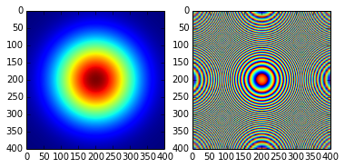

.. parsed-literal::

    FWHMx [mm]: 5.13005725474
    FWHMy [mm]: 5.13005725474
    Coordinates of center, [mm]: 0.0137167306277 0.0137167306277
    stepX, stepY [um]: 27.433461255317237 27.433461255317237 
    
    Total power (integrated over full range): 43.1073 [GW]
    Peak power calculated using FWHM:         43.9358 [GW]
    Max irradiance: 1.46734 [GW/mm^2]
    R-space
    FWHMx [mm], theta_fwhm [urad]: 5.13005725474 18.2564315115

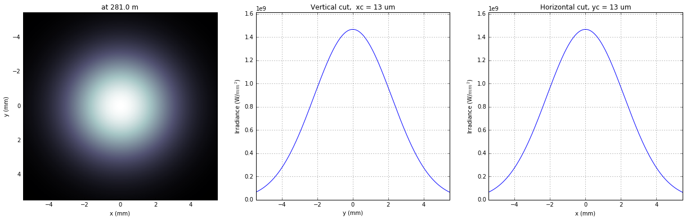

Defining optical beamline(s)
~~~~~~~~~~~~~~~~~~~~~~~~~~~~

.. code:: python

    print('*****Defining optical beamline(s) ...')
    
    z2 = d2hkb - d2m1
    
    DriftM1_KB = SRWLOptD(z2) #Drift from first offset mirror (M1) to exp hall
    horApM1 = 0.8*thetaOM
    opApM1 = SRWLOptA('r', 'a', horApM1, range_xy)  # clear aperture of the Offset Mirror(s)
    horApKB = 0.8 * thetaKB # Aperture of the KB system, CA 0.8 m
    opApKB = SRWLOptA('r', 'a', horApKB, horApKB)  # clear aperture of the Offset Mirror(s)
    
    #Wavefront Propagation Parameters:
    #[0]:  Auto-Resize (1) or not (0) Before propagation
    #[1]:  Auto-Resize (1) or not (0) After propagation
    #[2]:  Relative Precision for propagation with Auto-Resizing (1. is nominal)
    #[3]:  Allow (1) or not (0) for semi-analytical treatment of quadratic phase terms at propagation
    #[4]:  Do any Resizing on Fourier side, using FFT, (1) or not (0)
    #[5]:  Horizontal Range modification factor at Resizing (1. means no modification)
    #[6]:  Horizontal Resolution modification factor at Resizing
    #[7]:  Vertical Range modification factor at Resizing
    #[8]:  Vertical Resolution modification factor at Resizing
    #[9]:  Type of wavefront Shift before Resizing (not yet implemented)
    #[10]: New Horizontal wavefront Center position after Shift (not yet implemented)
    #[11]: New Vertical wavefront Center position after Shift (not yet implemented)
    #                 [ 0] [1] [2]  [3] [4] [5]  [6]  [7]  [8]  [9] [10] [11] 
    ppM1 =            [ 0,  0, 1.0,  0,  0, 1.0, 1.0, 1.0, 1.0,  0,  0,   0]
    ppTrErM1 =        [ 0,  0, 1.0,  0,  0, 1.0, 1.0, 1.0, 1.0,  0,  0,   0]
    ppDriftM1_KB =    [ 0,  0, 1.0,  1,  0, 2.4, 1.8, 2.4, 1.8,  0,  0,   0]
    ppApKB =          [ 0,  0, 1.0,  0,  0, 0.6, 8.0, 0.6, 4.0,  0,  0,   0]
    ppHKB =           [ 0,  0, 1.0,  1,  0, 1.0, 1.0, 1.0, 1.0,  0,  0,   0]
    ppTrErHKB =       [ 0,  0, 1.0,  0,  0, 1.0, 1.0, 1.0, 1.0,  0,  0,   0]
    ppDrift_HKB_foc = [ 0,  0, 1.0,  1,  0, 1.0, 1.0, 1.0, 1.0,  0,  0,   0]
    ppDrift_KB =      [ 0,  0, 1.0,  1,  0, 1.0, 1.0, 1.0, 1.0,  0,  0,   0]
    ppVKB =           [ 0,  0, 1.0,  0,  0, 1.0, 1.0, 1.0, 1.0,  0,  0,   0]
    ppTrErVKB =       [ 0,  0, 1.0,  0,  0, 1.0, 1.0, 1.0, 1.0,  0,  0,   0]
    ppDrift_foc =     [ 0,  0, 1.0,  1,  0, 1.0, 1.0, 1.0, 1.0,  0,  0,   0]
    #ppFin  =          [ 0,  0, 1.0,  0,  0, 0.05,5.0, 0.05,5.0,  0,  0,   0]
    #ppFin =           [ 0,  0, 1.0,  0,  1, .01, 20.0, .01, 20.0,  0,  0,   0]
    ppFin =           [ 0,  0, 1.0,  0,  1, .02, 10.0, .02, 10.0,  0,  0,   0]
    
    optBL0 = SRWLOptC([opApM1,  DriftM1_KB], 
                        [ppM1,ppDriftM1_KB]) 
    
    scale = 2     #5 mirror profile scaling factor 
    print('*****HOM1 data for BL1 beamline ')
    opTrErM1 = SRWLOptT(1500, 100, horApM1, range_xy)
    #defineOPD(opTrErM1, os.path.join(strInputDataFolder,'mirror1.dat'), 2, '\t', 'x',  thetaOM, scale)
    defineOPD(opTrErM1, os.path.join(strInputDataFolder,'mirror2.dat'), 2, ' ', 'x',  thetaOM, scale)
    opdTmp=np.array(opTrErM1.arTr)[1::2].reshape(opTrErM1.mesh.ny,opTrErM1.mesh.nx)
    plt.figure()
    plot_2d(opdTmp, opTrErM1.mesh.xStart*1e3,opTrErM1.mesh.xFin*1e3,opTrErM1.mesh.yStart*1e3,opTrErM1.mesh.yFin*1e3,
            'OPD [m]', 'x (mm)', 'y (mm)')  
    
    optBL1 = SRWLOptC([opApM1,opTrErM1,  DriftM1_KB], 
                        [ppM1,ppTrErM1,ppDriftM1_KB]) 
    
    dhkb_vkb = dhkb_foc - dvkb_foc          # distance between centers of HFM and VFM
    d2vkb = d2hkb +  dhkb_vkb
    vkbfoc =  1. /(1./dvkb_foc + 1. / d2vkb) # for thin lens approx
    hkbfoc =  1. /(1./dhkb_foc + 1. / d2hkb) # for thin lens approx 
    
    z3 = dhkb_vkb
    z4 = vkbfoc #distance to focal plane
    
    # HKB = SRWLOptMirEl(_p=d2hkb, _q=dhkb_foc, _ang_graz=thetaKB, _r_sag=1.e+40, _size_tang=0.85,
    #                    _nvx=cos(thetaKB), _nvy=0, _nvz=-sin(thetaKB), _tvx=-sin(thetaKB), _tvy=0,
    #                    _x=0, _y=0, _treat_in_out=1) #HKB Ellipsoidal Mirror
    # VKB = SRWLOptMirEl(_p=d2vkb, _q=dvkb_foc, _ang_graz=thetaKB, _r_sag=1.e+40, _size_tang=0.85,
    #                    _nvx=0, _nvy=cos(thetaKB), _nvz=-sin(thetaKB), _tvx=0, _tvy=-sin(thetaKB),
    #                    _x=0, _y=0, _treat_in_out=1) #VKB Ellipsoidal Mirror
    
    HKB = SRWLOptL(hkbfoc) #HKB as Thin Lens
    VKB = SRWLOptL(1e23,vkbfoc) #VKB as Thin Lens
    Drift_KB  = SRWLOptD(z3)
    Drift_foc = SRWLOptD(z4)
    optBL2 = SRWLOptC([opApM1,opTrErM1,  DriftM1_KB,opApKB, HKB,   Drift_KB,  VKB,  Drift_foc], 
                        [ppM1,ppTrErM1,ppDriftM1_KB,ppApKB,ppHKB,ppDrift_KB,ppVKB,ppDrift_foc,ppFin]) 

.. parsed-literal::

    *****Defining optical beamline(s) ...
    *****HOM1 data for BL1 beamline 

.. image:: output_14_1.png

.. image:: output_14_2.png

Propagating through BL0 beamline. Ideal mirror: HOM as an aperture
~~~~~~~~~~~~~~~~~~~~~~~~~~~~~~~~~~~~~~~~~~~~~~~~~~~~~~~~~~~~~~~~~~

.. code:: python

    print('*****Ideal mirror: HOM as an aperture')
    bPlotted = False
    isHlog = False
    isVlog = False
    bSaved = True
    optBL = optBL0
    strBL = 'bl0'
    pos_title = 'at exp hall wall'
    print('*****setting-up optical elements, beamline:', strBL)
    print_beamline(optBL)
    startTime = time.time()
    
    print('*****reading wavefront from h5 file...')
    w2 = Wavefront()
    w2.load_hdf5(ifname)
    wfr = w2._srwl_wf
    
    print('*****propagating wavefront (with resizing)...')
    srwl.PropagElecField(wfr, optBL)
    mwf = Wavefront(wfr)
    print('[nx, ny, xmin, xmax, ymin, ymax]', get_mesh(mwf))
    if bSaved:
        print('save hdf5:', fname0+'_'+strBL+'.h5')
        mwf.store_hdf5(os.path.join(strOutputDataFolder, fname0+'_'+strBL+'.h5'))
    print('done')
    print('propagation lasted:', round((time.time() - startTime) / 6.) / 10., 'min')

.. parsed-literal::

    *****Ideal mirror: HOM as an aperture
    *****setting-up optical elements, beamline: bl0
    Optical Element: Aperture / Obstacle
    Prop. parameters = [0, 0, 1.0, 0, 0, 1.0, 1.0, 1.0, 1.0, 0, 0, 0]
    	Dx = 0.0072
    	Dy = 0.0109459510409
    	ap_or_ob = a
    	shape = r
    	x = 0
    	y = 0
    	
    Optical Element: Drift Space
    Prop. parameters = [0, 0, 1.0, 1, 0, 2.4, 1.8, 2.4, 1.8, 0, 0, 0]
    	L = 161.3
    	treat = 0
    	
    
    *****reading wavefront from h5 file...
    *****propagating wavefront (with resizing)...
    [nx, ny, xmin, xmax, ymin, ymax] [1728, 1728, -0.019740897807083827, 0.019740897807083834, -0.02015430433530526, 0.020154304335305268]
    save hdf5: g0_800kev_bl0.h5
    done
    propagation lasted: 0.1 min

.. code:: python

    print('*****Ideal mirror: HOM as an aperture')
    plot_wfront(mwf, 'at '+str(z1+z2)+' m',False, False, 1e-5,1e-5,'x', True)
    plt.set_cmap('bone') #set color map, 'bone', 'hot', 'jet', etc
    plt.axis('tight')    
    print('FWHMx [mm], theta_fwhm [urad]:',calculate_fwhm_x(mwf)*1e3,calculate_fwhm_x(mwf)/(z1+z2)*1e6)
    print('FWHMy [mm], theta_fwhm [urad]:',calculate_fwhm_y(mwf)*1e3,calculate_fwhm_y(mwf)/(z1+z2)*1e6)

.. parsed-literal::

    *****Ideal mirror: HOM as an aperture
    FWHMx [mm]: 8.5730592677
    FWHMy [mm]: 8.1457466277
    Coordinates of center, [mm]: -0.0342922370708 0.15171161341
    stepX, stepY [um]: 22.86149138052557 23.34024821691403 
    
    Total power (integrated over full range): 39.2445 [GW]
    Peak power calculated using FWHM:         47.8113 [GW]
    Max irradiance: 0.601754 [GW/mm^2]
    R-space
    FWHMx [mm], theta_fwhm [urad]: 8.5730592677 19.3829058732
    FWHMy [mm], theta_fwhm [urad]: 8.1457466277 18.4167909286

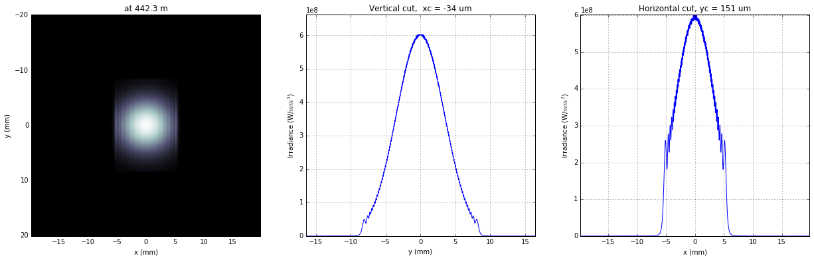

Propagating through BL1 beamline. Imperfect mirror, at KB aperture
~~~~~~~~~~~~~~~~~~~~~~~~~~~~~~~~~~~~~~~~~~~~~~~~~~~~~~~~~~~~~~~~~~

.. code:: python

    print ('*****Imperfect mirror, at KB aperture')
    bPlotted = False
    isHlog = True
    isVlog = False
    bSaved = False
    optBL = optBL1
    strBL = 'bl1'
    pos_title = 'at exp hall wall'
    print('*****setting-up optical elements, beamline:', strBL)
    print_beamline(optBL)
    startTime = time.time()
    print('*****reading wavefront from h5 file...')
    w2 = Wavefront()
    w2.load_hdf5(ifname)
    wfr = w2._srwl_wf
    print('*****propagating wavefront (with resizing)...')
    srwl.PropagElecField(wfr, optBL)
    mwf = Wavefront(wfr)
    print('[nx, ny, xmin, xmax, ymin, ymax]', get_mesh(mwf))
    if bSaved:
        print('save hdf5:', fname0+'_'+strBL+'.h5')
        mwf.store_hdf5(os.path.join(strOutputDataFolder,fname0+'_'+strBL+'.h5'))
    print('done')
    print('propagation lasted:', round((time.time() - startTime) / 6.) / 10., 'min')

.. parsed-literal::

    *****Imperfect mirror, at KB aperture
    *****setting-up optical elements, beamline: bl1
    Optical Element: Aperture / Obstacle
    Prop. parameters = [0, 0, 1.0, 0, 0, 1.0, 1.0, 1.0, 1.0, 0, 0, 0]
    	Dx = 0.0072
    	Dy = 0.0109459510409
    	ap_or_ob = a
    	shape = r
    	x = 0
    	y = 0
    	
    Optical Element: Transmission (generic)
    Prop. parameters = [0, 0, 1.0, 0, 0, 1.0, 1.0, 1.0, 1.0, 0, 0, 0]
    	Fx = 1e+23
    	Fy = 1e+23
    	arTr = array of size 300000
    	extTr = 0
    	mesh = Radiation Mesh (Sampling)
    		arSurf = None
    		eFin = 0
    		eStart = 0
    		hvx = 1
    		hvy = 0
    		hvz = 0
    		ne = 1
    		nvx = 0
    		nvy = 0
    		nvz = 1
    		nx = 1500
    		ny = 100
    		xFin = 0.0036
    		xStart = -0.0036
    		yFin = 0.00547297552044
    		yStart = -0.00547297552044
    		zStart = 0
    	
    	
    Optical Element: Drift Space
    Prop. parameters = [0, 0, 1.0, 1, 0, 2.4, 1.8, 2.4, 1.8, 0, 0, 0]
    	L = 161.3
    	treat = 0
    	
    
    *****reading wavefront from h5 file...
    *****propagating wavefront (with resizing)...
    [nx, ny, xmin, xmax, ymin, ymax] [1728, 1728, -0.01974162347178916, 0.019741623471789167, -0.02015430433530526, 0.020154304335305268]
    done
    propagation lasted: 0.1 min

.. code:: python

    print ('*****Imperfect mirror, at KB aperture')
    plot_wfront(mwf, 'at '+str(z1+z2)+' m',False, False, 1e-5,1e-5,'x', True)
    plt.set_cmap('bone') #set color map, 'bone', 'hot', etc
    plt.axis('tight')    
    print('FWHMx [mm], theta_fwhm [urad]:',calculate_fwhm_x(mwf)*1e3,calculate_fwhm_x(mwf)/(z1+z2)*1e6)
    print('FWHMy [mm], theta_fwhm [urad]:',calculate_fwhm_y(mwf)*1e3,calculate_fwhm_y(mwf)/(z1+z2)*1e6)

.. parsed-literal::

    *****Imperfect mirror, at KB aperture
    FWHMx [mm]: 7.93322911953
    FWHMy [mm]: 8.1457466277
    Coordinates of center, [mm]: -0.0342934976348 0.15171161341
    stepX, stepY [um]: 22.86233175655954 23.34024821691403 
    
    Total power (integrated over full range): 39.2445 [GW]
    Peak power calculated using FWHM:         47.2669 [GW]
    Max irradiance: 0.642883 [GW/mm^2]
    R-space
    FWHMx [mm], theta_fwhm [urad]: 7.93322911953 17.936308206
    FWHMy [mm], theta_fwhm [urad]: 8.1457466277 18.4167909286

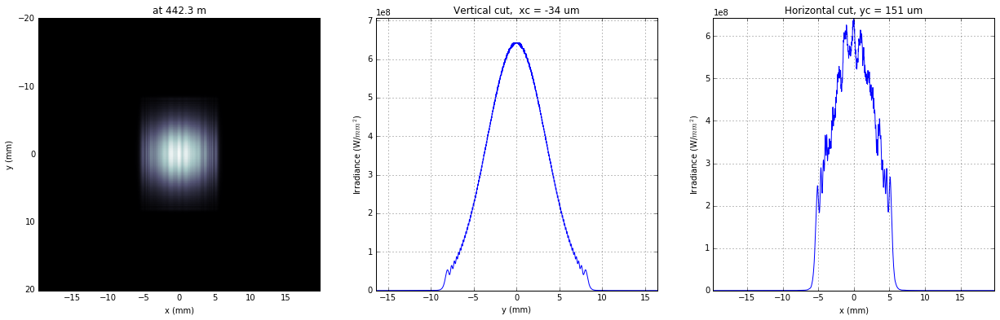

Propagating through BL2 beamline. Focused beam: perfect KB
~~~~~~~~~~~~~~~~~~~~~~~~~~~~~~~~~~~~~~~~~~~~~~~~~~~~~~~~~~

.. code:: python

    print('*****Focused beam: perfect KB')
    #optBL2 = SRWLOptC([opApM1,opTrErM1,  DriftM1_KB,opApKB, HKB,   Drift_KB,  VKB,  Drift_foc], 
    #                    [ppM1,ppTrErM1,ppDriftM1_KB,ppApKB,ppHKB,ppDrift_KB,ppVKB,ppDrift_foc]) 
    z3 = dhkb_vkb
    z4 = vkbfoc #distance to focal plane
    
    HKB = SRWLOptMirEl(_p=d2hkb, _q=dhkb_foc, _ang_graz=thetaKB, _r_sag=1.e+40, _size_tang=0.85,
                       _nvx=np.cos(thetaKB), _nvy=0, _nvz=-np.sin(thetaKB),
                       _tvx=-np.sin(thetaKB), _tvy=0, _x=0, _y=0, _treat_in_out=1) #HKB Ellipsoidal Mirror
    VKB = SRWLOptMirEl(_p=d2vkb, _q=dvkb_foc, _ang_graz=thetaKB, _r_sag=1.e+40, _size_tang=0.85,
                       _nvx=0, _nvy=np.cos(thetaKB), _nvz=-np.sin(thetaKB),
                       _tvx=0, _tvy=-np.sin(thetaKB), _x=0, _y=0, _treat_in_out=1) #VKB Ellipsoidal Mirror
    #HKB = SRWLOptL(hkbfoc) #HKB as Thin Lens
    #VKB = SRWLOptL(1e23,vkbfoc) #VKB as Thin Lens
    Drift_foc = SRWLOptD(dvkb_foc)
    optBL2 = SRWLOptC([opApM1,  DriftM1_KB,opApKB, HKB,   Drift_KB,  VKB,  Drift_foc], 
                        [ppM1,ppDriftM1_KB,ppApKB,ppHKB,ppDrift_KB,ppVKB,ppDrift_foc,ppFin]) 
    optBL = optBL2
    strBL = 'bl2'
    pos_title = 'at sample position'
    print('*****setting-up optical elements, beamline:', strBL)
    print_beamline(optBL)
    startTime = time.time()
    print('*****reading wavefront from h5 file...')
    w2 = Wavefront()
    w2.load_hdf5(ifname)
    wfr = w2._srwl_wf
    print('*****propagating wavefront (with resizing)...')
    srwl.PropagElecField(wfr, optBL)
    mwf = Wavefront(wfr)
    print('[nx, ny, xmin, xmax, ymin, ymax]', get_mesh(mwf))
    if bSaved:
        print('save hdf5:', fname0+'_'+strBL+'.h5')
        mwf.store_hdf5(os.path.join(strOutputDataFolder,fname0+'_'+strBL+'.h5'))
    print('done')
    print('propagation lasted:', round((time.time() - startTime) / 6.) / 10., 'min')

.. parsed-literal::

    *****Focused beam: perfect KB
    *****setting-up optical elements, beamline: bl2
    Optical Element: Aperture / Obstacle
    Prop. parameters = [0, 0, 1.0, 0, 0, 1.0, 1.0, 1.0, 1.0, 0, 0, 0]
    	Dx = 0.0072
    	Dy = 0.0109459510409
    	ap_or_ob = a
    	shape = r
    	x = 0
    	y = 0
    	
    Optical Element: Drift Space
    Prop. parameters = [0, 0, 1.0, 1, 0, 2.4, 1.8, 2.4, 1.8, 0, 0, 0]
    	L = 161.3
    	treat = 0
    	
    Optical Element: Aperture / Obstacle
    Prop. parameters = [0, 0, 1.0, 0, 0, 0.6, 8.0, 0.6, 4.0, 0, 0, 0]
    	Dx = 0.0072
    	Dy = 0.0072
    	ap_or_ob = a
    	shape = r
    	x = 0
    	y = 0
    	
    Optical Element: Mirror: Ellipsoid
    Prop. parameters = [0, 0, 1.0, 1, 0, 1.0, 1.0, 1.0, 1.0, 0, 0, 0]
    	Fx = 0
    	Fy = 0
    	angGraz = 0.009
    	apShape = r
    	arRefl = array of size 2
    	ds = 1
    	dt = 0.85
    	extIn = 0
    	extOut = 0
    	meth = 2
    	nps = 500
    	npt = 500
    	nvx = 0.999959500273
    	nvy = 0
    	nvz = -0.00899987850049
    	p = 442.3
    	q = 2.715
    	radSag = 1e+40
    	reflAngFin = 0
    	reflAngScaleType = lin
    	reflAngStart = 0
    	reflNumAng = 1
    	reflNumComp = 1
    	reflNumPhEn = 1
    	reflPhEnFin = 1000.0
    	reflPhEnScaleType = lin
    	reflPhEnStart = 1000.0
    	treatInOut = 1
    	tvx = -0.00899987850049
    	tvy = 0
    	x = 0
    	y = 0
    	
    Optical Element: Drift Space
    Prop. parameters = [0, 0, 1.0, 1, 0, 1.0, 1.0, 1.0, 1.0, 0, 0, 0]
    	L = 0.9999999999999998
    	treat = 0
    	
    Optical Element: Mirror: Ellipsoid
    Prop. parameters = [0, 0, 1.0, 0, 0, 1.0, 1.0, 1.0, 1.0, 0, 0, 0]
    	Fx = 0
    	Fy = 0
    	angGraz = 0.009
    	apShape = r
    	arRefl = array of size 2
    	ds = 1
    	dt = 0.85
    	extIn = 0
    	extOut = 0
    	meth = 2
    	nps = 500
    	npt = 500
    	nvx = 0
    	nvy = 0.999959500273
    	nvz = -0.00899987850049
    	p = 443.3
    	q = 1.715
    	radSag = 1e+40
    	reflAngFin = 0
    	reflAngScaleType = lin
    	reflAngStart = 0
    	reflNumAng = 1
    	reflNumComp = 1
    	reflNumPhEn = 1
    	reflPhEnFin = 1000.0
    	reflPhEnScaleType = lin
    	reflPhEnStart = 1000.0
    	treatInOut = 1
    	tvx = 0
    	tvy = -0.00899987850049
    	x = 0
    	y = 0
    	
    Optical Element: Drift Space
    Prop. parameters = [0, 0, 1.0, 1, 0, 1.0, 1.0, 1.0, 1.0, 0, 0, 0]
    	L = 1.715
    	treat = 0
    	
    Optical element: Empty.
        This is empty propagator used for sampling and zooming wavefront
        
    Prop. parameters = [0, 0, 1.0, 0, 1, 0.02, 10.0, 0.02, 10.0, 0, 0, 0]
    	
    
    *****reading wavefront from h5 file...
    *****propagating wavefront (with resizing)...
    [nx, ny, xmin, xmax, ymin, ymax] [1664, 832, -1.3331119492844142e-06, 1.347755378255926e-06, -1.6419426896857787e-06, 1.67847891996219e-06]
    done
    propagation lasted: 1.9 min

.. code:: python

    print ('*****Focused beam: Focused beam: perfect KB')
    bOnePlot = True
    isHlog = True
    isVlog = True
    bSaved = False
    #plot_wfront(mwf, 'at '+str(z1+z2+z3+z4)+' m',isHlog, isVlog, 1e-6,1e-6,'x', bOnePlot)
    dd0_v = plot_wfront(mwf, 'at '+str(z1+z2+z3+z4)+' m', False,  False,1e-6,1e-6, 'y', False,True)
    dd0_h = plot_wfront(mwf, 'at '+str(z1+z2+z3+z4)+' m',isHlog, isVlog,1e-6,1e-6, 'x', bOnePlot)
    plt.set_cmap('bone') #set color map, 'bone', 'hot', etc
    plt.axis('tight')    
    print('FWHMx [um], FWHMy [um]:',calculate_fwhm_x(mwf)*1e6,calculate_fwhm_y(mwf)*1e6)

.. parsed-literal::

    *****Focused beam: Focused beam: perfect KB
    FWHMx [mm]: 0.000565835497274
    FWHMy [mm]: 0.000311664122205
    Coordinates of center, [mm]: 4.84294215527e-05 -3.70820117114e-06
    stepX, stepY [um]: 0.0016120669438005656 0.003995693874425955 
    
    Total power (integrated over full range): 20.9969 [GW]
    Peak power calculated using FWHM:         20.3889 [GW]
    Max irradiance: 1.01619e+08 [GW/mm^2]
    R-space
    FWHMx[um]: 0.565835497274
    FWHMy [um]: 0.311664122205
    Coordinates of center, [mm]: 4.84294215527e-05 -3.70820117114e-06
    stepX, stepY [um]: 0.0016120669438005656 0.003995693874425955 
    
    Total power (integrated over full range): 20.9969 [GW]
    Peak power calculated using FWHM:         20.3889 [GW]
    Max irradiance: 1.01619e+08 [GW/mm^2]
    R-space
    FWHMx [um], FWHMy [um]: 0.565835497274 0.311664122205

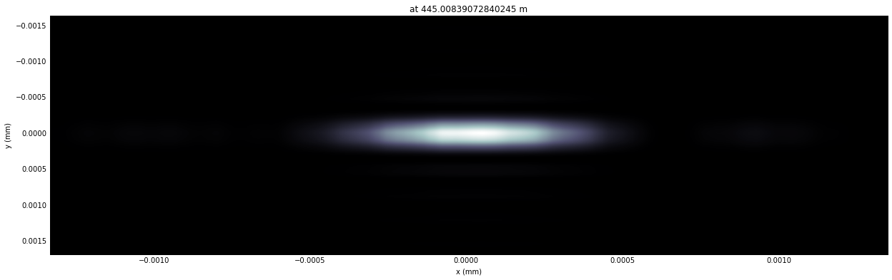

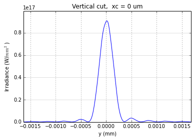

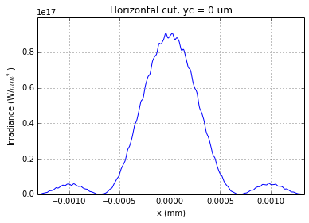

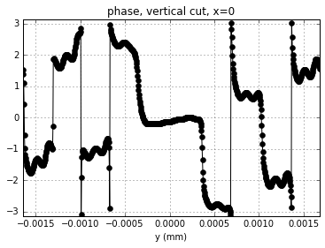

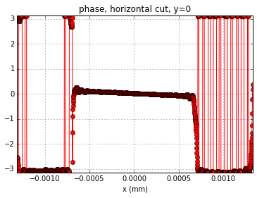

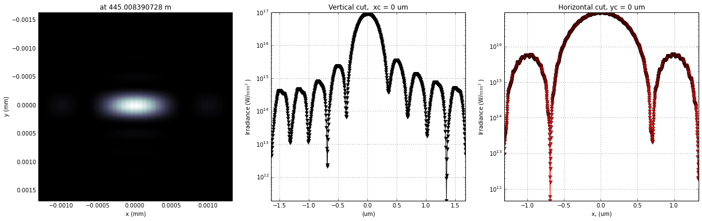

.. code:: python

    scaleKB = 8
    opTrErHKB = SRWLOptT(1500, 100, horApKB, horApKB)
    defineOPD(opTrErHKB, os.path.join(strInputDataFolder,'mirror1.dat'), 2, '\t', 'x',  thetaKB, scaleKB)
    opdTmp=np.array(opTrErHKB.arTr)[1::2].reshape(opTrErHKB.mesh.ny,opTrErHKB.mesh.nx)
    print('*****HKB data  ')
    plt.figure()
    #subplot()
    plot_2d(opdTmp, opTrErHKB.mesh.xStart*1e3,opTrErHKB.mesh.xFin*1e3,opTrErHKB.mesh.yStart*1e3,opTrErHKB.mesh.yFin*1e3,
            'OPD [m]', 'x (mm)', 'y (mm)')  
    print('*****VKB data  ')
    opTrErVKB = SRWLOptT(100, 1500, horApKB, horApKB)
    defineOPD(opTrErVKB, os.path.join(strInputDataFolder,'mirror2.dat'), 2, ' ', 'y',  thetaKB, scaleKB)
    opdTmp=np.array(opTrErVKB.arTr)[1::2].reshape(opTrErVKB.mesh.ny,opTrErVKB.mesh.nx)
    #subplot()
    plot_2d(opdTmp, opTrErVKB.mesh.xStart*1e3,opTrErVKB.mesh.xFin*1e3,opTrErVKB.mesh.yStart*1e3,opTrErVKB.mesh.yFin*1e3,
            'OPD [m]', 'x (mm)', 'y (mm)')  
    print(vkbfoc-dvkb_foc)

.. parsed-literal::

    *****HKB data  
    *****VKB data  
    -0.006609271597586286

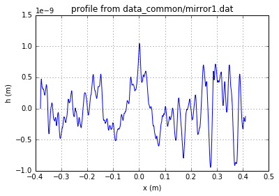

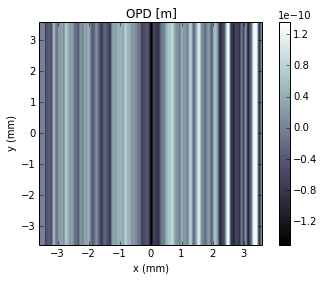

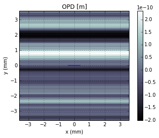

.. code:: python

    print('*****Focused beam: non-perfect KB')
    #optBL2 = SRWLOptC([opApM1,opTrErM1,  DriftM1_KB,opApKB, HKB,   Drift_KB,  VKB,  Drift_foc], 
    #                    [ppM1,ppTrErM1,ppDriftM1_KB,ppApKB,ppHKB,ppDrift_KB,ppVKB,ppDrift_foc]) 
    z3 = dhkb_vkb
    z4 = dvkb_foc #distance to focal plane
    #z4 = vkbfoc
    
    HKB = SRWLOptMirEl(_p=d2hkb, _q=dhkb_foc, _ang_graz=thetaKB, _r_sag=1.e+40, _size_tang=0.85,
                       _nvx=np.cos(thetaKB), _nvy=0, _nvz=-np.sin(thetaKB),
                       _tvx=-np.sin(thetaKB), _tvy=0, _x=0, _y=0, _treat_in_out=1) #HKB Ellipsoidal Mirror
    VKB = SRWLOptMirEl(_p=d2vkb, _q=dvkb_foc, _ang_graz=thetaKB, _r_sag=1.e+40, _size_tang=0.85,
                       _nvx=0, _nvy=np.cos(thetaKB), _nvz=-np.sin(thetaKB), _tvx=0, _tvy=-np.sin(thetaKB),
                       _x=0, _y=0, _treat_in_out=1) #VKB Ellipsoidal Mirror
    #HKB = SRWLOptL(hkbfoc) #HKB as Thin Lens
    #VKB = SRWLOptL(1e23,vkbfoc) #VKB as Thin Lens
    Drift_foc = SRWLOptD(z4)
    optBL2 = SRWLOptC([opApM1,  DriftM1_KB,opApKB, HKB,   Drift_KB,  VKB,  Drift_foc], 
                        [ppM1,ppDriftM1_KB,ppApKB,ppHKB,ppDrift_KB,ppVKB,ppDrift_foc,ppFin]) 
    optBL3 = SRWLOptC([opApM1,opTrErM1,  DriftM1_KB,opApKB, HKB,opTrErHKB,  Drift_KB,  VKB,opTrErVKB,  Drift_foc], 
                        [ppM1,ppTrErM1,ppDriftM1_KB,ppApKB,ppHKB,ppTrErM1,ppDrift_KB,ppVKB,ppTrErM1, ppDrift_foc,ppFin]) 
    optBL = optBL3
    strBL = 'bl3'
    pos_title = 'at sample position'
    print('*****setting-up optical elements, beamline:', strBL)
    print_beamline(optBL)
    startTime = time.time()
    print('*****reading wavefront from h5 file...')
    w2 = Wavefront()
    w2.load_hdf5(ifname)
    wfr = w2._srwl_wf
    print('*****propagating wavefront (with resizing)...')
    srwl.PropagElecField(wfr, optBL)
    mwf = Wavefront(wfr)
    print('[nx, ny, xmin, xmax, ymin, ymax]', get_mesh(mwf))
    if bSaved:
        print('save hdf5:', fname0+'_'+strBL+'.h5')
        mwf.store_hdf5(os.path.join(strOutputDataFolder,fname0+'_'+strBL+'.h5'))
    print('done')
    print('propagation lasted:', round((time.time() - startTime) / 6.) / 10., 'min')

.. parsed-literal::

    *****Focused beam: non-perfect KB
    *****setting-up optical elements, beamline: bl3
    Optical Element: Aperture / Obstacle
    Prop. parameters = [0, 0, 1.0, 0, 0, 1.0, 1.0, 1.0, 1.0, 0, 0, 0]
    	Dx = 0.0072
    	Dy = 0.0109459510409
    	ap_or_ob = a
    	shape = r
    	x = 0
    	y = 0
    	
    Optical Element: Transmission (generic)
    Prop. parameters = [0, 0, 1.0, 0, 0, 1.0, 1.0, 1.0, 1.0, 0, 0, 0]
    	Fx = 1e+23
    	Fy = 1e+23
    	arTr = array of size 300000
    	extTr = 0
    	mesh = Radiation Mesh (Sampling)
    		arSurf = None
    		eFin = 0
    		eStart = 0
    		hvx = 1
    		hvy = 0
    		hvz = 0
    		ne = 1
    		nvx = 0
    		nvy = 0
    		nvz = 1
    		nx = 1500
    		ny = 100
    		xFin = 0.0036
    		xStart = -0.0036
    		yFin = 0.00547297552044
    		yStart = -0.00547297552044
    		zStart = 0
    	
    	
    Optical Element: Drift Space
    Prop. parameters = [0, 0, 1.0, 1, 0, 2.4, 1.8, 2.4, 1.8, 0, 0, 0]
    	L = 161.3
    	treat = 0
    	
    Optical Element: Aperture / Obstacle
    Prop. parameters = [0, 0, 1.0, 0, 0, 0.6, 8.0, 0.6, 4.0, 0, 0, 0]
    	Dx = 0.0072
    	Dy = 0.0072
    	ap_or_ob = a
    	shape = r
    	x = 0
    	y = 0
    	
    Optical Element: Mirror: Ellipsoid
    Prop. parameters = [0, 0, 1.0, 1, 0, 1.0, 1.0, 1.0, 1.0, 0, 0, 0]
    	Fx = 0
    	Fy = 0
    	angGraz = 0.009
    	apShape = r
    	arRefl = array of size 2
    	ds = 1
    	dt = 0.85
    	extIn = 0
    	extOut = 0
    	meth = 2
    	nps = 500
    	npt = 500
    	nvx = 0.999959500273
    	nvy = 0
    	nvz = -0.00899987850049
    	p = 442.3
    	q = 2.715
    	radSag = 1e+40
    	reflAngFin = 0
    	reflAngScaleType = lin
    	reflAngStart = 0
    	reflNumAng = 1
    	reflNumComp = 1
    	reflNumPhEn = 1
    	reflPhEnFin = 1000.0
    	reflPhEnScaleType = lin
    	reflPhEnStart = 1000.0
    	treatInOut = 1
    	tvx = -0.00899987850049
    	tvy = 0
    	x = 0
    	y = 0
    	
    Optical Element: Transmission (generic)
    Prop. parameters = [0, 0, 1.0, 0, 0, 1.0, 1.0, 1.0, 1.0, 0, 0, 0]
    	Fx = 1e+23
    	Fy = 1e+23
    	arTr = array of size 300000
    	extTr = 0
    	mesh = Radiation Mesh (Sampling)
    		arSurf = None
    		eFin = 0
    		eStart = 0
    		hvx = 1
    		hvy = 0
    		hvz = 0
    		ne = 1
    		nvx = 0
    		nvy = 0
    		nvz = 1
    		nx = 1500
    		ny = 100
    		xFin = 0.0036
    		xStart = -0.0036
    		yFin = 0.0036
    		yStart = -0.0036
    		zStart = 0
    	
    	
    Optical Element: Drift Space
    Prop. parameters = [0, 0, 1.0, 1, 0, 1.0, 1.0, 1.0, 1.0, 0, 0, 0]
    	L = 0.9999999999999998
    	treat = 0
    	
    Optical Element: Mirror: Ellipsoid
    Prop. parameters = [0, 0, 1.0, 0, 0, 1.0, 1.0, 1.0, 1.0, 0, 0, 0]
    	Fx = 0
    	Fy = 0
    	angGraz = 0.009
    	apShape = r
    	arRefl = array of size 2
    	ds = 1
    	dt = 0.85
    	extIn = 0
    	extOut = 0
    	meth = 2
    	nps = 500
    	npt = 500
    	nvx = 0
    	nvy = 0.999959500273
    	nvz = -0.00899987850049
    	p = 443.3
    	q = 1.715
    	radSag = 1e+40
    	reflAngFin = 0
    	reflAngScaleType = lin
    	reflAngStart = 0
    	reflNumAng = 1
    	reflNumComp = 1
    	reflNumPhEn = 1
    	reflPhEnFin = 1000.0
    	reflPhEnScaleType = lin
    	reflPhEnStart = 1000.0
    	treatInOut = 1
    	tvx = 0
    	tvy = -0.00899987850049
    	x = 0
    	y = 0
    	
    Optical Element: Transmission (generic)
    Prop. parameters = [0, 0, 1.0, 0, 0, 1.0, 1.0, 1.0, 1.0, 0, 0, 0]
    	Fx = 1e+23
    	Fy = 1e+23
    	arTr = array of size 300000
    	extTr = 0
    	mesh = Radiation Mesh (Sampling)
    		arSurf = None
    		eFin = 0
    		eStart = 0
    		hvx = 1
    		hvy = 0
    		hvz = 0
    		ne = 1
    		nvx = 0
    		nvy = 0
    		nvz = 1
    		nx = 100
    		ny = 1500
    		xFin = 0.0036
    		xStart = -0.0036
    		yFin = 0.0036
    		yStart = -0.0036
    		zStart = 0
    	
    	
    Optical Element: Drift Space
    Prop. parameters = [0, 0, 1.0, 1, 0, 1.0, 1.0, 1.0, 1.0, 0, 0, 0]
    	L = 1.715
    	treat = 0
    	
    Optical element: Empty.
        This is empty propagator used for sampling and zooming wavefront
        
    Prop. parameters = [0, 0, 1.0, 0, 1, 0.02, 10.0, 0.02, 10.0, 0, 0, 0]
    	
    
    *****reading wavefront from h5 file...
    *****propagating wavefront (with resizing)...
    [nx, ny, xmin, xmax, ymin, ymax] [1664, 832, -1.3491024746288286e-06, 1.3639215498558462e-06, -1.6419426740561654e-06, 1.678478903984771e-06]
    done
    propagation lasted: 1.8 min

.. code:: python

    print ('*****Focused beam: Focused beam: non-perfect KB')
    bOnePlot = True
    isHlog = True
    isVlog = True
    bSaved = False
    #plot_wfront(mwf, 'at '+str(z1+z2+z3+z4)+' m',isHlog, isVlog, 1e-6,1e-6,'x', bOnePlot)
    dd1_v = plot_wfront(mwf, 'at '+str(z1+z2+z3+z4)+' m', False,  False,1e-6,1e-6, 'y', False,True)
    dd1_h = plot_wfront(mwf, 'at '+str(z1+z2+z3+z4)+' m',isHlog, isVlog,1e-6,1e-6, 'x', bOnePlot)
    plt.set_cmap('bone') #set color map, 'bone', 'hot', etc
    plt.axis('tight')    
    print('FWHMx [um], FWHMy [um]:',calculate_fwhm_x(mwf)*1e6,calculate_fwhm_y(mwf)*1e6)

.. parsed-literal::

    *****Focused beam: Focused beam: non-perfect KB
    FWHMx [mm]: 0.00062645894492
    FWHMy [mm]: 0.000335638282257
    Coordinates of center, [mm]: 8.22523936471e-06 1.62702680461e-05
    stepX, stepY [um]: 0.0016314035023960764 0.003995693836391019 
    
    Total power (integrated over full range): 20.2694 [GW]
    Peak power calculated using FWHM:         16.2036 [GW]
    Max irradiance: 6.77334e+07 [GW/mm^2]
    R-space
    FWHMx[um]: 0.62645894492
    FWHMy [um]: 0.335638282257
    Coordinates of center, [mm]: 8.22523936471e-06 1.62702680461e-05
    stepX, stepY [um]: 0.0016314035023960764 0.003995693836391019 
    
    Total power (integrated over full range): 20.2694 [GW]
    Peak power calculated using FWHM:         16.2036 [GW]
    Max irradiance: 6.77334e+07 [GW/mm^2]
    R-space
    FWHMx [um], FWHMy [um]: 0.62645894492 0.335638282257

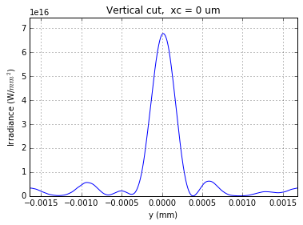

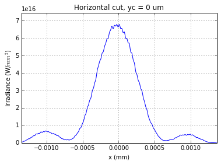

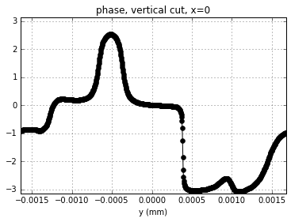

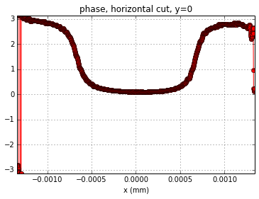

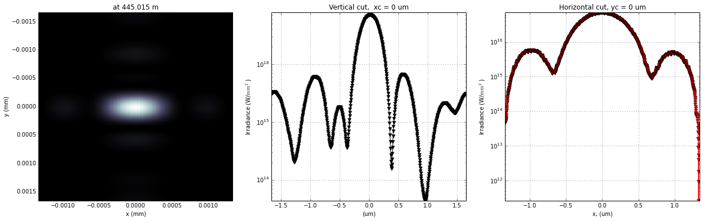

.. code:: python

    plt.figure()
    plt.plot(dd0_h[:,0]*1e6, dd0_h[:,1]/max(dd0_h[:,1]),#/ max(dd21_950_h[:,1]),
         dd1_h[:,0]*1e6, dd1_h[:,1]/max(dd0_h[:,1]),'--r')#/max(dd120_950_h[:,1]),'--r')
    plt.xlim([-1.5,1.5])
    #ylim([0,1.5])
    plt.title('horizontal cut')
    #legend(["4 nm PV height errors","ideal KB"])
    plt.xlabel('[$m$m]')
    plt.grid(True)
    plt.show()
    plt.figure()
    plt.plot(dd0_v[:,0]*1e6, dd0_v[:,1]/max(dd0_v[:,1]),#/ max(dd21_950_h[:,1]),
         dd1_v[:,0]*1e6, dd1_v[:,1]/max(dd0_v[:,1]),'--r')#/max(dd120_950_h[:,1]),'--r')
    plt.xlim([-1.5,1.5])
    #ylim([0,1.5])
    plt.title('vertical cut')
    #legend(["4 nm PV height errors","ideal KB"])
    plt.xlabel('[$\mu m$]')
    plt.grid(True)
    plt.show()

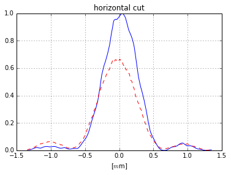

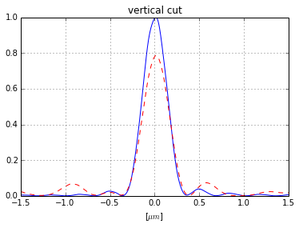

.. code:: python

    print('*****Focused beam behind focus: perfect KB')
    #optBL2 = SRWLOptC([opApM1,opTrErM1,  DriftM1_KB,opApKB, HKB,   Drift_KB,  VKB,  Drift_foc], 
    #                    [ppM1,ppTrErM1,ppDriftM1_KB,ppApKB,ppHKB,ppDrift_KB,ppVKB,ppDrift_foc]) 
    z3 = dhkb_vkb
    #z4 = dvkb_foc #distance to focal plane
    z4 = vkbfoc
    
    HKB = SRWLOptMirEl(_p=d2hkb, _q=dhkb_foc, _ang_graz=thetaKB, _r_sag=1.e+40, _size_tang=0.85,
                       _nvx=np.cos(thetaKB), _nvy=0, _nvz=-np.sin(thetaKB), _tvx=-np.sin(thetaKB),
                       _tvy=0, _x=0, _y=0, _treat_in_out=1) #HKB Ellipsoidal Mirror
    VKB = SRWLOptMirEl(_p=d2vkb, _q=dvkb_foc, _ang_graz=thetaKB, _r_sag=1.e+40, _size_tang=0.85,
                       _nvx=0, _nvy=np.cos(thetaKB), _nvz=-np.sin(thetaKB), _tvx=0, _tvy=-np.sin(thetaKB),
                       _x=0, _y=0, _treat_in_out=1) #VKB Ellipsoidal Mirror
    #HKB = SRWLOptL(hkbfoc) #HKB as Thin Lens
    #VKB = SRWLOptL(1e23,vkbfoc) #VKB as Thin Lens
    Drift_foc = SRWLOptD(z4)
    optBL2 = SRWLOptC([opApM1,  DriftM1_KB,opApKB, HKB,   Drift_KB,  VKB,  Drift_foc], 
                        [ppM1,ppDriftM1_KB,ppApKB,ppHKB,ppDrift_KB,ppVKB,ppDrift_foc]) 
    #optBL3 = SRWLOptC([opApM1,opTrErM1,  DriftM1_KB,opApKB, HKB,opTrErHKB,  Drift_KB,  VKB,opTrErVKB,  Drift_foc], 
    #                    [ppM1,ppTrErM1,ppDriftM1_KB,ppApKB,ppHKB,ppTrErM1,ppDrift_KB,ppVKB,ppTrErM1, ppDrift_foc]) 
    optBL = optBL2
    strBL = 'bl2'
    pos_title = 'behind the focus'
    print('*****setting-up optical elements, beamline:', strBL)
    print_beamline(optBL)
    startTime = time.time()
    print('*****reading wavefront from h5 file...')
    w2 = Wavefront()
    w2.load_hdf5(ifname)
    wfr = w2._srwl_wf
    print('*****propagating wavefront (with resizing)...')
    srwl.PropagElecField(wfr, optBL)
    mwf = Wavefront(wfr)
    print('[nx, ny, xmin, xmax, ymin, ymax]', get_mesh(mwf))
    if bSaved:
        print('save hdf5:', fname0+'_'+strBL+'.h5')
        mwf.store_hdf5(os.path.join(strOutputDataFolder,fname0+'_'+strBL+'.h5'))
    print('done')
    print('propagation lasted:', round((time.time() - startTime) / 6.) / 10., 'min')

.. parsed-literal::

    *****Focused beam behind focus: perfect KB
    *****setting-up optical elements, beamline: bl2
    Optical Element: Aperture / Obstacle
    Prop. parameters = [0, 0, 1.0, 0, 0, 1.0, 1.0, 1.0, 1.0, 0, 0, 0]
    	Dx = 0.0072
    	Dy = 0.0109459510409
    	ap_or_ob = a
    	shape = r
    	x = 0
    	y = 0
    	
    Optical Element: Drift Space
    Prop. parameters = [0, 0, 1.0, 1, 0, 2.4, 1.8, 2.4, 1.8, 0, 0, 0]
    	L = 161.3
    	treat = 0
    	
    Optical Element: Aperture / Obstacle
    Prop. parameters = [0, 0, 1.0, 0, 0, 0.6, 8.0, 0.6, 4.0, 0, 0, 0]
    	Dx = 0.0072
    	Dy = 0.0072
    	ap_or_ob = a
    	shape = r
    	x = 0
    	y = 0
    	
    Optical Element: Mirror: Ellipsoid
    Prop. parameters = [0, 0, 1.0, 1, 0, 1.0, 1.0, 1.0, 1.0, 0, 0, 0]
    	Fx = 0
    	Fy = 0
    	angGraz = 0.009
    	apShape = r
    	arRefl = array of size 2
    	ds = 1
    	dt = 0.85
    	extIn = 0
    	extOut = 0
    	meth = 2
    	nps = 500
    	npt = 500
    	nvx = 0.999959500273
    	nvy = 0
    	nvz = -0.00899987850049
    	p = 442.3
    	q = 2.715
    	radSag = 1e+40
    	reflAngFin = 0
    	reflAngScaleType = lin
    	reflAngStart = 0
    	reflNumAng = 1
    	reflNumComp = 1
    	reflNumPhEn = 1
    	reflPhEnFin = 1000.0
    	reflPhEnScaleType = lin
    	reflPhEnStart = 1000.0
    	treatInOut = 1
    	tvx = -0.00899987850049
    	tvy = 0
    	x = 0
    	y = 0
    	
    Optical Element: Drift Space
    Prop. parameters = [0, 0, 1.0, 1, 0, 1.0, 1.0, 1.0, 1.0, 0, 0, 0]
    	L = 0.9999999999999998
    	treat = 0
    	
    Optical Element: Mirror: Ellipsoid
    Prop. parameters = [0, 0, 1.0, 0, 0, 1.0, 1.0, 1.0, 1.0, 0, 0, 0]
    	Fx = 0
    	Fy = 0
    	angGraz = 0.009
    	apShape = r
    	arRefl = array of size 2
    	ds = 1
    	dt = 0.85
    	extIn = 0
    	extOut = 0
    	meth = 2
    	nps = 500
    	npt = 500
    	nvx = 0
    	nvy = 0.999959500273
    	nvz = -0.00899987850049
    	p = 443.3
    	q = 1.715
    	radSag = 1e+40
    	reflAngFin = 0
    	reflAngScaleType = lin
    	reflAngStart = 0
    	reflNumAng = 1
    	reflNumComp = 1
    	reflNumPhEn = 1
    	reflPhEnFin = 1000.0
    	reflPhEnScaleType = lin
    	reflPhEnStart = 1000.0
    	treatInOut = 1
    	tvx = 0
    	tvy = -0.00899987850049
    	x = 0
    	y = 0
    	
    Optical Element: Drift Space
    Prop. parameters = [0, 0, 1.0, 1, 0, 1.0, 1.0, 1.0, 1.0, 0, 0, 0]
    	L = 1.7083907284024138
    	treat = 0
    	
    
    *****reading wavefront from h5 file...
    *****propagating wavefront (with resizing)...
    [nx, ny, xmin, xmax, ymin, ymax] [8316, 4158, -6.784130971441318e-05, 6.784130971441323e-05, -8.456925201660192e-05, 8.4569252016602e-05]
    done
    propagation lasted: 1.6 min

.. code:: python

    print('*****Focused beam behind focus: perfect KB')
    bOnePlot = True
    isHlog = False
    isVlog = False
    bSaved = False
    plot_wfront(mwf, 'at '+str(z1+z2+z3+z4)+' m',isHlog, isVlog, 1e-6,1e-6,'x', bOnePlot)
    plt.set_cmap('bone') #set color map, 'bone', 'hot', etc
    plt.axis('tight')    
    print('FWHMx [um], FWHMy [um]:',calculate_fwhm_x(mwf)*1e6,calculate_fwhm_y(mwf)*1e6)

.. parsed-literal::

    *****Focused beam behind focus: perfect KB
    FWHMx [mm]: 0.0144086293392
    FWHMy [mm]: 0.024778770497
    Coordinates of center, [mm]: 0.00279850501889 0.0096226259812
    stepX, stepY [um]: 0.016317813521205822 0.04068763628414816 
    
    Total power (integrated over full range): 21.8569 [GW]
    Peak power calculated using FWHM:         37.3409 [GW]
    Max irradiance: 91925.9 [GW/mm^2]
    R-space
    FWHMx [um], FWHMy [um]: 14.4086293392 24.778770497

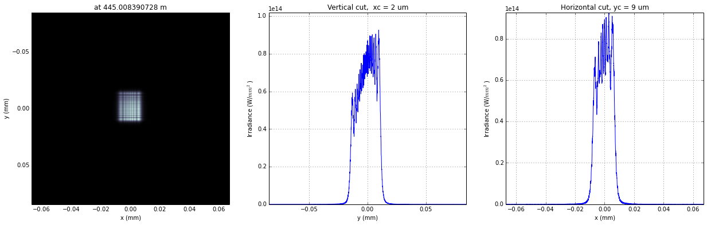

.. code:: python

    print('*****Focused beam behind focus: perfect KB')
    #optBL2 = SRWLOptC([opApM1,opTrErM1,  DriftM1_KB,opApKB, HKB,   Drift_KB,  VKB,  Drift_foc], 
    #                    [ppM1,ppTrErM1,ppDriftM1_KB,ppApKB,ppHKB,ppDrift_KB,ppVKB,ppDrift_foc]) 
    z3 = dhkb_vkb
    #z4 = dvkb_foc #distance to focal plane
    z4 = vkbfoc
    
    HKB = SRWLOptMirEl(_p=d2hkb, _q=dhkb_foc, _ang_graz=thetaKB, _r_sag=1.e+40, _size_tang=0.85,
                       _nvx=np.cos(thetaKB), _nvy=0, _nvz=-np.sin(thetaKB), _tvx=-np.sin(thetaKB),
                       _tvy=0, _x=0, _y=0, _treat_in_out=1) #HKB Ellipsoidal Mirror
    VKB = SRWLOptMirEl(_p=d2vkb, _q=dvkb_foc, _ang_graz=thetaKB, _r_sag=1.e+40, _size_tang=0.85,
                       _nvx=0, _nvy=np.cos(thetaKB), _nvz=-np.sin(thetaKB), _tvx=0, _tvy=-np.sin(thetaKB),
                       _x=0, _y=0, _treat_in_out=1) #VKB Ellipsoidal Mirror
    #HKB = SRWLOptL(hkbfoc) #HKB as Thin Lens
    #VKB = SRWLOptL(1e23,vkbfoc) #VKB as Thin Lens
    Drift_foc = SRWLOptD(z4)
    optBL2 = SRWLOptC([opApM1,  DriftM1_KB,opApKB, HKB,   Drift_KB,  VKB,  Drift_foc], 
                        [ppM1,ppDriftM1_KB,ppApKB,ppHKB,ppDrift_KB,ppVKB,ppDrift_foc]) 
    #optBL3 = SRWLOptC([opApM1,opTrErM1,  DriftM1_KB,opApKB, HKB,opTrErHKB,  Drift_KB,  VKB,opTrErVKB,  Drift_foc], 
    #                    [ppM1,ppTrErM1,ppDriftM1_KB,ppApKB,ppHKB,ppTrErM1,ppDrift_KB,ppVKB,ppTrErM1, ppDrift_foc]) 
    optBL = optBL2
    strBL = 'bl2'
    pos_title = 'behind the focus'
    print('*****setting-up optical elements, beamline:', strBL)
    print_beamline(optBL)
    startTime = time.time()
    print('*****reading wavefront from h5 file...')
    w2 = Wavefront()
    w2.load_hdf5(ifname)
    wfr = w2._srwl_wf
    print('*****propagating wavefront (with resizing)...')
    srwl.PropagElecField(wfr, optBL)
    mwf = Wavefront(wfr)
    print('[nx, ny, xmin, xmax, ymin, ymax]', get_mesh(mwf))
    if bSaved:
        print('save hdf5:', fname0+'_'+strBL+'.h5')
        mwf.store_hdf5(os.path.join(strOutputDataFolder,fname0+'_'+strBL+'.h5'))
    print('done')
    print('propagation lasted:', round((time.time() - startTime) / 6.) / 10., 'min')

.. parsed-literal::

    *****Focused beam behind focus: perfect KB
    *****setting-up optical elements, beamline: bl2
    Optical Element: Aperture / Obstacle
    Prop. parameters = [0, 0, 1.0, 0, 0, 1.0, 1.0, 1.0, 1.0, 0, 0, 0]
    	Dx = 0.0072
    	Dy = 0.0109459510409
    	ap_or_ob = a
    	shape = r
    	x = 0
    	y = 0
    	
    Optical Element: Drift Space
    Prop. parameters = [0, 0, 1.0, 1, 0, 2.4, 1.8, 2.4, 1.8, 0, 0, 0]
    	L = 161.3
    	treat = 0
    	
    Optical Element: Aperture / Obstacle
    Prop. parameters = [0, 0, 1.0, 0, 0, 0.6, 8.0, 0.6, 4.0, 0, 0, 0]
    	Dx = 0.0072
    	Dy = 0.0072
    	ap_or_ob = a
    	shape = r
    	x = 0
    	y = 0
    	
    Optical Element: Mirror: Ellipsoid
    Prop. parameters = [0, 0, 1.0, 1, 0, 1.0, 1.0, 1.0, 1.0, 0, 0, 0]
    	Fx = 0
    	Fy = 0
    	angGraz = 0.009
    	apShape = r
    	arRefl = array of size 2
    	ds = 1
    	dt = 0.85
    	extIn = 0
    	extOut = 0
    	meth = 2
    	nps = 500
    	npt = 500
    	nvx = 0.999959500273
    	nvy = 0
    	nvz = -0.00899987850049
    	p = 442.3
    	q = 2.715
    	radSag = 1e+40
    	reflAngFin = 0
    	reflAngScaleType = lin
    	reflAngStart = 0
    	reflNumAng = 1
    	reflNumComp = 1
    	reflNumPhEn = 1
    	reflPhEnFin = 1000.0
    	reflPhEnScaleType = lin
    	reflPhEnStart = 1000.0
    	treatInOut = 1
    	tvx = -0.00899987850049
    	tvy = 0
    	x = 0
    	y = 0
    	
    Optical Element: Drift Space
    Prop. parameters = [0, 0, 1.0, 1, 0, 1.0, 1.0, 1.0, 1.0, 0, 0, 0]
    	L = 0.9999999999999998
    	treat = 0
    	
    Optical Element: Mirror: Ellipsoid
    Prop. parameters = [0, 0, 1.0, 0, 0, 1.0, 1.0, 1.0, 1.0, 0, 0, 0]
    	Fx = 0
    	Fy = 0
    	angGraz = 0.009
    	apShape = r
    	arRefl = array of size 2
    	ds = 1
    	dt = 0.85
    	extIn = 0
    	extOut = 0
    	meth = 2
    	nps = 500
    	npt = 500
    	nvx = 0
    	nvy = 0.999959500273
    	nvz = -0.00899987850049
    	p = 443.3
    	q = 1.715
    	radSag = 1e+40
    	reflAngFin = 0
    	reflAngScaleType = lin
    	reflAngStart = 0
    	reflNumAng = 1
    	reflNumComp = 1
    	reflNumPhEn = 1
    	reflPhEnFin = 1000.0
    	reflPhEnScaleType = lin
    	reflPhEnStart = 1000.0
    	treatInOut = 1
    	tvx = 0
    	tvy = -0.00899987850049
    	x = 0
    	y = 0
    	
    Optical Element: Drift Space
    Prop. parameters = [0, 0, 1.0, 1, 0, 1.0, 1.0, 1.0, 1.0, 0, 0, 0]
    	L = 1.7083907284024138
    	treat = 0
    	
    
    *****reading wavefront from h5 file...
    *****propagating wavefront (with resizing)...
    [nx, ny, xmin, xmax, ymin, ymax] [8316, 4158, -6.784130971441318e-05, 6.784130971441323e-05, -8.456925201660192e-05, 8.4569252016602e-05]
    done
    propagation lasted: 1.5 min

.. code:: python

    print('*****Focused beam behind focus: perfect KB')
    bOnePlot = True
    isHlog = False
    isVlog = False
    bSaved = False
    plot_wfront(mwf, 'at '+str(z1+z2+z3+z4)+' m',isHlog, isVlog, 1e-6,1e-6,'x', bOnePlot)
    plt.set_cmap('bone') #set color map, 'bone', 'hot', etc
    plt.axis('tight')    
    print('FWHMx [um], FWHMy [um]:',calculate_fwhm_x(mwf)*1e6,calculate_fwhm_y(mwf)*1e6)

.. parsed-literal::

    *****Focused beam behind focus: perfect KB
    FWHMx [mm]: 0.0144086293392
    FWHMy [mm]: 0.024778770497
    Coordinates of center, [mm]: 0.00279850501889 0.0096226259812
    stepX, stepY [um]: 0.016317813521205822 0.04068763628414816 
    
    Total power (integrated over full range): 21.8569 [GW]
    Peak power calculated using FWHM:         37.3409 [GW]
    Max irradiance: 91925.9 [GW/mm^2]
    R-space
    FWHMx [um], FWHMy [um]: 14.4086293392 24.778770497

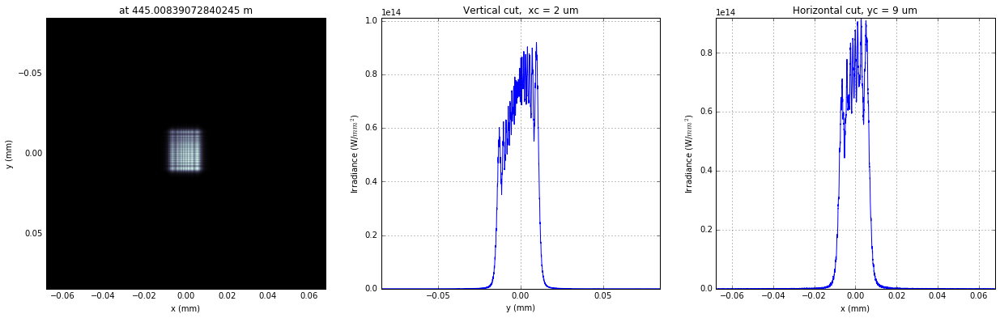

