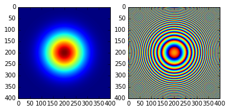
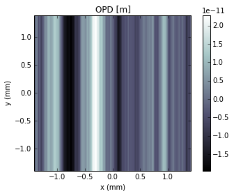
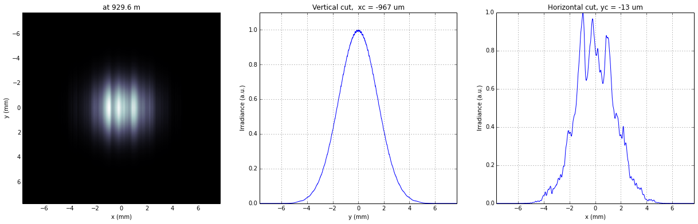
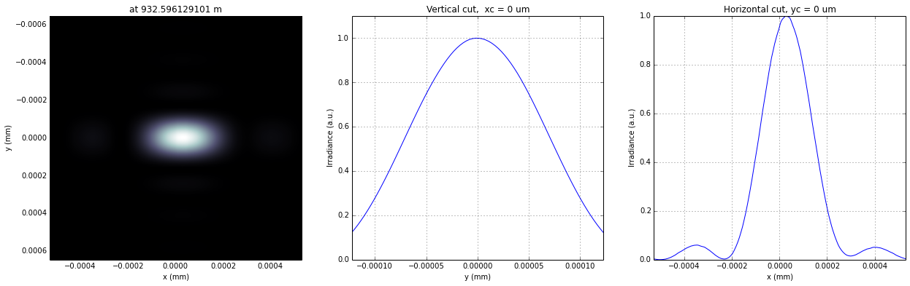
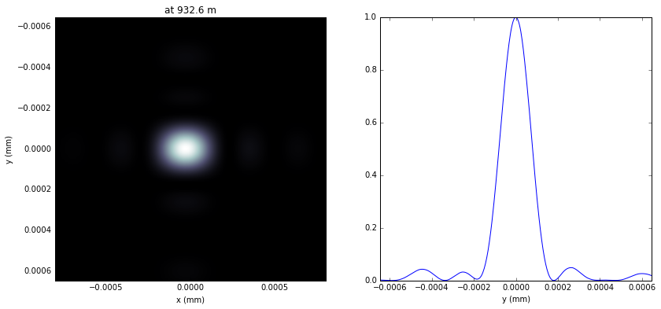
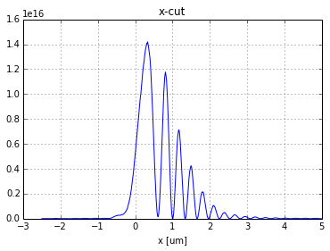
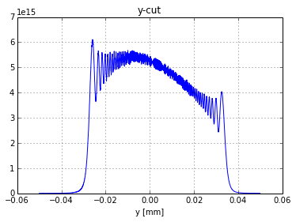

Wavefront propagation simulation tutorial - Case 3\_new
=======================================================

L.Samoylova liubov.samoylova@xfel.eu, A.Buzmakov buzmakov@gmail.com

Tutorial course on Wavefront Propagation Simulations, 28/11/2013,
European XFEL, Hamburg.

Wave optics software is based on SRW core library
https://github.com/ochubar/SRW, available through WPG interactive
framework https://github.com/samoylv/WPG

Propagation Gaussian through HOM and KB optics: extended analysis
-----------------------------------------------------------------

Import modules
~~~~~~~~~~~~~~

.. code:: python

    %pylab inline

.. parsed-literal::

    Populating the interactive namespace from numpy and matplotlib

.. code:: python

    #Importing necessary modules:
    
    import os
    import sys
    sys.path.insert(0,os.path.join('..','..'))
    
    import time
    import copy
    import numpy
    import pylab
    
    
    #import SRW core functions
    from wpg.srwlib import srwl,SRWLOptD,SRWLOptA,SRWLOptC,SRWLOptT,SRWLOptL,SRWLOptMirEl
    
    #import SRW helpers functions
    from wpg.useful_code.srwutils import AuxTransmAddSurfHeightProfileScaled
    
    #import some helpers functions
    from wpg.useful_code.wfrutils import calculate_fwhm_x, plot_wfront, calculate_fwhm_y, print_beamline, get_mesh, plot_1d, plot_2d
    from wpg.useful_code.wfrutils import propagate_wavefront
    
    #Import base wavefront class
    from wpg import Wavefront
    
    #Gaussian beam generator
    from wpg.generators import build_gauss_wavefront_xy
    from wpg.beamline import Beamline
    from wpg.optical_elements import Empty, Use_PP
    
    pylab.ion()
Define auxiliary functions
~~~~~~~~~~~~~~~~~~~~~~~~~~

.. code:: python

    def _resample(wf, axis, data, x0, x1):
        if axis.lower()=='x':
            y = data[data.shape[0]/2,:]
            x = numpy.linspace(wf.params.Mesh.xMin, wf.params.Mesh.xMax, y.shape[0])
        elif axis.lower()=='y':
            y = data[:,data.shape[1]/2]
            x = numpy.linspace(wf.params.Mesh.yMin, wf.params.Mesh.yMax, y.shape[0])
        else:
            raise ValueError(
                'Wrong axis {}, should be "x" or "y"'.format(axis))
        
        if not x0 is None:
            xmin = x0
        else:
            xmin = x[0]
        
        if not x1 is None:
            xmax = x1
        else:
            xmax = x[-1] 
        
        x1 = numpy.linspace(xmin,xmax,len(y))
        y1 = numpy.interp(x1, x,y)
        return x1, y1
        
    def intensity_cut(wf, axis, polarization, x0=None, x1=None):
        
        if polarization.lower()  == 'v' or polarization.lower() == 'vertical':
            pol = 'vertical'
        elif polarization.lower() == 'h' or polarization.lower() == 'horizontal':
            pol = 'horizontal'
        elif polarization.lower() == 't' or polarization.lower() == 'total':
            pol = 'total'
        else:
            raise ValueError(
                'Wrong polarization {}, should be "v" or "vertical"'+
                ' or "h" or "horizontal" or "t" or "total"'.format(polarization))
        
        data = wf.get_intensity(slice_number=0, polarization=pol)
        return _resample(wf, axis, data, x0, x1)
    
    def phase_cut(wf, axis, polarization, x0=None, x1=None):
        
        if polarization.lower()  == 'v' or polarization.lower() == 'vertical':
            pol = 'vertical'
        elif polarization.lower() == 'h' or polarization.lower() == 'horizontal':
            pol = 'horizontal'
        else:
            raise ValueError(
                'Wrong polarization {}, should be "v" or "vertical" or "h" or "horizontal"'.format(polarization))
        
        data = wf.get_phase(slice_number=0, polarization=pol)
        return _resample(wf, axis, data, x0, x1)
.. code:: python

    def calculate_source_fwhm(ekev, theta_fwhm):
        """
        Calculate source size from photon energy and FWHM angular divergence
        
        :param evev: Energy in keV
        :param theta_fwhm: theta_fwhm [units?] 
        """
        wl = 12.39e-10/ekev
        k = 2 * numpy.sqrt(2*numpy.log(2))
        theta_sigma = theta_fwhm /k
        sigma0 = wl /(2*numpy.pi*theta_sigma)
        return sigma0*k
    
    def calculate_theta_fwhm_cdr(ekev,qnC):
        """
        Calculate angular divergence using formula from XFEL CDR2011
        
        :param ekev: Energy in keV
        :param qnC: e-bunch charge, [nC]
        :return: theta_fwhm [units?]
        """
        theta_fwhm = (17.2 - 6.4 * numpy.sqrt(qnC))*1e-6/ekev**0.85
        return theta_fwhm
    
    def defineOPD(opTrErMirr, mdatafile, ncol, delim, Orient, theta, scale):
        """
        Define optical path difference (OPD) from mirror profile, i.e. ill the struct opTrErMirr
        
        :params mdatafile: an ascii file with mirror profile data
        :params ncol: number of columns in the file
        :params delim: delimiter between numbers in an row, can be space (' '), tab '\t', etc
        :params orient: mirror orientation, 'x' (horizontal) or 'y' (vertical)
        :params theta: incidence angle
        :params scale: scaling factor for the mirror profile    
        """
        heightProfData = numpy.loadtxt(mdatafile).T
        AuxTransmAddSurfHeightProfileScaled(opTrErMirr, heightProfData, Orient, theta, scale)
        pylab.figure()
        plot_1d(heightProfData,'profile from ' + mdatafile,'x (m)', 'h (m)')
.. code:: python

    def defineEFM(orient,p,q,thetaEFM,theta0,lengthEFM):
        """
        A wrapper to a SRWL function SRWLOptMirEl() for defining a plane elliptical focusing mirror propagator
        
        :param Orient:    mirror orientation, 'x' (horizontal) or 'y' (vertical)
        :param p:  the distance to two ellipsis centers
        :param q:  the distance to two ellipsis centers
        :param thetaEFM:  the design incidence angle in the center of the mirror
        :param theta0:    the "real" incidence angle in the center of the mirror
        :param lengthEFM: mirror length, [m]
        :return: the struct opEFM
        """
        if orient == 'x':     #horizontal plane ellipsoidal mirror
            opEFM = SRWLOptMirEl(_p=p, _q=q, _ang_graz=thetaEFM, _r_sag=1.e+40, _size_tang=lengthEFM, 
                _nvx=cos(theta0), _nvy=0, _nvz=-sin(theta0), _tvx=-sin(theta0), _tvy=0, _x=0, _y=0, _treat_in_out=1) 
        elif orient == 'y': #vertical plane ellipsoidal mirror
            opEFM = SRWLOptMirEl(_p=p, _q=q, _ang_graz=thetaEFM, _r_sag=1.e+40, _size_tang=lengthEFM, 
                _nvx=0, _nvy=cos(theta0), _nvz=-sin(theta0), _tvx=0, _tvy=-sin(theta0), _x=0, _y=0, _treat_in_out=1)
        else:
            raise TypeError('orient should be "x" or "y"')
        return opEFM
Defining initial wavefront and writing electric field data to h5-file
~~~~~~~~~~~~~~~~~~~~~~~~~~~~~~~~~~~~~~~~~~~~~~~~~~~~~~~~~~~~~~~~~~~~~

.. code:: python

    # #**********************Input Wavefront Structure and Parameters
    print('*****defining initial wavefront and writing electric field data to h5-file...')
    strInputDataFolder = 'data_common'  # input data sub-folder name
    strOutputDataFolder = 'Tutorial_case_3'  # output data sub-folder name
    
    #init Gauusian beam parameters
    d2m1_sase1 = 246.5
    d2m1_sase2 = 290.0
    d2m1_sase3 = 281.0
    
    d2hkb_sase1 = 929.6       # distance to nmKB's HFM
    dHKB_foc_sase1 = 3.0      # nominal focal length for HFM KB
    dVKB_foc_sase1 = 1.9      # nominal focal length for VFM KB
    d2hkb_sase3 = 442.3
    dHKB_foc_sase3 = 2.715    # nominal focal length for HFM KB
    dVKB_foc_sase3 = 1.715    # nominal focal length for VFM KB
    
    
    qnC = 0.1                    # e-bunch charge, [nC]
    ekev_sase3 = 0.8
    thetaOM_sase3 = 9.e-3
    thetaKB_sase3 = 9.e-3
    ekev_sase1 = 5.0
    thetaOM_sase1 = 3.5e-3       # 
    thetaKB_sase1 = 3.5e-3
    
    ekev = ekev_sase1
    thetaOM = thetaOM_sase1
    d2m1 = d2m1_sase1
    d2hkb = d2hkb_sase1
    thetaKB = thetaKB_sase1
    dhkb_foc = dHKB_foc_sase1     # nominal focal length for HFM KB
    dvkb_foc = dVKB_foc_sase1      # nominal focal length for VFM KB
    dhkb_vkb = dhkb_foc - dvkb_foc          # distance between centers of HFM and VFM
    
    z1 = d2m1
    theta_fwhm = calculate_theta_fwhm_cdr(ekev,qnC)
    k = 2*sqrt(2*log(2))
    sigX = 12.4e-10*k/(ekev*4*pi*theta_fwhm) 
    print 'waist_fwhm [um], theta_fwhms [urad]:', sigX*k*1e6, theta_fwhm*1e6
    #define limits
    range_xy = theta_fwhm/k*z1*7. # sigma*7 beam size
    np=400
    
    #define unique filename for storing results
    ip = floor(ekev)
    frac = numpy.floor((ekev - ip)*1e3)
    fname0 = 'g' + str(int(ip))+'_'+str(int(frac))+'kev'
    print('save hdf5: '+fname0+'.h5')
    ifname = os.path.join(strOutputDataFolder,fname0+'.h5')
    
    #tiltX = theta_rms
    #build SRW gauusian wavefront
    wfr0=build_gauss_wavefront_xy(nx=np, ny=np, ekev=ekev,
                                  xMin=-range_xy/2, xMax=range_xy/2,
                                  yMin=-range_xy/2, yMax=range_xy/2,
                                  sigX=sigX, sigY=sigX, d2waist=z1,
                                  xoff=0, yoff=0, tiltX=0, tiltY=0)    
    
    #init WPG Wavefront helper class
    mwf = Wavefront(wfr0)
    
    #store wavefront to HDF5 file 
    mwf.store_hdf5(ifname)
    
    #draw wavefront with common functions
    pylab.subplot(1,2,1)
    pylab.imshow(mwf.get_intensity(slice_number=0))
    pylab.subplot(1,2,2)
    pylab.imshow(mwf.get_phase(slice_number=0,polarization='vertical'))
    pylab.show()
    
    #draw wavefront with cuts
    plot_wfront(mwf, title_fig='at '+str(z1)+' m',
                isHlog=False, isVlog=False,
                i_x_min=1e-5, i_y_min=1e-5, orient='x', onePlot=True)
    
    pylab.set_cmap('bone') #set color map, 'bone', 'hot', 'jet', etc
    fwhm_x = calculate_fwhm_x(mwf)
    print 'FWHMx [mm], theta_fwhm [urad]:',fwhm_x*1e3,fwhm_x/z1*1e6

.. parsed-literal::

    *****defining initial wavefront and writing electric field data to h5-file...
    waist_fwhm [um], theta_fwhms [urad]: 28.3217691481 3.86399794107
    save hdf5: g5_0kev.h5

.. parsed-literal::

    FWHMx [mm]: 0.943784566665
    FWHMy [mm]: 0.943784566665
    Coordinates of center, [mm]: 0.0035480622807 0.0035480622807
    stepX, stepY [um]: 7.09612456139 7.09612456139 
    
    FWHMx [mm], theta_fwhm [urad]: 0.943784566665 3.82874063556

.. image:: output_11_3.png

Defining optical beamline(s)
~~~~~~~~~~~~~~~~~~~~~~~~~~~~

.. code:: python

    print('*****Defining optical beamline(s) ...')
    
    z2 = d2hkb - d2m1
    
    DriftM1_KB = SRWLOptD(z2) #Drift from first offset mirror (M1) to exp hall
    horApM1 = 0.8*thetaOM
    opApM1 = SRWLOptA('r', 'a', horApM1, range_xy)  # clear aperture of the Offset Mirror(s)
    horApKB = 0.8 * thetaKB # Aperture of the KB system, CA 0.8 m
    opApKB = SRWLOptA('r', 'a', horApKB, horApKB)  # clear aperture of the Offset Mirror(s)
    
    #Wavefront Propagation Parameters:
    #[0]:  Auto-Resize (1) or not (0) Before propagation
    #[1]:  Auto-Resize (1) or not (0) After propagation
    #[2]:  Relative Precision for propagation with Auto-Resizing (1. is nominal)
    #[3]:  Allow (1) or not (0) for semi-analytical treatment of quadratic phase terms at propagation
    #[4]:  Do any Resizing on Fourier side, using FFT, (1) or not (0)
    #[5]:  Horizontal Range modification factor at Resizing (1. means no modification)
    #[6]:  Horizontal Resolution modification factor at Resizing
    #[7]:  Vertical Range modification factor at Resizing
    #[8]:  Vertical Resolution modification factor at Resizing
    #[9]:  Type of wavefront Shift before Resizing (not yet implemented)
    #[10]: New Horizontal wavefront Center position after Shift (not yet implemented)
    #[11]: New Vertical wavefront Center position after Shift (not yet implemented)
    #                 [ 0] [1] [2]  [3] [4] [5]  [6]  [7]  [8]  [9] [10] [11] 
    ppM1 =            [ 0,  0, 1.0,  0,  0, 1.0, 1.0, 1.0, 1.0,  0,  0,   0]
    ppTrErM1 =        [ 0,  0, 1.0,  0,  0, 1.0, 1.0, 1.0, 1.0,  0,  0,   0]
    ppDriftM1_KB =    [ 0,  0, 1.0,  1,  0, 2.4, 1.8, 2.4, 1.8,  0,  0,   0]
    ppApKB =          [ 0,  0, 1.0,  0,  0, 0.6, 8.0, 0.6, 4.0,  0,  0,   0]
    ppHKB =           [ 0,  0, 1.0,  1,  0, 1.0, 1.0, 1.0, 1.0,  0,  0,   0]
    ppTrErHKB =       [ 0,  0, 1.0,  0,  0, 1.0, 1.0, 1.0, 1.0,  0,  0,   0]
    ppDrift_HKB_foc = [ 0,  0, 1.0,  1,  0, 1.0, 1.0, 1.0, 1.0,  0,  0,   0]
    ppDrift_KB =      [ 0,  0, 1.0,  1,  0, 1.0, 1.0, 1.0, 1.0,  0,  0,   0]
    ppVKB =           [ 0,  0, 1.0,  0,  0, 1.0, 1.0, 1.0, 1.0,  0,  0,   0]
    ppTrErVKB =       [ 0,  0, 1.0,  0,  0, 1.0, 1.0, 1.0, 1.0,  0,  0,   0]
    ppDrift_foc =     [ 0,  0, 1.0,  1,  0, 1.0, 1.0, 1.0, 1.0,  0,  0,   0]
    #ppFin  =          [ 0,  0, 1.0,  0,  0, 0.05,5.0, 0.05,5.0,  0,  0,   0]
    ppFin =           [ 0,  0, 1.0,  0,  1, .01, 20.0, .01, 20.0,  0,  0,   0]
    
    optBL0 = SRWLOptC([opApM1,  DriftM1_KB], 
                        [ppM1,ppDriftM1_KB]) 
    
    scale = 2     #5 mirror profile scaling factor 
    print('*****HOM1 data for BL1 beamline ')
    opTrErM1 = SRWLOptT(1500, 100, horApM1, range_xy)
    #defineOPD(opTrErM1, os.path.join(strInputDataFolder,'mirror1.dat'), 2, '\t', 'x',  thetaOM, scale)
    defineOPD(opTrErM1, os.path.join(strInputDataFolder,'mirror2.dat'), 2, ' ', 'x',  thetaOM, scale)
    opdTmp=numpy.array(opTrErM1.arTr)[1::2].reshape(opTrErM1.mesh.ny,opTrErM1.mesh.nx)
    figure()
    plot_2d(opdTmp, opTrErM1.mesh.xStart*1e3,opTrErM1.mesh.xFin*1e3,opTrErM1.mesh.yStart*1e3,opTrErM1.mesh.yFin*1e3,
            'OPD [m]', 'x (mm)', 'y (mm)')  
    
    optBL1 = SRWLOptC([opApM1,opTrErM1,  DriftM1_KB], 
                        [ppM1,ppTrErM1,ppDriftM1_KB]) 
    
    dhkb_vkb = dhkb_foc - dvkb_foc          # distance between centers of HFM and VFM
    d2vkb = d2hkb +  dhkb_vkb
    vkbfoc =  1. /(1./dvkb_foc + 1. / d2vkb) # for thin lens approx
    hkbfoc =  1. /(1./dhkb_foc + 1. / d2hkb) # for thin lens approx 
    
    z3 = dhkb_vkb
    z4 = vkbfoc #distance to focal plane
    
    #HKB = SRWLOptMirEl(_p=d2hkb, _q=dhkb_foc, _ang_graz=thetaKB, _r_sag=1.e+40, _size_tang=0.85, _nvx=cos(thetaKB), _nvy=0, _nvz=-sin(thetaKB), _tvx=-sin(thetaKB), _tvy=0, _x=0, _y=0, _treat_in_out=1) #HKB Ellipsoidal Mirror
    #VKB = SRWLOptMirEl(_p=d2vkb, _q=dvkb_foc, _ang_graz=thetaKB, _r_sag=1.e+40, _size_tang=0.85, _nvx=0, _nvy=cos(thetaKB), _nvz=-sin(thetaKB), _tvx=0, _tvy=-sin(thetaKB), _x=0, _y=0, _treat_in_out=1) #VKB Ellipsoidal Mirror
    #HKB = SRWLOptL(hkbfoc) #HKB as Thin Lens
    #VKB = SRWLOptL(1e23,vkbfoc) #VKB as Thin Lens
    HKB = defineEFM('x', d2hkb, dhkb_foc, thetaKB, thetaKB, 0.85) #HKB Ellipsoidal Mirror
    VKB = defineEFM('y', d2vkb, dvkb_foc, thetaKB, thetaKB, 0.85) #VKB Ellipsoidal Mirror
    Drift_KB  = SRWLOptD(z3)
    Drift_foc = SRWLOptD(z4)
    optBL2 = SRWLOptC([opApM1,opTrErM1,  DriftM1_KB,opApKB, HKB,   Drift_KB,  VKB,  Drift_foc], 
                        [ppM1,ppTrErM1,ppDriftM1_KB,ppApKB,ppHKB,ppDrift_KB,ppVKB,ppDrift_foc,ppFin]) 

.. parsed-literal::

    *****Defining optical beamline(s) ...
    *****HOM1 data for BL1 beamline 

.. image:: output_13_1.png

Propagating through BL1 beamline. Imperfect mirror, at KB aperture
~~~~~~~~~~~~~~~~~~~~~~~~~~~~~~~~~~~~~~~~~~~~~~~~~~~~~~~~~~~~~~~~~~

.. code:: python

    print ('*****Imperfect HOM mirror, at KB aperture')
    bPlotted = False
    isHlog = True
    isVlog = False
    bSaved = True
    optBL = optBL1
    strBL = 'bl1'
    pos_title = 'at exp hall wall'
    print '*****setting-up optical elements, beamline:', strBL
    bl = Beamline(optBL)
    print bl
    
    if bSaved:
        out_file_name = os.path.join(strOutputDataFolder, fname0+'_'+strBL+'.h5')
        print 'save hdf5:', out_file_name
    else:
        out_file_name = None
        
    startTime = time.time()
    mwf = propagate_wavefront(ifname, bl,out_file_name)
    print 'propagation lasted:', round((time.time() - startTime) / 6.) / 10., 'min'

.. parsed-literal::

    *****Imperfect HOM mirror, at KB aperture
    *****setting-up optical elements, beamline: bl1
    Optical Element: Aperture / Obstacle
    Prop. parameters = [0, 0, 1.0, 0, 0, 1.0, 1.0, 1.0, 1.0, 0, 0, 0]
    	Dx = 0.0028
    	Dy = 0.0028313537
    	ap_or_ob = a
    	shape = r
    	x = 0
    	y = 0
    	
    Optical Element: Transmission (generic)
    Prop. parameters = [0, 0, 1.0, 0, 0, 1.0, 1.0, 1.0, 1.0, 0, 0, 0]
    	Fx = 1e+23
    	Fy = 1e+23
    	arTr = array of size 300000
    	extTr = 0
    	mesh = Radiation Mesh (Sampling)
    		arSurf = None
    		eFin = 0
    		eStart = 0
    		hvx = 1
    		hvy = 0
    		hvz = 0
    		ne = 1
    		nvx = 0
    		nvy = 0
    		nvz = 1
    		nx = 1500
    		ny = 100
    		xFin = 0.0014
    		xStart = -0.0014
    		yFin = 0.00141567685
    		yStart = -0.00141567685
    		zStart = 0
    	
    	
    Optical Element: Drift Space
    Prop. parameters = [0, 0, 1.0, 1, 0, 2.4, 1.8, 2.4, 1.8, 0, 0, 0]
    	L = 683.1
    	treat = 0
    	
    
    save hdf5: Tutorial_case_3/g5_0kev_bl1.h5
    *****reading wavefront from h5 file...
    *****propagating wavefront (with resizing)...
    [nx, ny, xmin, xmax, ymin, ymax] [1728, 1728, -0.007700854156063072, 0.007700854156063072, -0.007726062980405428, 0.00772606298040543]
    save hdf5: Tutorial_case_3/g5_0kev_bl1.h5
    done
    propagation lasted: 0.1 min

.. code:: python

    print ('*****Imperfect HOM mirror, at KB aperture')
    plot_wfront(mwf, 'at '+str(z1+z2)+' m',False, False, 1e-5,1e-5,'x', True)
    #pylab.set_cmap('bone') #set color map, 'bone', 'hot', etc
    pylab.axis('tight')    
    print 'FWHMx [mm], theta_fwhm [urad]:',calculate_fwhm_x(mwf)*1e3,calculate_fwhm_x(mwf)/(z1+z2)*1e6
    print 'FWHMy [mm], theta_fwhm [urad]:',calculate_fwhm_y(mwf)*1e3,calculate_fwhm_y(mwf)/(z1+z2)*1e6

.. parsed-literal::

    *****Imperfect HOM mirror, at KB aperture
    FWHMx [mm]: 2.91624702841
    FWHMy [mm]: 3.5521100211
    Coordinates of center, [mm]: -0.967623249488 -0.0134210706087
    stepX, stepY [um]: 8.91818663123 8.9473804058 
    
    FWHMx [mm], theta_fwhm [urad]: 2.91624702841 3.13709878271
    FWHMy [mm], theta_fwhm [urad]: 3.5521100211 3.82111663199

Propagating through BL2 beamline. Focused beam: perfect KB
~~~~~~~~~~~~~~~~~~~~~~~~~~~~~~~~~~~~~~~~~~~~~~~~~~~~~~~~~~

.. code:: python

    print ('*****Focused beam: perfect KB')
    bSaved = False
    z3 = dhkb_vkb
    z4 = dvkb_foc 
    z4 = vkbfoc #distance to focal plane
    
    #HKB = SRWLOptL(hkbfoc) #HKB as Thin Lens
    #VKB = SRWLOptL(1e23,vkbfoc) #VKB as Thin Lens
    #HKB = defineEFM('x', d2hkb, dhkb_foc, thetaKB, thetaKB, 0.85) #HKB Ellipsoidal Mirror
    #VKB = defineEFM('y', d2vkb, dvkb_foc, thetaKB, thetaKB, 0.85) #VKB Ellipsoidal Mirror
    Drift_foc = SRWLOptD(dvkb_foc)
    #optBL2 = SRWLOptC([opApM1,  DriftM1_KB,opApKB, HKB,   Drift_KB,  VKB,  Drift_foc], 
    #                    [ppM1,ppDriftM1_KB,ppApKB,ppHKB,ppDrift_KB,ppVKB,ppDrift_foc,ppFin]) 
    optBL2 = SRWLOptC([opApM1,opTrErM1,  DriftM1_KB,opApKB, HKB,   Drift_KB,  VKB,  Drift_foc], 
                        [ppM1,ppTrErM1,ppDriftM1_KB,ppApKB,ppHKB,ppDrift_KB,ppVKB,ppDrift_foc]) 
    optBL = optBL2
    strBL = 'bl2'
    pos_title = 'at sample position'
    print '*****setting-up optical elements, beamline:', strBL
    bl = Beamline(optBL)
    bl.append(Empty(), Use_PP(zoom=0.02, sampling=5.0))
    print bl
    
    if bSaved:
        out_file_name = os.path.join(strOutputDataFolder, fname0+'_'+strBL+'.h5')
        print 'save hdf5:', out_file_name
    else:
        out_file_name = None
        
    startTime = time.time()
    mwf = propagate_wavefront(ifname, bl,out_file_name)
    print 'propagation lasted:', round((time.time() - startTime) / 6.) / 10., 'min'

.. parsed-literal::

    *****Focused beam: perfect KB
    *****setting-up optical elements, beamline: bl2
    Optical Element: Aperture / Obstacle
    Prop. parameters = [0, 0, 1.0, 0, 0, 1.0, 1.0, 1.0, 1.0, 0, 0, 0]
    	Dx = 0.0028
    	Dy = 0.0028313537
    	ap_or_ob = a
    	shape = r
    	x = 0
    	y = 0
    	
    Optical Element: Transmission (generic)
    Prop. parameters = [0, 0, 1.0, 0, 0, 1.0, 1.0, 1.0, 1.0, 0, 0, 0]
    	Fx = 1e+23
    	Fy = 1e+23
    	arTr = array of size 300000
    	extTr = 0
    	mesh = Radiation Mesh (Sampling)
    		arSurf = None
    		eFin = 0
    		eStart = 0
    		hvx = 1
    		hvy = 0
    		hvz = 0
    		ne = 1
    		nvx = 0
    		nvy = 0
    		nvz = 1
    		nx = 1500
    		ny = 100
    		xFin = 0.0014
    		xStart = -0.0014
    		yFin = 0.00141567685
    		yStart = -0.00141567685
    		zStart = 0
    	
    	
    Optical Element: Drift Space
    Prop. parameters = [0, 0, 1.0, 1, 0, 2.4, 1.8, 2.4, 1.8, 0, 0, 0]
    	L = 683.1
    	treat = 0
    	
    Optical Element: Aperture / Obstacle
    Prop. parameters = [0, 0, 1.0, 0, 0, 0.6, 8.0, 0.6, 4.0, 0, 0, 0]
    	Dx = 0.0028
    	Dy = 0.0028
    	ap_or_ob = a
    	shape = r
    	x = 0
    	y = 0
    	
    Optical Element: Mirror: Ellipsoid
    Prop. parameters = [0, 0, 1.0, 1, 0, 1.0, 1.0, 1.0, 1.0, 0, 0, 0]
    	Fx = 0
    	Fy = 0
    	angGraz = 0.0035
    	apShape = r
    	arRefl = array of size 2
    	ds = 1
    	dt = 0.85
    	extIn = 0
    	extOut = 0
    	meth = 2
    	nps = 500
    	npt = 500
    	nvx = 0.999993875006
    	nvy = 0
    	nvz = -0.00349999285417
    	p = 929.6
    	q = 3.0
    	radSag = 1e+40
    	reflAngFin = 0
    	reflAngScaleType = lin
    	reflAngStart = 0
    	reflNumAng = 1
    	reflNumComp = 1
    	reflNumPhEn = 1
    	reflPhEnFin = 1000.0
    	reflPhEnScaleType = lin
    	reflPhEnStart = 1000.0
    	treatInOut = 1
    	tvx = -0.00349999285417
    	tvy = 0
    	x = 0
    	y = 0
    	
    Optical Element: Drift Space
    Prop. parameters = [0, 0, 1.0, 1, 0, 1.0, 1.0, 1.0, 1.0, 0, 0, 0]
    	L = 1.1
    	treat = 0
    	
    Optical Element: Mirror: Ellipsoid
    Prop. parameters = [0, 0, 1.0, 0, 0, 1.0, 1.0, 1.0, 1.0, 0, 0, 0]
    	Fx = 0
    	Fy = 0
    	angGraz = 0.0035
    	apShape = r
    	arRefl = array of size 2
    	ds = 1
    	dt = 0.85
    	extIn = 0
    	extOut = 0
    	meth = 2
    	nps = 500
    	npt = 500
    	nvx = 0
    	nvy = 0.999993875006
    	nvz = -0.00349999285417
    	p = 930.7
    	q = 1.9
    	radSag = 1e+40
    	reflAngFin = 0
    	reflAngScaleType = lin
    	reflAngStart = 0
    	reflNumAng = 1
    	reflNumComp = 1
    	reflNumPhEn = 1
    	reflPhEnFin = 1000.0
    	reflPhEnScaleType = lin
    	reflPhEnStart = 1000.0
    	treatInOut = 1
    	tvx = 0
    	tvy = -0.00349999285417
    	x = 0
    	y = 0
    	
    Optical Element: Drift Space
    Prop. parameters = [0, 0, 1.0, 1, 0, 1.0, 1.0, 1.0, 1.0, 0, 0, 0]
    	L = 1.9
    	treat = 0
    	
    Optical element: Empty
        This is empty propagator used for sampling and zooming wavefront
        
    Prop. parameters = [0, 0, 1.0, 0, 0, 0.02, 5.0, 0.02, 5.0, 0, 0, 0]
    	
    
    *****reading wavefront from h5 file...
    *****propagating wavefront (with resizing)...
    [nx, ny, xmin, xmax, ymin, ymax] [832, 416, -5.298680569906364e-07, 5.298680569906432e-07, -6.448693451909924e-07, 6.44869345191006e-07]
    done
    propagation lasted: 0.9 min

.. code:: python

    print ('*****Focused beam: Focused beam: perfect KB')
    bOnePlot = True
    isHlog = False
    isVlog = False
    plot_wfront(mwf, 'at '+str(z1+z2+z3+z4)+' m',isHlog, isVlog, 1e-5,1e-5,'x', bOnePlot)
    #pylab.set_cmap('bone') #set color map, 'bone', 'hot', etc
    pylab.axis('tight')    
    print 'FWHMx [um], FWHMy [um]:',calculate_fwhm_x(mwf)*1e6,calculate_fwhm_y(mwf)*1e6

.. parsed-literal::

    *****Focused beam: Focused beam: perfect KB
    FWHMx [mm]: 0.000234646744853
    FWHMy [mm]: 0.000146066791441
    Coordinates of center, [mm]: 2.86932160825e-05 -1.5539020366e-06
    stepX, stepY [um]: 0.00127525404811 0.00310780407321 
    
    FWHMx [um], FWHMy [um]: 0.234646744853 0.146066791441

Defining OPD for HKB and VKB
~~~~~~~~~~~~~~~~~~~~~~~~~~~~

.. code:: python

    print('*****HKB and VKB OPD from data  profiles ')
    scale = 2 #scaling factor of mirror
    opTrErHKB = SRWLOptT(1500, 100, horApKB, horApKB)
    defineOPD(opTrErHKB, os.path.join(strInputDataFolder,'mirror1.dat'), 2, '\t', 'x',  thetaOM, scale)
    opdTmp=numpy.array(opTrErHKB.arTr)[1::2].reshape(opTrErHKB.mesh.ny,opTrErHKB.mesh.nx)
    figure()
    plot_2d(opdTmp, opTrErM1.mesh.xStart*1e3,opTrErM1.mesh.xFin*1e3,opTrErM1.mesh.yStart*1e3,opTrErM1.mesh.yFin*1e3,
            'OPD [m]', 'x (mm)', 'y (mm)')  
    print('*****VKB data  ')
    opTrErVKB = SRWLOptT(100, 1500, horApKB, horApKB)
    defineOPD(opTrErVKB, os.path.join(strInputDataFolder,'mirror2.dat'), 2, ' ', 'y',  thetaOM, scale)
    opdTmp=numpy.array(opTrErVKB.arTr)[1::2].reshape(opTrErVKB.mesh.ny,opTrErVKB.mesh.nx)
    figure()
    plot_2d(opdTmp, opTrErVKB.mesh.xStart*1e3,opTrErVKB.mesh.xFin*1e3,opTrErVKB.mesh.yStart*1e3,opTrErVKB.mesh.yFin*1e3,
            'OPD [m]', 'x (mm)', 'y (mm)')  

.. parsed-literal::

    *****HKB and VKB OPD from data  profiles 
    *****VKB data  

.. image:: output_21_1.png

.. image:: output_21_2.png

.. image:: output_21_3.png

.. image:: output_21_4.png

Propagating through BL2 beamline. Focused beam: imperfect KB
~~~~~~~~~~~~~~~~~~~~~~~~~~~~~~~~~~~~~~~~~~~~~~~~~~~~~~~~~~~~

.. code:: python

    print ('*****Focused beam on focus: imperfect KB')
    z3 = dhkb_vkb
    z4 = dvkb_foc #distance to focal plane
    #z4 = vkbfoc  #focus distance of lens
    
    HKB = SRWLOptL(hkbfoc) #HKB as Thin Lens
    #VKB = SRWLOptL(1e23,vkbfoc) #VKB as Thin Lens
    #HKB = defineEFM('x', d2hkb, dhkb_foc, thetaKB, thetaKB, 0.85) #HKB Ellipsoidal Mirror
    #VKB = defineEFM('y', d2vkb, dvkb_foc, thetaKB, thetaKB, 0.85) #VKB Ellipsoidal Mirror
    Drift_foc = SRWLOptD(z4)
    optBL2 = SRWLOptC([opApM1,opTrErM1,  DriftM1_KB,opApKB, HKB,opTrErHKB,  Drift_KB,  VKB,opTrErVKB,  Drift_foc], 
                        [ppM1,ppTrErM1,ppDriftM1_KB,ppApKB,ppHKB,ppTrErM1,ppDrift_KB,ppVKB,ppTrErM1, ppDrift_foc]) 
    optBL = optBL2
    strBL = 'bl2'
    pos_title = 'at sample position'
    print '*****setting-up optical elements, beamline:', strBL
    bl = Beamline(optBL)
    bl.append(Empty(), Use_PP(zoom=0.02, sampling=5.0))
    print bl
    
    if bSaved:
        out_file_name = os.path.join(strOutputDataFolder, fname0+'_'+strBL+'.h5')
        print 'save hdf5:', out_file_name
    else:
        out_file_name = None
        
    startTime = time.time()
    mwf = propagate_wavefront(ifname, bl,out_file_name)
    print 'propagation lasted:', round((time.time() - startTime) / 6.) / 10., 'min'

.. parsed-literal::

    *****Focused beam on focus: imperfect KB
    *****setting-up optical elements, beamline: bl2
    Optical Element: Aperture / Obstacle
    Prop. parameters = [0, 0, 1.0, 0, 0, 1.0, 1.0, 1.0, 1.0, 0, 0, 0]
    	Dx = 0.0028
    	Dy = 0.0028313537
    	ap_or_ob = a
    	shape = r
    	x = 0
    	y = 0
    	
    Optical Element: Transmission (generic)
    Prop. parameters = [0, 0, 1.0, 0, 0, 1.0, 1.0, 1.0, 1.0, 0, 0, 0]
    	Fx = 1e+23
    	Fy = 1e+23
    	arTr = array of size 300000
    	extTr = 0
    	mesh = Radiation Mesh (Sampling)
    		arSurf = None
    		eFin = 0
    		eStart = 0
    		hvx = 1
    		hvy = 0
    		hvz = 0
    		ne = 1
    		nvx = 0
    		nvy = 0
    		nvz = 1
    		nx = 1500
    		ny = 100
    		xFin = 0.0014
    		xStart = -0.0014
    		yFin = 0.00141567685
    		yStart = -0.00141567685
    		zStart = 0
    	
    	
    Optical Element: Drift Space
    Prop. parameters = [0, 0, 1.0, 1, 0, 2.4, 1.8, 2.4, 1.8, 0, 0, 0]
    	L = 683.1
    	treat = 0
    	
    Optical Element: Aperture / Obstacle
    Prop. parameters = [0, 0, 1.0, 0, 0, 0.6, 8.0, 0.6, 4.0, 0, 0, 0]
    	Dx = 0.0028
    	Dy = 0.0028
    	ap_or_ob = a
    	shape = r
    	x = 0
    	y = 0
    	
    Optical Element: Thin Lens
    Prop. parameters = [0, 0, 1.0, 1, 0, 1.0, 1.0, 1.0, 1.0, 0, 0, 0]
    	Fx = 2.99034956037
    	Fy = 1e+23
    	x = 0
    	y = 0
    	
    Optical Element: Transmission (generic)
    Prop. parameters = [0, 0, 1.0, 0, 0, 1.0, 1.0, 1.0, 1.0, 0, 0, 0]
    	Fx = 1e+23
    	Fy = 1e+23
    	arTr = array of size 300000
    	extTr = 0
    	mesh = Radiation Mesh (Sampling)
    		arSurf = None
    		eFin = 0
    		eStart = 0
    		hvx = 1
    		hvy = 0
    		hvz = 0
    		ne = 1
    		nvx = 0
    		nvy = 0
    		nvz = 1
    		nx = 1500
    		ny = 100
    		xFin = 0.0014
    		xStart = -0.0014
    		yFin = 0.0014
    		yStart = -0.0014
    		zStart = 0
    	
    	
    Optical Element: Drift Space
    Prop. parameters = [0, 0, 1.0, 1, 0, 1.0, 1.0, 1.0, 1.0, 0, 0, 0]
    	L = 1.1
    	treat = 0
    	
    Optical Element: Mirror: Ellipsoid
    Prop. parameters = [0, 0, 1.0, 0, 0, 1.0, 1.0, 1.0, 1.0, 0, 0, 0]
    	Fx = 0
    	Fy = 0
    	angGraz = 0.0035
    	apShape = r
    	arRefl = array of size 2
    	ds = 1
    	dt = 0.85
    	extIn = 0
    	extOut = 0
    	meth = 2
    	nps = 500
    	npt = 500
    	nvx = 0
    	nvy = 0.999993875006
    	nvz = -0.00349999285417
    	p = 930.7
    	q = 1.9
    	radSag = 1e+40
    	reflAngFin = 0
    	reflAngScaleType = lin
    	reflAngStart = 0
    	reflNumAng = 1
    	reflNumComp = 1
    	reflNumPhEn = 1
    	reflPhEnFin = 1000.0
    	reflPhEnScaleType = lin
    	reflPhEnStart = 1000.0
    	treatInOut = 1
    	tvx = 0
    	tvy = -0.00349999285417
    	x = 0
    	y = 0
    	
    Optical Element: Transmission (generic)
    Prop. parameters = [0, 0, 1.0, 0, 0, 1.0, 1.0, 1.0, 1.0, 0, 0, 0]
    	Fx = 1e+23
    	Fy = 1e+23
    	arTr = array of size 300000
    	extTr = 0
    	mesh = Radiation Mesh (Sampling)
    		arSurf = None
    		eFin = 0
    		eStart = 0
    		hvx = 1
    		hvy = 0
    		hvz = 0
    		ne = 1
    		nvx = 0
    		nvy = 0
    		nvz = 1
    		nx = 100
    		ny = 1500
    		xFin = 0.0014
    		xStart = -0.0014
    		yFin = 0.0014
    		yStart = -0.0014
    		zStart = 0
    	
    	
    Optical Element: Drift Space
    Prop. parameters = [0, 0, 1.0, 1, 0, 1.0, 1.0, 1.0, 1.0, 0, 0, 0]
    	L = 1.9
    	treat = 0
    	
    Optical element: Empty
        This is empty propagator used for sampling and zooming wavefront
        
    Prop. parameters = [0, 0, 1.0, 0, 0, 0.02, 5.0, 0.02, 5.0, 0, 0, 0]
    	
    
    save hdf5: Tutorial_case_3/g5_0kev_bl2.h5
    *****reading wavefront from h5 file...
    *****propagating wavefront (with resizing)...
    [nx, ny, xmin, xmax, ymin, ymax] [832, 416, -5.298680569883682e-07, 5.298680569883817e-07, -6.448693451909924e-07, 6.44869345191006e-07]
    save hdf5: Tutorial_case_3/g5_0kev_bl2.h5
    done
    propagation lasted: 1.0 min

.. code:: python

    print ('*****Focused beam behind focus: imperfect KB')
    bOnePlot= True
    isHlog = False
    isVlog = False
    bSaved = True
    try:
        plot_wfront(mwf, 'at '+str(z1+z2+z3+z4)+' m',isHlog, isVlog, 1e-3,1e-3,'x', bOnePlot)
    except ValueError,e:
        print e
    #pylab.set_cmap('bone') #set color map, 'bone', 'hot', etc
    pylab.axis('tight')    
    print 'FWHMx [um], FWHMy [um]:',calculate_fwhm_x(mwf)*1e6,calculate_fwhm_y(mwf)*1e6

.. parsed-literal::

    *****Focused beam behind focus: imperfect KB
    FWHMx [mm]: 0.0002359219989
    FWHMy [mm]: 0.00015539020366
    Coordinates of center, [mm]: -2.99684701305e-05 -1.5539020366e-06
    stepX, stepY [um]: 0.00127525404811 0.00310780407321 
    
    zero-size array to reduction operation minimum which has no identity
    FWHMx [um], FWHMy [um]: 0.2359219989 0.15539020366

Propagating through BL4 beamline. Focused beam: perfect KB
~~~~~~~~~~~~~~~~~~~~~~~~~~~~~~~~~~~~~~~~~~~~~~~~~~~~~~~~~~

.. code:: python

    print ('*****Focused beam behind focus: misaligned perfect KB')
    z3 = dhkb_vkb
    #z4 = dvkb_foc #distance to focal plane
    theta0 = thetaKB + 50e-6
    p = d2hkb
    q = dhkb_foc
    R0 = 2./(1./p+1./q)/thetaKB
    q_mis = 1./(2/(R0*theta0)-1./p)
    offset = q_mis - q #79e-3 if \Delta\theta 10 urad#0. if thetaKB0 = thetaKB
    print 'Distance to focus, without and with misalignment:', q,q_mis, 'm'
    z4 = dvkb_foc+(q_mis-q) #distance to focal plane
    Drift_foc = SRWLOptD(z4)
    HKB = defineEFM('x', d2hkb, dhkb_foc, thetaKB, theta0, 0.85) #HKB Ellipsoidal Mirror
    VKB = defineEFM('y', d2vkb, dvkb_foc, thetaKB, thetaKB, 0.85) #VKB Ellipsoidal Mirror
    optBL4 = SRWLOptC([opApM1,opTrErM1,  DriftM1_KB,opApKB, HKB,   Drift_KB,  VKB,  Drift_foc], 
                        [ppM1,ppTrErM1,ppDriftM1_KB,ppApKB,ppHKB,ppDrift_KB,ppVKB, ppDrift_foc]) 
    optBL = optBL4
    strBL = 'bl4'
    pos_title = 'at new focal plane, misalidned KB angle:'+str(theta0)
    print '*****setting-up optical elements, beamline:', strBL
    bl = Beamline(optBL)
    bl.append(Empty(), Use_PP(zoom_h=0.2, sampling_h=5.0))
    print bl
    
    if bSaved:
        out_file_name = os.path.join(strOutputDataFolder, fname0+'_'+strBL+'.h5')
        print 'save hdf5:', out_file_name
    else:
        out_file_name = None
        
    startTime = time.time()
    mwf = propagate_wavefront(ifname, bl,out_file_name)
    print 'propagation lasted:', round((time.time() - startTime) / 6.) / 10., 'min'

.. parsed-literal::

    *****Focused beam behind focus: misaligned perfect KB
    Distance to focus, without and with misalignment: 3.0 3.04299743349 m
    *****setting-up optical elements, beamline: bl4
    Optical Element: Aperture / Obstacle
    Prop. parameters = [0, 0, 1.0, 0, 0, 1.0, 1.0, 1.0, 1.0, 0, 0, 0]
    	Dx = 0.0028
    	Dy = 0.0028313537
    	ap_or_ob = a
    	shape = r
    	x = 0
    	y = 0
    	
    Optical Element: Transmission (generic)
    Prop. parameters = [0, 0, 1.0, 0, 0, 1.0, 1.0, 1.0, 1.0, 0, 0, 0]
    	Fx = 1e+23
    	Fy = 1e+23
    	arTr = array of size 300000
    	extTr = 0
    	mesh = Radiation Mesh (Sampling)
    		arSurf = None
    		eFin = 0
    		eStart = 0
    		hvx = 1
    		hvy = 0
    		hvz = 0
    		ne = 1
    		nvx = 0
    		nvy = 0
    		nvz = 1
    		nx = 1500
    		ny = 100
    		xFin = 0.0014
    		xStart = -0.0014
    		yFin = 0.00141567685
    		yStart = -0.00141567685
    		zStart = 0
    	
    	
    Optical Element: Drift Space
    Prop. parameters = [0, 0, 1.0, 1, 0, 2.4, 1.8, 2.4, 1.8, 0, 0, 0]
    	L = 683.1
    	treat = 0
    	
    Optical Element: Aperture / Obstacle
    Prop. parameters = [0, 0, 1.0, 0, 0, 0.6, 8.0, 0.6, 4.0, 0, 0, 0]
    	Dx = 0.0028
    	Dy = 0.0028
    	ap_or_ob = a
    	shape = r
    	x = 0
    	y = 0
    	
    Optical Element: Mirror: Ellipsoid
    Prop. parameters = [0, 0, 1.0, 1, 0, 1.0, 1.0, 1.0, 1.0, 0, 0, 0]
    	Fx = 0
    	Fy = 0
    	angGraz = 0.0035
    	apShape = r
    	arRefl = array of size 2
    	ds = 1
    	dt = 0.85
    	extIn = 0
    	extOut = 0
    	meth = 2
    	nps = 500
    	npt = 500
    	nvx = 0.999993698757
    	nvy = 0
    	nvz = -0.00354999254353
    	p = 929.6
    	q = 3.0
    	radSag = 1e+40
    	reflAngFin = 0
    	reflAngScaleType = lin
    	reflAngStart = 0
    	reflNumAng = 1
    	reflNumComp = 1
    	reflNumPhEn = 1
    	reflPhEnFin = 1000.0
    	reflPhEnScaleType = lin
    	reflPhEnStart = 1000.0
    	treatInOut = 1
    	tvx = -0.00354999254353
    	tvy = 0
    	x = 0
    	y = 0
    	
    Optical Element: Drift Space
    Prop. parameters = [0, 0, 1.0, 1, 0, 1.0, 1.0, 1.0, 1.0, 0, 0, 0]
    	L = 1.1
    	treat = 0
    	
    Optical Element: Mirror: Ellipsoid
    Prop. parameters = [0, 0, 1.0, 0, 0, 1.0, 1.0, 1.0, 1.0, 0, 0, 0]
    	Fx = 0
    	Fy = 0
    	angGraz = 0.0035
    	apShape = r
    	arRefl = array of size 2
    	ds = 1
    	dt = 0.85
    	extIn = 0
    	extOut = 0
    	meth = 2
    	nps = 500
    	npt = 500
    	nvx = 0
    	nvy = 0.999993875006
    	nvz = -0.00349999285417
    	p = 930.7
    	q = 1.9
    	radSag = 1e+40
    	reflAngFin = 0
    	reflAngScaleType = lin
    	reflAngStart = 0
    	reflNumAng = 1
    	reflNumComp = 1
    	reflNumPhEn = 1
    	reflPhEnFin = 1000.0
    	reflPhEnScaleType = lin
    	reflPhEnStart = 1000.0
    	treatInOut = 1
    	tvx = 0
    	tvy = -0.00349999285417
    	x = 0
    	y = 0
    	
    Optical Element: Drift Space
    Prop. parameters = [0, 0, 1.0, 1, 0, 1.0, 1.0, 1.0, 1.0, 0, 0, 0]
    	L = 1.94299743349
    	treat = 0
    	
    Optical element: Empty
        This is empty propagator used for sampling and zooming wavefront
        
    Prop. parameters = [0, 0, 1.0, 0, 0, 0.2, 5.0, 1.0, 1.0, 0, 0, 0]
    	
    
    save hdf5: Tutorial_case_3/g5_0kev_bl4.h5
    *****reading wavefront from h5 file...
    *****propagating wavefront (with resizing)...
    [nx, ny, xmin, xmax, ymin, ymax] [8316, 4158, -5.374331939598285e-06, 5.374331939598299e-06, -0.0001049498664324107, 0.00010494986643241067]
    save hdf5: Tutorial_case_3/g5_0kev_bl4.h5
    done
    propagation lasted: 1.7 min

.. code:: python

    print ('*****Focused beam behind focus: misaligned ideal KB')
    pos_title = 'at new focal plane, misalidned KB angle:'+str(theta0)
    bOnePlot= True
    isHlog = False
    isVlog = False
    bSaved = True
    plot_wfront(mwf, 'at '+str(z1+z2+z3+z4)+' m',isHlog, isVlog, 1e-3,1e-3,'x', bOnePlot)
    #pylab.set_cmap('bone') #set color map, 'bone', 'hot', etc
    pylab.axis('tight')    
    print 'FWHMx [um], FWHMy [um]:',calculate_fwhm_x(mwf)*1e6,calculate_fwhm_y(mwf)*1e6

.. parsed-literal::

    *****Focused beam behind focus: misaligned ideal KB
    FWHMx [mm]: 0.00111041518608
    FWHMy [mm]: 0.060995640438
    Coordinates of center, [mm]: 0.000334158702679 -0.0258777034143
    stepX, stepY [um]: 0.00129268356936 0.0504930798328 
    
    FWHMx [um], FWHMy [um]: 1.11041518608 60.995640438

.. image:: output_27_1.png

.. code:: python

    print 'at new focal plane, misalidned KB angle:'+str(theta0)
    x,y = intensity_cut(mwf, axis='x', polarization='v', x0=-2.5e-6, x1=5.e-6)
    pylab.figure()
    pylab.title('x-cut')
    pylab.plot(x*1e6,y) # x in [um]
    pylab.grid(True)
    pylab.xlabel('x [um]')
    
    x,y = intensity_cut(mwf, axis='y', polarization='v', x0=-0.05e-3, x1=0.05e-3)
    pylab.figure()
    pylab.title('y-cut')
    pylab.plot(x*1e3,y) # x in [mm]
    pylab.grid(True)
    pylab.xlabel('y [mm]')

.. parsed-literal::

    at new focal plane, misalidned KB angle:0.00355

.. parsed-literal::

    <matplotlib.text.Text at 0x7f64122475d0>

