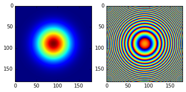
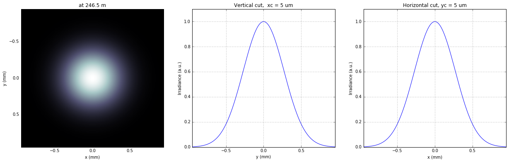
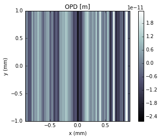
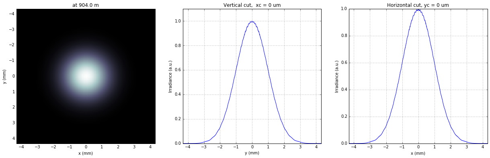
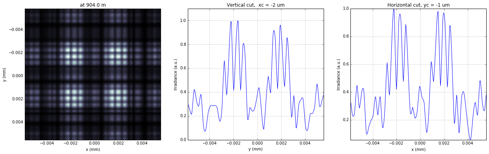
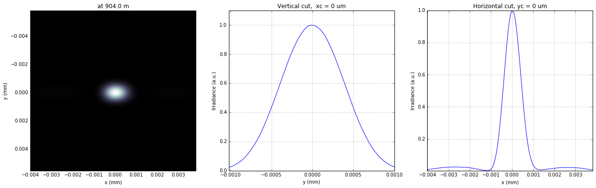
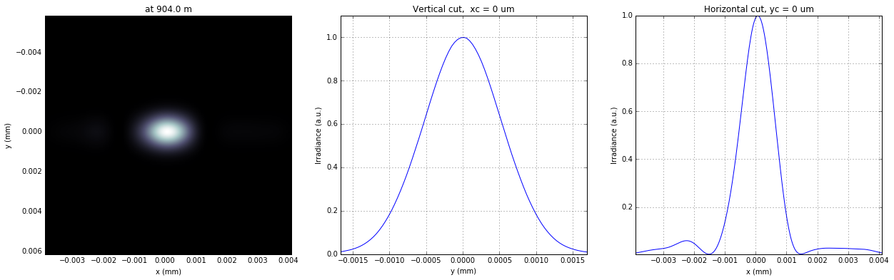

Wavefront propagation simulation tutorial
=========================================

L.Samoylova liubov.samoylova@xfel.eu, A.Buzmakov buzmakov@gmail.com

Tutorial course on Wavefront Propagation Simulations, 28/11/2013,
European XFEL, Hamburg.

Wave optics software is based on SRW core library
https://github.com/ochubar/SRW, available through WPG interactive
framework https://github.com/samoylv/WPG

Propagation Gaussian through horizontal offset mirror (HOM)
-----------------------------------------------------------

Import modules
~~~~~~~~~~~~~~

.. code:: python

    %matplotlib inline

.. code:: python

    from __future__ import absolute_import
    from __future__ import division
    from __future__ import print_function
    from __future__ import unicode_literals
    
    #Importing necessary modules:
    import os
    import sys
    sys.path.insert(0,os.path.join('..', '..'))
    
    import time
    import copy
    import numpy as np
    import pylab as plt
    
    
    #import SRW core functions
    from wpg.srwlib import srwl,SRWLOptD,SRWLOptA,SRWLOptC,SRWLOptT,SRWLOptL
    
    #import SRW helpers functions
    from wpg.useful_code.srwutils import AuxTransmAddSurfHeightProfileScaled
    
    #import some helpers functions
    from wpg.useful_code.wfrutils import calculate_fwhm_x, plot_wfront, calculate_fwhm_y, print_beamline, get_mesh
    
    #Import base wavefront class
    from wpg import Wavefront
    
    #Gaussian beam generator
    from wpg.generators import build_gauss_wavefront_xy
    
    plt.ion()

Define auxiliary functions
~~~~~~~~~~~~~~~~~~~~~~~~~~

.. code:: python

    #Plotting
    def plot_1d(profile, title_fig, title_x, title_y):
        plt.plot(profile[0], profile[1])
        plt.xlabel(title_x)
        plt.ylabel(title_y)
        plt.title(title_fig)
        plt.grid(True)
    
    
    def plot_2d(amap, xmin, xmax, ymin, ymax, title_fig, title_x, title_y):
        plt.imshow(amap, extent=(ymin, ymax, xmin, xmax))
        plt.colorbar()
        plt.xlabel(title_x)
        plt.ylabel(title_y)
        plt.title(title_fig)

.. code:: python

    #calculate source size from photon energy and FWHM angular divergence
    def calculate_source_fwhm(ekev, theta_fwhm):
        wl = 12.39e-10/ekev
        k = 2 * np.sqrt(2*np.log(2))
        theta_sigma = theta_fwhm /k
        sigma0 = wl /(2*np.pi*theta_sigma)
        return sigma0*k

.. code:: python

    #calculate angular divergence using formula from CDR2011
    def calculate_theta_fwhm_cdr(ekev,qnC):
        theta_fwhm = (17.2 - 6.4 * np.sqrt(qnC))*1e-6/ekev**0.85
        return theta_fwhm

.. code:: python

    #define optical path difference (OPD) from mirror profile, i.e.
    #fill the struct opTrErMirr
    #input: 
    #    mdatafile: an ascii file with mirror profile data
    #    ncol:      number of columns in the file
    #    delim:     delimiter between numbers in an row, can be space (' '), tab '\t', etc
    #    Orient:    mirror orientation, 'x' (horizontal) or 'y' (vertical)
    #    theta:     incidence angle
    #    scale:     scaling factor for the mirror profile
    def defineOPD(opTrErMirr, mdatafile, ncol, delim, Orient, theta, scale):
        heightProfData = np.loadtxt(mdatafile).T
        AuxTransmAddSurfHeightProfileScaled(opTrErMirr, heightProfData, Orient, theta, scale)
        plt.figure()
        plot_1d(heightProfData,'profile from ' + mdatafile,'x (m)', 'h (m)') #@todo add the func def in on top of example

Defining initial wavefront and writing electric field data to h5-file
~~~~~~~~~~~~~~~~~~~~~~~~~~~~~~~~~~~~~~~~~~~~~~~~~~~~~~~~~~~~~~~~~~~~~

.. code:: python

    # #**********************Input Wavefront Structure and Parameters
    print('*****defining initial wavefront and writing electric field data to h5-file...')
    strInputDataFolder = 'data_common'  # input data sub-folder name
    strOutputDataFolder = 'Tutorial_intro'  # output data sub-folder name
    
    #init Gauusian beam parameters
    d2m1_sase1 = 246.5
    d2m1_sase2 = 290.0
    d2m1_sase3 = 281.0
    qnC = 0.1                    # e-bunch charge, [nC]
    ekev_sase1 = 8.0
    thetaOM_sase1 = 2.5e-3       # @check!
    ekev_sase3 = 3.0
    thetaOM_sase3 = 9.e-3
    
    ekev = ekev_sase1
    thetaOM = thetaOM_sase1
    d2m1 = d2m1_sase1
    #ekev = ekev_sase3
    #thetaOM = thetaOM_sase3
    #d2m1 = d2m1_sase3
    z1 = d2m1
    theta_fwhm = calculate_theta_fwhm_cdr(ekev,qnC)
    k = 2*np.sqrt(2*np.log(2))
    sigX = 12.4e-10*k/(ekev*4*np.pi*theta_fwhm) 
    print('waist_fwhm [um], theta_fwhms [urad]:', sigX*k*1e6, theta_fwhm*1e6)
    #define limits
    range_xy = theta_fwhm/k*z1*7. # sigma*7 beam size
    npoints=180
    
    #define unique filename for storing results
    ip = np.floor(ekev)
    frac = np.floor((ekev - ip)*1e3)
    fname0 = 'g' + str(int(ip))+'_'+str(int(frac))+'kev'
    print('save hdf5: '+fname0+'.h5')
    ifname = os.path.join(strOutputDataFolder,fname0+'.h5')
    
    #build SRW gauusian wavefront
    wfr0=build_gauss_wavefront_xy(nx=npoints,ny=npoints,ekev=ekev,
                                  xMin=-range_xy/2, xMax=range_xy/2,
                                  yMin=-range_xy/2, yMax=range_xy/2,
                                  sigX=sigX, sigY=sigX, d2waist=z1)    
        
    
    
    #init WPG Wavefront helper class
    mwf = Wavefront(wfr0)
    
    #store wavefront to HDF5 file 
    mwf.store_hdf5(ifname)
    
    #draw wavefront with common functions
    plt.subplot(1,2,1)
    plt.imshow(mwf.get_intensity(slice_number=0))
    plt.subplot(1,2,2)
    plt.imshow(mwf.get_phase(slice_number=0,polarization='horizontal'))
    plt.show()
    
    #draw wavefront with cuts
    plot_wfront(mwf, title_fig='at '+str(z1)+' m',
                isHlog=False, isVlog=False,
                i_x_min=1e-5, i_y_min=1e-5, orient='x', onePlot=True,)
    
    plt.set_cmap('bone') #set color map, 'bone', 'hot', 'jet', etc
    fwhm_x = calculate_fwhm_x(mwf)
    print('FWHMx [mm], theta_fwhm [urad]:',fwhm_x*1e3,fwhm_x/z1*1e6)

.. parsed-literal::

    *****defining initial wavefront and writing electric field data to h5-file...
    waist_fwhm [um], theta_fwhms [urad]: 26.3938279331 2.59140266508
    save hdf5: g8_0kev.h5

.. parsed-literal::

    FWHMx [mm]: 0.625880068386
    FWHMy [mm]: 0.625880068386
    Coordinates of center, [mm]: 0.00530406837615 0.00530406837615
    stepX, stepY [um]: 10.608136752297826 10.608136752297826 
    
    R-space
    FWHMx [mm], theta_fwhm [urad]: 0.625880068386 2.53906721455

Defining optical beamline(s)
~~~~~~~~~~~~~~~~~~~~~~~~~~~~

.. code:: python

    print('*****Defining optical beamline(s) ...')
    d2exp_sase1 = 904.0
    d2exp_sase3 = 418.0
    
    d2exp = d2exp_sase1
    z2 = d2exp - d2m1
    DriftM1_Exp = SRWLOptD(z2) #Drift from first offset mirror (M1) to exp hall
    horApM1 = 0.8*thetaOM
    opApM1 = SRWLOptA('r', 'a', horApM1, range_xy)  # clear aperture of the Offset Mirror(s)
    
    #Wavefront Propagation Parameters:
    #[0]:  Auto-Resize (1) or not (0) Before propagation
    #[1]:  Auto-Resize (1) or not (0) After propagation
    #[2]:  Relative Precision for propagation with Auto-Resizing (1. is nominal)
    #[3]:  Allow (1) or not (0) for semi-analytical treatment of quadratic phase terms at propagation
    #[4]:  Do any Resizing on Fourier side, using FFT, (1) or not (0)
    #[5]:  Horizontal Range modification factor at Resizing (1. means no modification)
    #[6]:  Horizontal Resolution modification factor at Resizing
    #[7]:  Vertical Range modification factor at Resizing
    #[8]:  Vertical Resolution modification factor at Resizing
    #[9]:  Type of wavefront Shift before Resizing (not yet implemented)
    #[10]: New Horizontal wavefront Center position after Shift (not yet implemented)
    #[11]: New Vertical wavefront Center position after Shift (not yet implemented)
    #                 [ 0] [1] [2]  [3] [4] [5]  [6]  [7]  [8]  [9] [10] [11] 
    ppM1 =            [ 0,  0, 1.0,  0,  0, 1.0, 1.0, 1.0, 1.0,  0,  0,   0]
    ppTrErM1 =        [ 0,  0, 1.0,  0,  0, 1.0, 1.0, 1.0, 1.0,  0,  0,   0]
    ppDriftM1_Exp =   [ 0,  0, 1.0,  1,  0, 2.4, 1.8, 2.4, 1.8,  0,  0,   0]
    ppLens =          [ 0,  0, 1.0,  0,  0, 1.0, 1.0, 1.0, 1.0,  0,  0,   0]
    ppDrift_Foc  =    [ 0,  0, 1.0,  1,  0, 1.0, 1.5, 1.0, 1.5,  0,  0,   0]
    ppFin  =          [ 0,  0, 1.0,  0,  0, 0.05,5.0, 0.05,5.0,  0,  0,   0]
    
    optBL0 = SRWLOptC([opApM1,  DriftM1_Exp], 
                        [ppM1,ppDriftM1_Exp]) 
    
    scale = 5     #5 mirror profile scaling factor 
    print('*****HOM1 data for BL1 beamline ')
    opTrErM1 = SRWLOptT(1500, 100, horApM1, range_xy)
    defineOPD(opTrErM1, os.path.join(strInputDataFolder,'mirror1.dat'), 2, '\t', 'x',  thetaOM, scale)
    opdTmp=np.array(opTrErM1.arTr)[1::2].reshape(opTrErM1.mesh.ny,opTrErM1.mesh.nx)
    plt.figure()
    plot_2d(opdTmp, opTrErM1.mesh.xStart*1e3,opTrErM1.mesh.xFin*1e3,opTrErM1.mesh.yStart*1e3,opTrErM1.mesh.yFin*1e3,
            'OPD [m]', 'x (mm)', 'y (mm)')  
    
    optBL1 = SRWLOptC([opApM1,opTrErM1,  DriftM1_Exp], 
                        [ppM1,ppTrErM1,ppDriftM1_Exp]) 
    
    z3 = 30. #distance to focal plane
    f_x = 1./(1./(z1+z2)+1./z3)
    opLens = SRWLOptL(f_x,f_x,0,0)    
    Drift_Foc = SRWLOptD(z3)
    optBL2 = SRWLOptC([opApM1,opTrErM1,  DriftM1_Exp,opLens,  Drift_Foc], 
                        [ppM1,ppTrErM1,ppDriftM1_Exp,ppLens,ppDrift_Foc,ppFin]) 
    
    optBL20= SRWLOptC([opApM1,  DriftM1_Exp,opLens,  Drift_Foc], 
                        [ppM1,ppDriftM1_Exp,ppLens,ppDrift_Foc,ppFin]) 

.. parsed-literal::

    *****Defining optical beamline(s) ...
    *****HOM1 data for BL1 beamline 

.. image:: output_14_1.png

.. code:: python

    print_beamline(optBL1)

.. parsed-literal::

    Optical Element: Aperture / Obstacle
    Prop. parameters = [0, 0, 1.0, 0, 0, 1.0, 1.0, 1.0, 1.0, 0, 0, 0]
    	Dx = 0.002
    	Dy = 0.00189885647866
    	ap_or_ob = a
    	shape = r
    	x = 0
    	y = 0
    	
    Optical Element: Transmission (generic)
    Prop. parameters = [0, 0, 1.0, 0, 0, 1.0, 1.0, 1.0, 1.0, 0, 0, 0]
    	Fx = 1e+23
    	Fy = 1e+23
    	arTr = array of size 300000
    	extTr = 0
    	mesh = Radiation Mesh (Sampling)
    		arSurf = None
    		eFin = 0
    		eStart = 0
    		hvx = 1
    		hvy = 0
    		hvz = 0
    		ne = 1
    		nvx = 0
    		nvy = 0
    		nvz = 1
    		nx = 1500
    		ny = 100
    		xFin = 0.001
    		xStart = -0.001
    		yFin = 0.000949428239331
    		yStart = -0.000949428239331
    		zStart = 0
    	
    	
    Optical Element: Drift Space
    Prop. parameters = [0, 0, 1.0, 1, 0, 2.4, 1.8, 2.4, 1.8, 0, 0, 0]
    	L = 657.5
    	treat = 0
    	
    

Propagating through BL0 beamline. Ideal mirror: HOM as an aperture
~~~~~~~~~~~~~~~~~~~~~~~~~~~~~~~~~~~~~~~~~~~~~~~~~~~~~~~~~~~~~~~~~~

.. code:: python

    print('*****Ideal mirror: HOM as an aperture')
    bPlotted = False
    isHlog = False
    isVlog = False
    bSaved = True
    optBL = optBL0
    strBL = 'bl0'
    pos_title = 'at exp hall wall'
    print('*****setting-up optical elements, beamline:', strBL)
    print_beamline(optBL)
    startTime = time.time()
    
    print('*****reading wavefront from h5 file...')
    w2 = Wavefront()
    w2.load_hdf5(ifname)
    wfr = w2._srwl_wf
    
    print('*****propagating wavefront (with resizing)...')
    srwl.PropagElecField(wfr, optBL)
    mwf = Wavefront(wfr)
    print('[nx, ny, xmin, xmax, ymin, ymax]', get_mesh(mwf))
    if bSaved:
        print('save hdf5:', fname0+'_'+strBL+'.h5')
        mwf.store_hdf5(os.path.join(strOutputDataFolder, fname0+'_'+strBL+'.h5'))
    print('done')
    print('propagation lasted:', round((time.time() - startTime) / 6.) / 10., 'min')

.. parsed-literal::

    *****Ideal mirror: HOM as an aperture
    *****setting-up optical elements, beamline: bl0
    Optical Element: Aperture / Obstacle
    Prop. parameters = [0, 0, 1.0, 0, 0, 1.0, 1.0, 1.0, 1.0, 0, 0, 0]
    	Dx = 0.002
    	Dy = 0.00189885647866
    	ap_or_ob = a
    	shape = r
    	x = 0
    	y = 0
    	
    Optical Element: Drift Space
    Prop. parameters = [0, 0, 1.0, 1, 0, 2.4, 1.8, 2.4, 1.8, 0, 0, 0]
    	L = 657.5
    	treat = 0
    	
    
    *****reading wavefront from h5 file...
    *****propagating wavefront (with resizing)...
    [nx, ny, xmin, xmax, ymin, ymax] [780, 780, -0.004307718157368225, 0.004296672726195485, -0.0043295102195176245, 0.004318408911262452]
    save hdf5: g8_0kev_bl0.h5
    done
    propagation lasted: 0.0 min

.. code:: python

    print('*****Ideal mirror: HOM as an aperture')
    plot_wfront(mwf, 'at '+str(d2exp)+' m',False, False, 1e-5,1e-5,'x', True)
    plt.set_cmap('bone') #set color map, 'bone', 'hot', 'jet', etc
    plt.axis('tight')    
    print('FWHMx [mm], theta_fwhm [urad]:',calculate_fwhm_x(mwf)*1e3,calculate_fwhm_x(mwf)/(z1+z2)*1e6)
    print('FWHMy [mm], theta_fwhm [urad]:',calculate_fwhm_y(mwf)*1e3,calculate_fwhm_y(mwf)/(z1+z2)*1e6)

.. parsed-literal::

    *****Ideal mirror: HOM as an aperture
    FWHMx [mm]: 2.31954054628
    FWHMy [mm]: 2.33127473359
    Coordinates of center, [mm]: -8.67361737988e-16 0.0
    stepX, stepY [um]: 11.045431172739036 11.101308255173397 
    
    R-space
    FWHMx [mm], theta_fwhm [urad]: 2.31954054628 2.56586343615
    FWHMy [mm], theta_fwhm [urad]: 2.33127473359 2.57884373184

Propagating through BL1 beamline. Imperfect mirror, unfocused beam
~~~~~~~~~~~~~~~~~~~~~~~~~~~~~~~~~~~~~~~~~~~~~~~~~~~~~~~~~~~~~~~~~~

.. code:: python

    print('*****Imperfect mirror, unfocused beam')
    bPlotted = False
    isHlog = True
    isVlog = False
    bSaved = False
    optBL = optBL1
    strBL = 'bl1'
    pos_title = 'at exp hall wall'
    print('*****setting-up optical elements, beamline:', strBL)
    print_beamline(optBL)
    startTime = time.time()
    print('*****reading wavefront from h5 file...')
    w2 = Wavefront()
    w2.load_hdf5(ifname)
    wfr = w2._srwl_wf
    print('*****propagating wavefront (with resizing)...')
    srwl.PropagElecField(wfr, optBL)
    mwf = Wavefront(wfr)
    print('[nx, ny, xmin, xmax, ymin, ymax]', get_mesh(mwf))
    if bSaved:
        print('save hdf5:', fname0+'_'+strBL+'.h5')
        mwf.store_hdf5(os.path.join(strOutputDataFolder,fname0+'_'+strBL+'.h5'))
    print('done')
    print('propagation lasted:', round((time.time() - startTime) / 6.) / 10., 'min')

.. parsed-literal::

    *****Imperfect mirror, unfocused beam
    *****setting-up optical elements, beamline: bl1
    Optical Element: Aperture / Obstacle
    Prop. parameters = [0, 0, 1.0, 0, 0, 1.0, 1.0, 1.0, 1.0, 0, 0, 0]
    	Dx = 0.002
    	Dy = 0.00189885647866
    	ap_or_ob = a
    	shape = r
    	x = 0
    	y = 0
    	
    Optical Element: Transmission (generic)
    Prop. parameters = [0, 0, 1.0, 0, 0, 1.0, 1.0, 1.0, 1.0, 0, 0, 0]
    	Fx = 1e+23
    	Fy = 1e+23
    	arTr = array of size 300000
    	extTr = 0
    	mesh = Radiation Mesh (Sampling)
    		arSurf = None
    		eFin = 0
    		eStart = 0
    		hvx = 1
    		hvy = 0
    		hvz = 0
    		ne = 1
    		nvx = 0
    		nvy = 0
    		nvz = 1
    		nx = 1500
    		ny = 100
    		xFin = 0.001
    		xStart = -0.001
    		yFin = 0.000949428239331
    		yStart = -0.000949428239331
    		zStart = 0
    	
    	
    Optical Element: Drift Space
    Prop. parameters = [0, 0, 1.0, 1, 0, 2.4, 1.8, 2.4, 1.8, 0, 0, 0]
    	L = 657.5
    	treat = 0
    	
    
    *****reading wavefront from h5 file...
    *****propagating wavefront (with resizing)...
    [nx, ny, xmin, xmax, ymin, ymax] [780, 780, -0.007224996707959405, 0.007206471075374892, -0.0043295102195176245, 0.004318408911262452]
    done
    propagation lasted: 0.0 min

.. code:: python

    print ('*****Imperfect mirror, unfocused beam')
    plot_wfront(mwf, 'at '+str(d2exp)+' m',False, False, 1e-5,1e-5,'x', True)
    plt.set_cmap('bone') #set color map, 'bone', 'hot', etc
    plt.axis('tight')    
    print('FWHMx [mm], theta_fwhm [urad]:',calculate_fwhm_x(mwf)*1e3,calculate_fwhm_x(mwf)/(z1+z2)*1e6)
    print('FWHMy [mm], theta_fwhm [urad]:',calculate_fwhm_y(mwf)*1e3,calculate_fwhm_y(mwf)/(z1+z2)*1e6)

.. parsed-literal::

    *****Imperfect mirror, unfocused beam
    FWHMx [mm]: 1.88961452362
    FWHMy [mm]: 2.33127473359
    Coordinates of center, [mm]: 0.666922773042 0.0
    stepX, stepY [um]: 18.525632584511293 11.101308255173397 
    
    R-space
    FWHMx [mm], theta_fwhm [urad]: 1.88961452362 2.09028155268
    FWHMy [mm], theta_fwhm [urad]: 2.33127473359 2.57884373184

.. image:: output_21_1.png

Propagating through BL2 beamline. Focused beam: HOM aperture effect
~~~~~~~~~~~~~~~~~~~~~~~~~~~~~~~~~~~~~~~~~~~~~~~~~~~~~~~~~~~~~~~~~~~

.. code:: python

    print ('*****Focused beam: Focused beam: HOM aperture effect')
    bPlotted = False
    isHlog = True
    isVlog = False
    bSaved = False
    optBL = optBL20
    strBL = 'bl20'
    pos_title = 'at sample'
    print('*****setting-up optical elements, beamline:', strBL)
    print_beamline(optBL)
    startTime = time.time()
    print('*****reading wavefront from h5 file...')
    w2 = Wavefront()
    w2.load_hdf5(ifname)
    wfr = w2._srwl_wf
    print('*****propagating wavefront (with resizing)...')
    srwl.PropagElecField(wfr, optBL)
    mwf = Wavefront(wfr)
    print('[nx, ny, xmin, xmax, ymin, ymax]', get_mesh(mwf))
    if bSaved:
        print('save hdf5:', fname0+'_'+strBL+'.h5')
        mwf.store_hdf5(os.path.join(strOutputDataFolder,fname0+'_'+strBL+'.h5'))
    print('done')
    print('propagation lasted:', round((time.time() - startTime) / 6.) / 10., 'min')

.. parsed-literal::

    *****Focused beam: Focused beam: HOM aperture effect
    *****setting-up optical elements, beamline: bl20
    Optical Element: Aperture / Obstacle
    Prop. parameters = [0, 0, 1.0, 0, 0, 1.0, 1.0, 1.0, 1.0, 0, 0, 0]
    	Dx = 0.002
    	Dy = 0.00189885647866
    	ap_or_ob = a
    	shape = r
    	x = 0
    	y = 0
    	
    Optical Element: Drift Space
    Prop. parameters = [0, 0, 1.0, 1, 0, 2.4, 1.8, 2.4, 1.8, 0, 0, 0]
    	L = 657.5
    	treat = 0
    	
    Optical Element: Thin Lens
    Prop. parameters = [0, 0, 1.0, 0, 0, 1.0, 1.0, 1.0, 1.0, 0, 0, 0]
    	Fx = 29.036402569593147
    	Fy = 29.036402569593147
    	x = 0
    	y = 0
    	
    Optical Element: Drift Space
    Prop. parameters = [0, 0, 1.0, 1, 0, 1.0, 1.5, 1.0, 1.5, 0, 0, 0]
    	L = 30.0
    	treat = 0
    	
    Optical element: Empty.
        This is empty propagator used for sampling and zooming wavefront
        
    Prop. parameters = [0, 0, 1.0, 0, 0, 0.05, 5.0, 0.05, 5.0, 0, 0, 0]
    	
    
    *****reading wavefront from h5 file...
    *****propagating wavefront (with resizing)...
    [nx, ny, xmin, xmax, ymin, ymax] [294, 294, -5.863662987539073e-06, 5.5701129005533396e-06, -5.832142801804413e-06, 5.540170696582709e-06]
    done
    propagation lasted: 0.1 min

.. code:: python

    print ('*****Focused beam: HOM aperture effect')
    plot_wfront(mwf, 'at '+str(d2exp)+' m',False, False, 1e-5,1e-5,'x', True)
    plt.set_cmap('bone') #set color map, 'bone', 'hot', etc
    plt.axis('tight')    
    print('FWHMx [mm], FWHMy [mm]:',calculate_fwhm_x(mwf)*1e3,calculate_fwhm_y(mwf)*1e3)

.. parsed-literal::

    *****Focused beam: HOM aperture effect
    FWHMx [mm]: 0.0055803070034
    FWHMy [mm]: 0.00555031000092
    Coordinates of center, [mm]: -0.00223451227903 -0.00164030028363
    stepX, stepY [um]: 0.03902312589792632 0.0388133566497854 
    
    R-space
    FWHMx [mm], FWHMy [mm]: 0.0055803070034 0.00555031000092

Propagating through BL3 beamline. Focused beam: Imperfect mirror
~~~~~~~~~~~~~~~~~~~~~~~~~~~~~~~~~~~~~~~~~~~~~~~~~~~~~~~~~~~~~~~~

.. code:: python

    print ('*****Focused beam: Imperfect mirror')
    bPlotted = False
    isHlog = True
    isVlog = False
    bSaved = False
    optBL = optBL2
    strBL = 'bl2'
    pos_title = 'at sample position'
    print('*****setting-up optical elements, beamline:', strBL)
    print_beamline(optBL)
    startTime = time.time()
    print('*****reading wavefront from h5 file...')
    w2 = Wavefront()
    w2.load_hdf5(ifname)
    wfr = w2._srwl_wf
    print('*****propagating wavefront (with resizing)...')
    srwl.PropagElecField(wfr, optBL)
    mwf = Wavefront(wfr)
    print('[nx, ny, xmin, xmax, ymin, ymax]', get_mesh(mwf))
    if bSaved:
        print('save hdf5:', fname0+'_'+strBL+'.h5')
        mwf.store_hdf5(os.path.join(strOutputDataFolder,fname0+'_'+strBL+'.h5'))
    print('done')
    print('propagation lasted:', round((time.time() - startTime) / 6.) / 10., 'min')

.. parsed-literal::

    *****Focused beam: Imperfect mirror
    *****setting-up optical elements, beamline: bl2
    Optical Element: Aperture / Obstacle
    Prop. parameters = [0, 0, 1.0, 0, 0, 1.0, 1.0, 1.0, 1.0, 0, 0, 0]
    	Dx = 0.002
    	Dy = 0.00189885647866
    	ap_or_ob = a
    	shape = r
    	x = 0
    	y = 0
    	
    Optical Element: Transmission (generic)
    Prop. parameters = [0, 0, 1.0, 0, 0, 1.0, 1.0, 1.0, 1.0, 0, 0, 0]
    	Fx = 1e+23
    	Fy = 1e+23
    	arTr = array of size 300000
    	extTr = 0
    	mesh = Radiation Mesh (Sampling)
    		arSurf = None
    		eFin = 0
    		eStart = 0
    		hvx = 1
    		hvy = 0
    		hvz = 0
    		ne = 1
    		nvx = 0
    		nvy = 0
    		nvz = 1
    		nx = 1500
    		ny = 100
    		xFin = 0.001
    		xStart = -0.001
    		yFin = 0.000949428239331
    		yStart = -0.000949428239331
    		zStart = 0
    	
    	
    Optical Element: Drift Space
    Prop. parameters = [0, 0, 1.0, 1, 0, 2.4, 1.8, 2.4, 1.8, 0, 0, 0]
    	L = 657.5
    	treat = 0
    	
    Optical Element: Thin Lens
    Prop. parameters = [0, 0, 1.0, 0, 0, 1.0, 1.0, 1.0, 1.0, 0, 0, 0]
    	Fx = 29.036402569593147
    	Fy = 29.036402569593147
    	x = 0
    	y = 0
    	
    Optical Element: Drift Space
    Prop. parameters = [0, 0, 1.0, 1, 0, 1.0, 1.5, 1.0, 1.5, 0, 0, 0]
    	L = 30.0
    	treat = 0
    	
    Optical element: Empty.
        This is empty propagator used for sampling and zooming wavefront
        
    Prop. parameters = [0, 0, 1.0, 0, 0, 0.05, 5.0, 0.05, 5.0, 0, 0, 0]
    	
    
    *****reading wavefront from h5 file...
    *****propagating wavefront (with resizing)...
    [nx, ny, xmin, xmax, ymin, ymax] [294, 294, -4.012059890591799e-06, 3.811205828484517e-06, -5.832142801804413e-06, 5.540170696582709e-06]
    done
    propagation lasted: 0.1 min

.. code:: python

    print('*****Focused beam: Imperfect mirror')
    plot_wfront(mwf, 'at '+str(d2exp)+' m',False, False, 1e-5,1e-5,'x', True)
    plt.set_cmap('bone') #set color map, 'bone', 'hot', etc
    plt.axis('tight')    
    print('FWHMx [mm], FWHMy [mm]:',calculate_fwhm_x(mwf)*1e3,calculate_fwhm_y(mwf)*1e3)
    #int_x=mwf.get_intensity(slice=0); np.savetxt('bl2.txt',int_x[int_x.shape[1]/2,:])

.. parsed-literal::

    *****Focused beam: Imperfect mirror
    FWHMx [mm]: 0.000881118664606
    FWHMy [mm]: 0.000892707202945
    Coordinates of center, [mm]: 1.97255141199e-05 -1.01393043366e-05
    stepX, stepY [um]: 0.02670056559411712 0.0388133566497854 
    
    R-space
    FWHMx [mm], FWHMy [mm]: 0.000881118664606 0.000892707202945

Propagating through BL4 beamline. Focused beam, out of focus
~~~~~~~~~~~~~~~~~~~~~~~~~~~~~~~~~~~~~~~~~~~~~~~~~~~~~~~~~~~~

.. code:: python

    print('*****Focused beam, out of focus')
    dz = 15.e-3
    n = 5
    startTime = time.time()
    for idx in range(-n,n):
        Drift = SRWLOptD(z3+dz*idx/n)
        optBL = SRWLOptC([opApM1,opTrErM1,  DriftM1_Exp,opLens,  Drift], 
                           [ppM1,ppTrErM1,ppDriftM1_Exp,ppLens,ppDrift_Foc,ppFin]) 
        #print_beamline(optBL4)
        strBL = 'bl'+'_'+str(idx+n)
        print('*****reading wavefront from h5 file...')
        w2 = Wavefront()
        w2.load_hdf5(ifname)
        wfr = w2._srwl_wf
        print('*****propagating wavefront (with resizing)...')
        srwl.PropagElecField(wfr, optBL)
        mwf = Wavefront(wfr)
        print('save hdf5:', fname0+'_'+strBL+'.h5')
        mwf.store_hdf5(os.path.join(strOutputDataFolder,fname0+'_'+strBL+'.h5'))

.. parsed-literal::

    *****Focused beam, out of focus
    *****reading wavefront from h5 file...
    *****propagating wavefront (with resizing)...
    save hdf5: g8_0kev_bl_0.h5
    *****reading wavefront from h5 file...
    *****propagating wavefront (with resizing)...
    save hdf5: g8_0kev_bl_1.h5
    *****reading wavefront from h5 file...
    *****propagating wavefront (with resizing)...
    save hdf5: g8_0kev_bl_2.h5
    *****reading wavefront from h5 file...
    *****propagating wavefront (with resizing)...
    save hdf5: g8_0kev_bl_3.h5
    *****reading wavefront from h5 file...
    *****propagating wavefront (with resizing)...
    save hdf5: g8_0kev_bl_4.h5
    *****reading wavefront from h5 file...
    *****propagating wavefront (with resizing)...
    save hdf5: g8_0kev_bl_5.h5
    *****reading wavefront from h5 file...
    *****propagating wavefront (with resizing)...
    save hdf5: g8_0kev_bl_6.h5
    *****reading wavefront from h5 file...
    *****propagating wavefront (with resizing)...
    save hdf5: g8_0kev_bl_7.h5
    *****reading wavefront from h5 file...
    *****propagating wavefront (with resizing)...
    save hdf5: g8_0kev_bl_8.h5
    *****reading wavefront from h5 file...
    *****propagating wavefront (with resizing)...
    save hdf5: g8_0kev_bl_9.h5

.. code:: python

    print('*****Focused beam, out of focus, last slice')
    plot_wfront(mwf, 'at '+str(d2exp)+' m',False, False, 1e-5,1e-5,'x', True)
    plt.set_cmap('bone') #set color map, 'bone', 'hot', etc
    plt.axis('tight')    
    print('FWHMx [um], FWHMy [um]:',calculate_fwhm_x(mwf)*1e6,calculate_fwhm_y(mwf)*1e6)
    #int_x=mwf.get_intensity(slice=0); np.savetxt('bl2.txt',int_x[int_x.shape[1]/2,:])

.. parsed-literal::

    *****Focused beam, out of focus, last slice
    FWHMx [mm]: 0.00120037884559
    FWHMy [mm]: 0.00122854539774
    Coordinates of center, [mm]: 6.16894426568e-05 1.06978600103e-05
    stepX, stepY [um]: 0.027281337399753247 0.04095151325811603 
    
    R-space
    FWHMx [um], FWHMy [um]: 1.20037884559 1.22854539774

